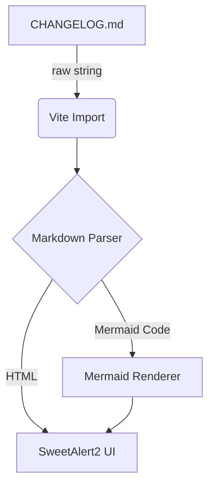

# Changelog

All notable changes to this project will be documented in this file.
Format: [Keep a Changelog](https://keepachangelog.com/en/1.0.0/) · [Semantic Versioning](https://semver.org/spec/v2.0.0.html)

---

### [1.2.6] - 2026-06-23

#### Added
- **Delete on Push Toggle**: Added `delete_on_push` per-project flag in the configuration modal. When enabled, pushing will use `--delete` to remove files on the Remote that no longer exist on the Local, keeping the Remote as a perfect mirror. Defaults to OFF for safety.
- **Safety Guard for Push**: Added a protective confirmation dialog when attempting to Push with `delete_on_push` enabled while there are pending Pull changes. This prevents accidental deletion of AI-generated files on the Remote.

#### Changed
- **Native Antigravity Quota Flow**: Replaced the flaky third-party `antigravity-usage` NPM CLI tool with a custom Node.js script `scripts/get-antigravity-usage.js` compiled directly into the Tauri Rust binary. This resolves the process-matching conflict with Volar/CSS language servers and macOS command argument truncation. We also removed the legacy `50K Quota` badge (which displayed static/fake monthly credits) and simplified the Vue frontend code. Quota polling is now 100% stable, fast (takes ~40ms), runs entirely locally, and returns accurate active model telemetry. Added reference documentation in [antigravity-usage.md](docs/ref/antigravity-usage.md).

#### Fixed
- **Sync Status Deletions**: Fixed an issue where locally deleted files were ignored by the sync status checker. The `count_rsync_changes` logic now correctly accounts for `deleting ` lines from the `rsync` dry-run, ensuring the Push button accurately reflects pending deletions.

---

### [1.2.5] - 2026-06-23

#### Added
- **Open Popup Header**: Added a project title header inside the Open Popup to prevent accidental clicks.
- **Open Popup Animation**: Added a smooth fade/scale animation with dynamic `transform-origin` flipping based on the popup's vertical position.
- **Brighter Popup UI**: Slightly brightened the popup's background color for better contrast.

#### Changed
- **Rebranding**: Renamed "Project Hub" to "Open Popup" across the UI, codebase, and documentation.
- **Documentation**: Consolidated old planning docs and created a dedicated `docs/feat/open-popup.md` feature document.

#### Fixed
- **Remote `$HOME` Resolution**: Fixed a bug where remote IDEs failed to launch if the path was configured using `$HOME` instead of `~/`.
- **OpenSSH Argument Bug**: Fixed a backend issue where `Command::new("ssh")` passed separated arguments that OpenSSH incorrectly concatenated without quotes, causing remote bash scripts to fail. Scripts are now passed as a single quoted string.

### [1.2.4] - 2026-06-23

#### Added
- **Build Identifier**: Added `#HHMM` build identifier to the titlebar (e.g., `v1.2.4 (2026.06.23 #1430)`) to distinguish same-day builds.
- **Bundle Metadata**: Added `category`, `description`, `copyright`, and `publisher` to `tauri.conf.json` for OS-level app metadata.

#### Changed
- **Push Special UI**: Renamed the `PUSH SPECIAL` button to `SELECT`.
- **Build Date Format**: Replaced the `HH:MM` time in `buildDate` with the new `#HHMM` build identifier.

#### Fixed
- **Special Push Git Sync**: Fixed empty modal issue by explicitly showing `.git/` when git sync is enabled, allowing manual git pushing even on a clean working tree.
- **VSCode Remote SSH**: Fixed `~/` paths creating a literal `~` directory at the remote root. Paths are now automatically resolved to absolute paths via SSH before opening.
- **Force Sync Diagnostics**: `force-sync-parse.py` now emits JSON diagnostics to stdout. If Force Sync fails silently, the exact reason is now logged in the browser console.

---

### [1.2.3] - 2026-06-23

#### Added
- **Background Sync Logging**: The application now intelligently logs state transitions from the background sync checker (which polls every 60s). It logs the initial state of each project upon startup, and subsequently only emits a log when it detects a *new* pending push or pull. This turns the project log into a linear timeline of when you (locally) or the AI (remotely) finished making changes, without spamming the log with redundant checks.
- **Auto Version Sync**: Added `scripts/sync-version.js` and updated `package.json` scripts to automatically synchronize the application version from `package.json` into `src-tauri/Cargo.toml` before every `tauri dev` and `tauri build` execution.
- **Intro Modal**: Added an interactive "INTRO" button to the header with a pulsing notification badge. The modal provides a comprehensive and visually appealing explanation of the Aki Dev Sync workflow, explicitly distinguishing between the author's primary use case (Security / Claude MAX sharing) and general use cases for other developers.

#### Changed
- **Changelog UI**: Reduced the global font size and line height of the changelog content for improved readability.
- **Build Artifacts**: Modified the post-build artifact renaming script to map `aarch64` to `arm` and support `universal` in `.dmg` filenames for better clarity.

- **Project Hub UI**: Refactored the hub to trigger from a dedicated "OPEN" button in the actions column rather than the project icon. The popup layout was changed to a wider horizontal two-column format (Local and Remote) to prevent vertical overflow.
- **Project Info Layout**: Reduced the width of the Project/Path column to save space. Full paths are now available via hover tooltips. The Production URL link was moved out of the hub back to the project row, right-aligned next to the project name.
- **App Identifier**: Updated `tauri.conf.json` identifier from `com.aki.remotedevsync` to `aki.devsync`.

#### Fixed
- **Remote Terminal Fallback Issue**: Fixed an issue where opening a remote terminal would fail with `No such file or directory` and fallback to the remote `$HOME` directory if the project's remote directory had not yet been created. A `mkdir -p` command is now automatically prepended before `cd` to ensure the directory exists.
- **VSCode/Insiders Remote Open**: Fixed an issue causing a `Could not resolve hostname` error when opening a remote project in VS Code or VS Code Insiders. This was caused by a missing slash `/` separator between the hostname and the tilde-prefixed path (`~`) when constructing the `vscode-remote://` URI.
- **Antigravity IDE Remote Open**: Added automatic tilde expansion (`~/` -> `$HOME/`) for remote paths passed to the Antigravity IDE CLI to ensure correct path resolution.
- **Sync Buttons False Positive in Build**: Fixed an issue where the Push and Pull buttons would falsely light up for all projects in the compiled production build on macOS. This occurred because the production GUI app uses the ancient macOS default `/usr/bin/rsync` (v2.6.9), which outputs `building file list ... done`, `Transfer starting:`, and `Skip newer ` during dry runs. These strings are now explicitly filtered out from the `count_rsync_changes` parsing logic.
- **Homebrew PATH Injection**: Injected `/opt/homebrew/bin:/usr/local/bin` into the environment `PATH` of all Rust `Command` executions on macOS. This ensures the production build automatically uses the modern `rsync 3.x` from Homebrew (if installed) for drastically improved sync performance, matching the development environment.
- **Rsync Version Logging**: Added automatic extraction and printing of both the **Local** and **Remote** `rsync` versions to the sync logs before execution. This helps developers verify whether the local macOS is using Homebrew's `rsync` and quickly identify any version or protocol mismatches between the two environments.
- **VSCode Insiders Icon**: Updated the icon's CSS filter in the project hub to match the bright green color (`#10b981`) of a clean Git state, fixing the previously incorrect color.
- **Project Hub Popup Positioning**: Added dynamic bounding box calculation so the hover popup correctly flips upwards when near the bottom of the window, preventing it from being cut off by the global log area.
- **Antigravity IDE Compatibility**: Fixed macOS app detection to correctly locate `Antigravity IDE.app` and updated the frontend arguments (`-a 'Antigravity IDE'`) to launch it successfully from the hub.
- **DMG Icon Alignment**: Shifted the macOS DMG application folder alias 6px to the left in the installer background for perfect pixel alignment.

---

### [1.2.2] - 2026-06-23

#### Fixed
- **Push/Pull buttons no longer falsely light up on startup**: `hasPendingPush` and
  `hasPendingPull` are now initialized to `null` instead of `undefined`. Buttons
  display a visually distinct "checking" state (very faint outline) while the background
  sync-status check is in flight, then resolve to fully lit (pending changes) or muted
  (clean) once the live fetch completes. No disk caching needed — background fetch is
  the source of truth.

---

### [1.2.1] - 2026-06-23

#### Changed
- **IPC open consolidation**: replaced 7 thin Rust wrapper commands (`open_url`, `open_local_dir`,
  `open_in_terminal`, `open_antigravity_app`, `open_ide_local`, `open_ide_remote` vscode arms,
  `open_remote_terminal`) with a single `macos_open(args: Vec<String>)` command. JS now builds
  the arg list directly (`['-a', 'Visual Studio Code', path]`, `[url]`, etc.) — macOS `open` is
  called once per intent, no Rust matching required. Subprocess-only cases (AppleScript SSH
  terminal, `antigravity-ide --remote`) remain in Rust as `open_remote_subprocess`.
- **Removed dead command** `open_remote_terminal` — no callers since the hub refactor (v1.2.0).
- **Test coverage updated**: `validate_ssh_host` tests replaced by equivalent `validate_remote_host`
  tests (the active validation function); `applescript_escape` tests unchanged.

---

### [1.2.0] - 2026-06-23

#### Added
- **Project Open Hub**: hovering over the project icon now reveals a floating menu with three
  sections — LOCAL (Finder, Terminal, VSCode, VSCode Insiders, Antigravity IDE), REMOTE SSH
  (SSH Terminal, VSCode Remote, VSCode Insiders Remote, Antigravity Remote), and LINKS (Open
  Production Site). IDE items are automatically greyed out when the application is not installed,
  checked once per session via the new `check_ide_availability` Tauri command.
- **`check_ide_availability` command**: detects presence of VSCode, VSCode Insiders, and
  Antigravity in `/Applications/` on macOS. Result cached in-session — only one IPC call per
  app lifecycle regardless of how many projects are hovered.
- **`open_ide_local` command**: unified local-open replacing separate `open_in_vscode` and
  `open_antigravity_app` commands. Accepts `ide_name` (`finder` | `terminal` | `vscode` |
  `vscode_insiders` | `antigravity`) and opens the given path with the matching application.
- **`open_ide_remote` command**: opens a remote project via SSH. Terminal uses AppleScript,
  VSCode/Insiders use the `vscode://vscode-remote/ssh-remote+<host><path>` URL scheme,
  Antigravity uses `antigravity-ide --remote`. Host validated to allow `user@host` format.
- **Remote Git URL in Git modal**: the project's remote git URL is now shown as a clickable link
  inside the Git modal, replacing the icon that was previously shown next to the project name.

#### Changed
- **ACTIONS column cleaned up**: removed standalone Terminal (`>_`) and VSCode buttons — these
  actions are now available through the Project Open Hub. Remaining actions: GIT, PUSH SPECIAL,
  PUSH/DRY/PULL group, LOG, CONFIG.
- **Path labels no longer clickable**: local path and remote path text in the project row no
  longer have click handlers. All open actions are consolidated into the hub.
- **Production URL moved to hub**: the globe icon (Open Production Site) is removed from the
  project name row and now lives in the hub's LINKS section.
- **Remote path display**: the remote path label is now hidden when a project has no `remote_host`
  configured, eliminating the empty `:` display.
- **Rebranding**: Project officially renamed to **Aki Dev Sync**. All UI texts, window titles, and documentation have been updated to reflect the new identity.
- **Build Process**: Output release binaries (e.g. `.dmg`) are now automatically renamed post-build using `scripts/rename-artifacts.js` to match the standard format `Aki-DevSync-vX.X.X-arch.dmg` (Kebab-case with version) for better DX and URL distribution without spaces.
- **Source of Truth Versioning**: Updated `tauri.conf.json` to read the app version directly from `package.json` via `"version": "../package.json"`. Resolved the previous bug where compiled files were incorrectly labeled as v1.1.1.

---

### [1.1.3] - 2026-06-23

#### Added
- **Background Refresh**: a new settings panel (⚙ icon next to REFRESH) lets you configure
  independent auto-refresh intervals for Git Status, Remote Diff, and Agent Usage. Settings
  persist across sessions; set any interval to 0 to disable that type.
- **REFRESH button** (renamed from RELOAD): triggers all three refresh types simultaneously —
  git status, remote diff, and agent usage — in one click. Grouped with the ⚙ settings icon
  as a paired control.

#### Fixed
- **Agent Usage — percentage display**: fixed floating-point noise rendering values like
  `7.000000000000001%`. Percentages are now always displayed as whole numbers.
- **Agent Usage — stale indicator**: the "Stale" badge now reflects the actual current age of
  the cached data rather than its age at the time of the last fetch. The badge also no longer
  flickers (disappearing and reappearing) on every refresh cycle.
- **Agent Usage — auto-setup on first use**: when no usage cache is found on a remote host,
  the app now automatically provisions the host in the background — patching Claude Code's
  statusline hook so rate-limit data is cached on every session. No manual setup required.
- **Modal backdrop**: clicking outside any modal now dismisses it, equivalent to pressing Cancel.
- **Git modal stale data**: the Git modal now fetches fresh data from the backend on every open
  instead of showing a potentially stale cached snapshot. A loading state is shown while in flight.
- **Project Config preset notification**: the success toast after applying a preset was silently
  failing due to an unresolved reference. Now fires correctly.
- **Push Special modal width**: the modal was rendering at 800px instead of the intended 600px
  after the `BaseModal` refactor. Corrected by passing the right container class.

#### Changed
- **`BaseModal` component**: extracted shared modal scaffolding (overlay, drag handle, header,
  close button, ESC listener, backdrop click) into a single reusable `BaseModal.vue`. All 5 modals
  now use it, removing ~80 lines of duplicated boilerplate each.
- **Log panel ESC**: pressing Escape in an expanded log panel now collapses the panel and returns
  to the Global Event Log in one keystroke. Has no effect when a modal is open — modal ESC takes
  priority.
- **Push button dirty state**: the Push button no longer stays permanently lit when `sync_git` is
  enabled. Directory entries (e.g. `.git/`) are now filtered from the rsync dry-run change count —
  previously a routine `git status` call was enough to flip the button to dirty.
- **UI language**: completed a full English pass — all remaining Vietnamese strings replaced across
  `AppHeader`, `UsageProgressBar`, `useSsh.js`, and `useSync.js`.
- **Version display**: `package.json` is now the single source of truth for the app version. Version
  is injected at build time via Vite (same pattern as build date), replacing a `getVersion()` call
  that read from `Cargo.toml` and required manual updates in two separate files to stay in sync.

---

### [1.1.2] - 2026-06-23

#### Added
- **`ignore_hook_errors` flag** on `SyncHooks`: when enabled, a hook that exits non-zero emits a
  `[WARN]` log line and allows the sync to continue instead of aborting. Useful for post-sync
  scripts that may fail on the first push (e.g. directory not yet created on remote, optional
  install steps). Toggle available in Project Config modal under the hooks section.
- **Sync status indicator**: Push/Pull buttons now show visual state based on real-time rsync dry-run
  checks. Buttons appear muted (`.btn-sync-clean`) when no changes are pending in that direction.
  Background polling every 60s keeps status fresh. New `check_sync_status` Tauri command runs
  `rsync --dry-run` for both directions and returns `has_local_changes` / `has_remote_changes`.

#### Fixed
- **Titlebar sacred boundary**: Modal overlays now start at `top: 42px` instead of `top: 0` to never
  cover the custom titlebar drag region. Added `--titlebar-h` CSS variable and documentation at
  `docs/ref/titlebar-sacred-boundary.md` to enforce the rule for all future fixed-position UI.

---

### [1.1.1] - 2026-06-23

#### Fixed
- **UI freeze on Push/Pull**: `run_sync` restored to `async fn` with internal `spawn_blocking` for
  subprocess work. Previous patch incorrectly changed it to a sync `fn`, causing Tauri's IPC
  dispatch to block briefly before returning a Promise to JS — making the UI appear frozen on every
  sync action. Now truly non-blocking end-to-end.
- **Corrupt projects.json now surfaces error**: previously a bad JSON file silently returned an
  empty project list, making users think all projects were lost. Now returns a clear error message.
- **Remote mkdir failure now caught**: SSH `mkdir -p` exit status was not checked — a permission
  error would silently proceed into rsync and fail with a confusing message. Now reported immediately.
- **JSON field injection** in agent usage now uses `serde_json::Value` instead of string
  concatenation, safe for values containing quotes.

#### Changed
- Internal: major DRY pass on `sync.rs` (`spawn_and_stream`, `run_hook_phase`, `build_rsync_args`),
  `git.rs` (`git_capture`), `ssh.rs` (`ssh_config_path`), `projects.rs` (`validate_path_segment`).
- `get_project_files` moved from `projects.rs` to `git.rs` (co-located with all git porcelain parsing).
- All `scripts/` now fully external (`get-claudecode-usage.sh` extracted); `include_str!` at every call site.

---

### [1.1.0] - 2026-06-23

#### Added
- **Dry Run toggle** (default ON): each project has a `dry_run` flag persisted in config. Sync previews changes without writing until explicitly turned off.
- **Delete on Pull toggle**: `delete_on_pull` per-project flag controls whether `--delete` is passed on PULL. Default on; opt-out to preserve local-only files.
- **Parallel sync**: removed global sync lock. Each project tracks its own `syncing` state independently — multiple projects can sync simultaneously.
- **Per-project runtime state** (`projectRuntime` map): ephemeral data (`git_status`, `git_log`, `remote_url`, `syncing`) separated from persisted config. Eliminates deep-watch overhead and copy-back hacks.
- **`delete_on_pull` toggle** in Project Config modal (danger-styled, hooks section).
- **Rust unit tests**: 23 tests across `projects.rs`, `sync.rs`, `system.rs` covering `validate_project`, `expand_remote_tilde`, `validate_specific_paths`, `validate_ssh_host`, `applescript_escape`. Run with `cargo test --lib`.
- **External scripts**: `scripts/provision-claudecode.sh`, `scripts/force-sync-claudecode.sh`, `scripts/force-sync-parse.py` — embedded at compile time via `include_str!`.
- **Frontend module split**: `useProjects.js` decomposed into `store/projectStore.js` (pure state), `useGit.js`, `useProjectConfig.js`, `useSync.js`. `useProjects.js` remains as a thin re-export facade — no component changes needed.

#### Changed
- **Rust backend split**: `lib.rs` god-module → 6 domain modules (`projects`, `ssh`, `git`, `sync`, `agent_usage`, `system`). `lib.rs` now only declares modules and wires the Tauri builder.
- **`run_sync` is now a sync `fn`**: previously `async fn` with blocking `thread::spawn+join` inside, which starved the async executor. Tauri's thread pool handles blocking commands natively.
- **Remote directory creation**: replaced `--rsync-path="mkdir -p ... && rsync"` string injection with a dedicated `ssh mkdir -p` call before rsync.
- **Agent usage poll is read-only**: `checkUsage()` no longer auto-runs `provision`. Provisioning is an explicit user action via `provision()` in the UI.
- **SSH undo/redo**: both operations now share `swap_ssh_state(from, to)` helper instead of duplicated logic.
- **CSP**: `"csp": null` → `"default-src 'self'; img-src 'self' data:; style-src 'self' 'unsafe-inline'; script-src 'self'"`.

#### Fixed
- **`include_str!` path**: scripts were referenced as `../scripts/` (resolved to `src-tauri/scripts/`) instead of `../../scripts/` (project root). Caused compile error.
- **AppleScript injection**: `open_remote_terminal` now validates SSH host (allowlist chars) and escapes path via `applescript_escape()` before interpolating into AppleScript string.
- **Path traversal check**: `validate_project()` now covers both `local_path` and `remote_path`; `validate_specific_paths()` covers partial-sync params.

---

### [1.0.1] - 2026-06-22

#### Fixed
- **PULL creates nested subdirectory**: rsync was receiving `host:path` without a trailing slash on the source, causing it to sync the *directory itself* into the destination instead of syncing its *contents*. Both local and remote paths are now normalized to always carry exactly one trailing slash at the Rust layer.

---

### [1.0.0] - 2026-06-22

#### Added
- **Global Logs**: Added explicit system logs when triggering manual Reload and when modifying Project/SSH Configurations.
- **Environment Check**: Added `check-env.js` script to warn Linux users over SSH about Tauri's GUI restrictions during `npm run dev` or `build`.
- **GUI Versioning**: Added dynamic version display and Build Date (`YYYY.MM.DD HH:MM`) directly to the App's Titlebar (`AppHeader.vue`).

#### Changed
- **Version SSOT**: Removed hardcoded `version` inside `tauri.conf.json`. `package.json` is now the Single Source of Truth for the App's version. Tauri CLI syncs the version from it during build.

#### Architecture
Added lightweight Markdown module with Mermaid support:

