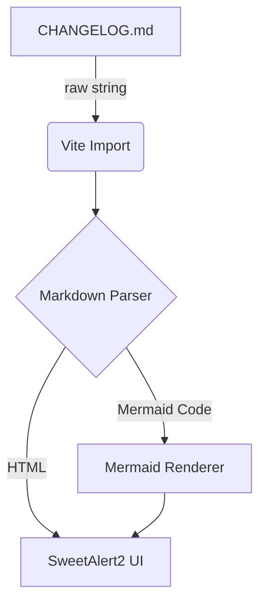

# Changelog

All notable changes to this project will be documented in this file.
Format: [Keep a Changelog](https://keepachangelog.com/en/1.0.0/) · [Semantic Versioning](https://semver.org/spec/v2.0.0.html)

---

### [1.1.3] - 2026-06-23

#### Added
- **Background Refresh**: a new settings panel (⚙ icon next to REFRESH) lets you configure
  independent auto-refresh intervals for Git Status, Remote Diff, and Agent Usage. Settings
  persist across sessions; set any interval to 0 to disable that type.
- **REFRESH button** (renamed from RELOAD): triggers all three refresh types simultaneously —
  git status, remote diff, and agent usage — in one click. Grouped with the ⚙ settings icon
  as a paired control.

#### Fixed
- **Agent Usage — percentage display**: fixed floating-point noise rendering values like
  `7.000000000000001%`. Percentages are now always displayed as whole numbers.
- **Agent Usage — stale indicator**: the "Stale" badge now reflects the actual current age of
  the cached data rather than its age at the time of the last fetch. The badge also no longer
  flickers (disappearing and reappearing) on every refresh cycle.
- **Agent Usage — auto-setup on first use**: when no usage cache is found on a remote host,
  the app now automatically provisions the host in the background — patching Claude Code's
  statusline hook so rate-limit data is cached on every session. No manual setup required.
- **Modal backdrop**: clicking outside any modal now dismisses it, equivalent to pressing Cancel.
- **Git modal stale data**: the Git modal now fetches fresh data from the backend on every open
  instead of showing a potentially stale cached snapshot. A loading state is shown while in flight.
- **Project Config preset notification**: the success toast after applying a preset was silently
  failing due to an unresolved reference. Now fires correctly.
- **Push Special modal width**: the modal was rendering at 800px instead of the intended 600px
  after the `BaseModal` refactor. Corrected by passing the right container class.

#### Changed
- **`BaseModal` component**: extracted shared modal scaffolding (overlay, drag handle, header,
  close button, ESC listener, backdrop click) into a single reusable `BaseModal.vue`. All 5 modals
  now use it, removing ~80 lines of duplicated boilerplate each.
- **Log panel ESC**: pressing Escape in an expanded log panel now collapses the panel and returns
  to the Global Event Log in one keystroke. Has no effect when a modal is open — modal ESC takes
  priority.
- **Push button dirty state**: the Push button no longer stays permanently lit when `sync_git` is
  enabled. Directory entries (e.g. `.git/`) are now filtered from the rsync dry-run change count —
  previously a routine `git status` call was enough to flip the button to dirty.
- **UI language**: completed a full English pass — all remaining Vietnamese strings replaced across
  `AppHeader`, `UsageProgressBar`, `useSsh.js`, and `useSync.js`.
- **Version display**: `package.json` is now the single source of truth for the app version. Version
  is injected at build time via Vite (same pattern as build date), replacing a `getVersion()` call
  that read from `Cargo.toml` and required manual updates in two separate files to stay in sync.

---

### [1.1.2] - 2026-06-23

#### Added
- **`ignore_hook_errors` flag** on `SyncHooks`: when enabled, a hook that exits non-zero emits a
  `[WARN]` log line and allows the sync to continue instead of aborting. Useful for post-sync
  scripts that may fail on the first push (e.g. directory not yet created on remote, optional
  install steps). Toggle available in Project Config modal under the hooks section.
- **Sync status indicator**: Push/Pull buttons now show visual state based on real-time rsync dry-run
  checks. Buttons appear muted (`.btn-sync-clean`) when no changes are pending in that direction.
  Background polling every 60s keeps status fresh. New `check_sync_status` Tauri command runs
  `rsync --dry-run` for both directions and returns `has_local_changes` / `has_remote_changes`.

#### Fixed
- **Titlebar sacred boundary**: Modal overlays now start at `top: 42px` instead of `top: 0` to never
  cover the custom titlebar drag region. Added `--titlebar-h` CSS variable and documentation at
  `docs/ref/titlebar-sacred-boundary.md` to enforce the rule for all future fixed-position UI.

---

### [1.1.1] - 2026-06-23

#### Fixed
- **UI freeze on Push/Pull**: `run_sync` restored to `async fn` with internal `spawn_blocking` for
  subprocess work. Previous patch incorrectly changed it to a sync `fn`, causing Tauri's IPC
  dispatch to block briefly before returning a Promise to JS — making the UI appear frozen on every
  sync action. Now truly non-blocking end-to-end.
- **Corrupt projects.json now surfaces error**: previously a bad JSON file silently returned an
  empty project list, making users think all projects were lost. Now returns a clear error message.
- **Remote mkdir failure now caught**: SSH `mkdir -p` exit status was not checked — a permission
  error would silently proceed into rsync and fail with a confusing message. Now reported immediately.
- **JSON field injection** in agent usage now uses `serde_json::Value` instead of string
  concatenation, safe for values containing quotes.

#### Changed
- Internal: major DRY pass on `sync.rs` (`spawn_and_stream`, `run_hook_phase`, `build_rsync_args`),
  `git.rs` (`git_capture`), `ssh.rs` (`ssh_config_path`), `projects.rs` (`validate_path_segment`).
- `get_project_files` moved from `projects.rs` to `git.rs` (co-located with all git porcelain parsing).
- All `scripts/` now fully external (`get-claudecode-usage.sh` extracted); `include_str!` at every call site.

---

### [1.1.0] - 2026-06-23

#### Added
- **Dry Run toggle** (default ON): each project has a `dry_run` flag persisted in config. Sync previews changes without writing until explicitly turned off.
- **Delete on Pull toggle**: `delete_on_pull` per-project flag controls whether `--delete` is passed on PULL. Default on; opt-out to preserve local-only files.
- **Parallel sync**: removed global sync lock. Each project tracks its own `syncing` state independently — multiple projects can sync simultaneously.
- **Per-project runtime state** (`projectRuntime` map): ephemeral data (`git_status`, `git_log`, `remote_url`, `syncing`) separated from persisted config. Eliminates deep-watch overhead and copy-back hacks.
- **`delete_on_pull` toggle** in Project Config modal (danger-styled, hooks section).
- **Rust unit tests**: 23 tests across `projects.rs`, `sync.rs`, `system.rs` covering `validate_project`, `expand_remote_tilde`, `validate_specific_paths`, `validate_ssh_host`, `applescript_escape`. Run with `cargo test --lib`.
- **External scripts**: `scripts/provision-claudecode.sh`, `scripts/force-sync-claudecode.sh`, `scripts/force-sync-parse.py` — embedded at compile time via `include_str!`.
- **Frontend module split**: `useProjects.js` decomposed into `store/projectStore.js` (pure state), `useGit.js`, `useProjectConfig.js`, `useSync.js`. `useProjects.js` remains as a thin re-export facade — no component changes needed.

#### Changed
- **Rust backend split**: `lib.rs` god-module → 6 domain modules (`projects`, `ssh`, `git`, `sync`, `agent_usage`, `system`). `lib.rs` now only declares modules and wires the Tauri builder.
- **`run_sync` is now a sync `fn`**: previously `async fn` with blocking `thread::spawn+join` inside, which starved the async executor. Tauri's thread pool handles blocking commands natively.
- **Remote directory creation**: replaced `--rsync-path="mkdir -p ... && rsync"` string injection with a dedicated `ssh mkdir -p` call before rsync.
- **Agent usage poll is read-only**: `checkUsage()` no longer auto-runs `provision`. Provisioning is an explicit user action via `provision()` in the UI.
- **SSH undo/redo**: both operations now share `swap_ssh_state(from, to)` helper instead of duplicated logic.
- **CSP**: `"csp": null` → `"default-src 'self'; img-src 'self' data:; style-src 'self' 'unsafe-inline'; script-src 'self'"`.

#### Fixed
- **`include_str!` path**: scripts were referenced as `../scripts/` (resolved to `src-tauri/scripts/`) instead of `../../scripts/` (project root). Caused compile error.
- **AppleScript injection**: `open_remote_terminal` now validates SSH host (allowlist chars) and escapes path via `applescript_escape()` before interpolating into AppleScript string.
- **Path traversal check**: `validate_project()` now covers both `local_path` and `remote_path`; `validate_specific_paths()` covers partial-sync params.

---

### [1.0.1] - 2026-06-22

#### Fixed
- **PULL creates nested subdirectory**: rsync was receiving `host:path` without a trailing slash on the source, causing it to sync the *directory itself* into the destination instead of syncing its *contents*. Both local and remote paths are now normalized to always carry exactly one trailing slash at the Rust layer.

---

### [1.0.0] - 2026-06-22

#### Added
- **Global Logs**: Added explicit system logs when triggering manual Reload and when modifying Project/SSH Configurations.
- **Environment Check**: Added `check-env.js` script to warn Linux users over SSH about Tauri's GUI restrictions during `npm run dev` or `build`.
- **GUI Versioning**: Added dynamic version display and Build Date (`YYYY.MM.DD HH:MM`) directly to the App's Titlebar (`AppHeader.vue`).

#### Changed
- **Version SSOT**: Removed hardcoded `version` inside `tauri.conf.json`. `package.json` is now the Single Source of Truth for the App's version. Tauri CLI syncs the version from it during build.

#### Architecture
Added lightweight Markdown module with Mermaid support:

