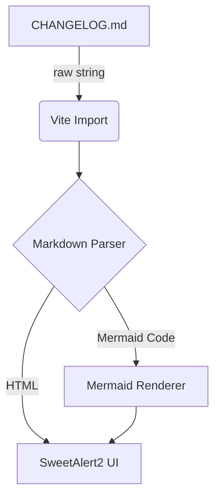

# Changelog

All notable changes to this project will be documented in this file.

The format is based on [Keep a Changelog](https://keepachangelog.com/en/1.0.0/),
and this project adheres to [Semantic Versioning](https://semver.org/spec/v2.0.0.html).

## [1.0.1] - 2026-06-22

### Fixed
- **PULL creates nested subdirectory**: rsync was receiving `host:path` without a trailing slash on the source, causing it to sync the *directory itself* into the destination instead of syncing its *contents*. Both local and remote paths are now normalized to always carry exactly one trailing slash at the Rust layer, regardless of how they are stored in config.

## [1.0.0] - 2026-06-22

### Added
- **Global Logs**: Added explicit system logs when triggering manual Reload and when modifying Project/SSH Configurations.
- **Environment Check**: Added `check-env.js` script to warn Linux users over SSH about Tauri's GUI restrictions during `npm run dev` or `build`.
- **GUI Versioning**: Added dynamic version display and Build Date (`YYYY.MM.DD HH:MM`) directly to the App's Titlebar (`AppHeader.vue`).

### Changed
- **Version SSOT**: Removed hardcoded `version` inside `tauri.conf.json`. `package.json` is now the Single Source of Truth (SSOT) for the App's version. Tauri CLI will automatically sync the version from it during the build process.

### Architecture Update
Added lightweight Markdown module with Mermaid support:

