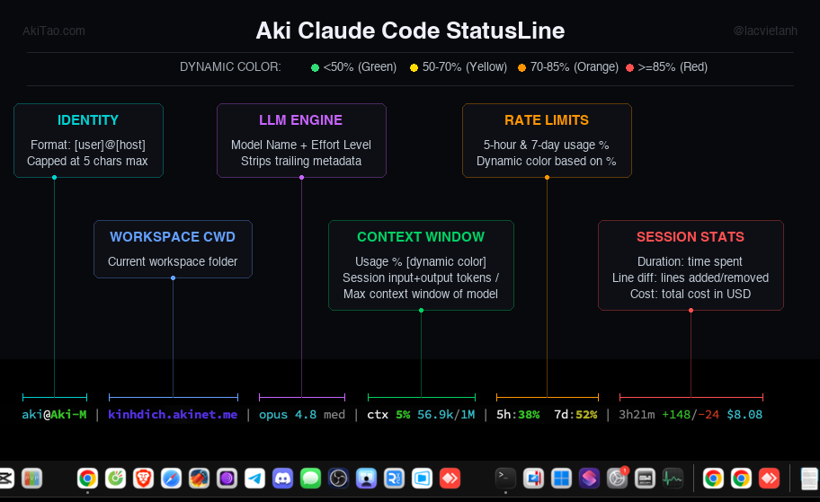

# Aki Dev Sync 🚀

> MacOS App (tauri v2) for my workflow: rsync code between local-remote. Antigravity IDE for local with .git source-of-truth, ClaudeCode on remote with shared Claude MAX plan. Live monitor Local AG & remote CC quota limit


https://github.com/lacvietanh/aki-dev-sync/releases/latest


## 🧭 The Model: Local ↔ Remote

Aki Dev Sync solves one problem: keeping a **split development environment** in sync. You code on one machine and let an AI agent work on another — without committing noise to Git just to move files around.

```
                       PUSH  ───────────────►
   ┌───────────────────────┐         ┌───────────────────────┐
   │   LOCAL                │         │   REMOTE               │
   │   Source of Truth      │         │   AI Workspace         │
   │   • Git history        │         │   • Claude Code / MAX  │
   │   • Antigravity IDE    │         │   • Heavy builds / GPU │
   └───────────────────────┘         └───────────────────────┘
                       ◄───────────────  PULL
```

- **LOCAL — Source of Truth.** Your Git history lives here. You review, commit, and edit in a personal IDE (e.g. Antigravity Pro).
- **REMOTE — AI Workspace.** A stronger box reachable over SSH where an AI agent (e.g. Claude Code / Claude MAX) reads the full project context and generates code at scale.
- **PUSH** sends your local changes up so the AI sees everything; **PULL** brings the AI's work back for review and commit — closing the loop.

## 👥 Who is this for?

This tool was built for a specific way of working — you'll feel at home if you:

- **Code on a weak machine, run on a strong server** — keep the laptop light, push heavy builds / AI to a server.
- **Need to protect your source** — work machine locked down? Keep the core code on your own remote server.
- **Switch between devices** — sync fast across PC, laptop, and server without dumping junk commits on GitHub.
- **Feed a full project to an AI** — push everything (including `.git/`) so the agent has complete context.

## ✨ Features

### ⚡ Sync

| Feature | What it does |
|---|---|
| **PUSH** | Push Local → Remote, carrying everything not listed in that project's `push_excludes`. `.git/` ships by default so the AI gets full history — drop it from PULL's list only, and it becomes a **push-only path**: pushed up, never pulled back, and never counted as "changed" (no more badge lighting up from git housekeeping). Add `.git/` to `push_excludes` to skip it entirely. |
| **SELECT** (Push Special) | Native OS file picker (multi-select, starts in project root). If any selected file already exists on remote, shows a local-vs-remote mtime conflict table before confirming the push. |
| **PULL** | Pull what the AI just wrote on Remote straight back to Local for a quick review & commit. |
| **Mirror / Delete** (per project) | Optional `--delete` mode for Push and Pull. Off by default for Push (it never deletes on the remote); when on, pushing over pending AI changes triggers a confirm dialog first. |
| **DRY RUN** | Preview the exact rsync changes without writing a single byte. |
| **Sync Status** | PUSH/PULL buttons light up automatically when the two sides drift; background polling keeps it current. |
| **Pre / Post Hooks** | Run scripts before/after each push & pull (build, restart a service, notify…), locally or on the remote. |

### 🛠 Tools & Monitor

| Feature | What it does |
|---|---|
| **Project Tasks** | Per-project task list in a centered modal dialog (TASKS column, right before GIT). Track active, pinned (📌), and wish (🕒) tasks with independent toggles. Pinned tasks sort to the top, wish tasks sink to the bottom, and completed tasks sink to the absolute bottom with a smooth Vue transition. Marking a task as completed automatically unpins it. Includes a project notes card at the top with native height autogrow (`field-sizing: content`) and auto-trim. Stored in `projects.json`. |
| **Open Popup** | One menu to open a project — **Local:** Finder, Terminal, VSCode, VSCode Insiders, Antigravity; **Remote (SSH):** SSH Terminal, VSCode Remote, VSCode Insiders Remote, Antigravity Remote. Two inline **DEV** (green) and **BUILD** (amber) buttons auto-detected by stack (Tauri / Nuxt / Node) with tooltip showing the exact command; per-project overrides in Settings. Unavailable IDEs are dimmed automatically. |
| **Global Note** | A persistent free-form notepad in the titlebar (sticky note icon, turns amber when non-empty). Not tied to any project — jot down anything across sessions. Auto-saves with 500ms debounce to `{appDataDir}/globalnote.json`. |
| **Agent Usage** | **Real** quota — not estimates. **Claude Code** reads Anthropic's own `rate_limits` (5-hour + 7-day) — locally on this Mac or on any selected SSH host — showing plan tier, email, and org name. **Antigravity** reads the IDE's native Language Server, showing the Gemini and Claude/OSS pools. Two independent display slots each freely pick LOCAL/REMOTE and, within LOCAL, which agent (AG/CC) to show; each source has its own power icon, and the two slots refuse to both show the same source at once (native lock, no auto-swap). Relative-time reset countdowns. Email visibility toggleable per column (eye icon). Antigravity's account dropdown includes a **Log Out** action that clears the local session (see [Antigravity quota](docs/arch/usage-antigravity.md)). |
| **Remote Mode** | One master switch — a power icon next to the SSH host picker in the usage widget's REMOTE tab — turns all remote/SSH activity on or off app-wide: PUSH/PULL/SELECT buttons, the Open popup's remote IDE options, background + manual remote-diff checks, and Claude Code remote usage monitoring. Defaults ON; if you never touch remote hosts, flipping it off stops the app from running any SSH/remote check at all. |
| **Force Sync Quota** (↻) | Re-read local usage data by running `claude --model haiku -p /usage` locally or on the remote. This reads local JSONL session logs on that machine (P2, not a network call to Anthropic). Returns `0%` if no local session has run in the current 5h window. |
| **SSH Config Editor** | Edit `~/.ssh/config` in-app with a built-in undo/backup safety net — auto-loads your hosts. |
| **Git Actions** | Unified Git modal: status (Clean / Dirty / Ahead / No Git), remote URL, and commit log. Supports colored terminal log consoles (ANSI parser), stage & commit, fetch, push, Vietnamese accents (quotepath=false), and visual project changelog Markdown preview. |
| **App Update Check** | Automatically checks for app updates silently on launch or manually from the dropdown menu, displaying version badges. |
| **Project Config** | Per-direction rsync excludes with one-click presets (**Nuxt 4 / Tauri v2 / Aki Default**) in a side-by-side PUSH/PULL layout. Per-project DEV/BUILD command overrides. Production URL quick-open, run-hooks-local-or-remote, and ignore-hook-errors toggles. |
| **Background Refresh** | Polls git status, remote sync diff, and agent usage in the background; per-type intervals are configurable. Visual countdown rings on the GIT and ACTIONS column headers show live refresh progress. |
| **Narrow Mode** | The window stays usable resized down to 400px wide. One shared 700px breakpoint drives every component; labels hide first (icons + tooltips stay), never the reverse. |

## 🔬 Under the Hood

The parts I'm quietly proud of — the clever bits that make the boring stuff "just work":

- **ANSI Terminal status colors & Unicode Vietnamese.** Force git to output color and raw paths via `-c color.status=always -c core.quotepath=false`. An extremely lightweight client-side Regex ANSI parser converts terminal escapes into styled HTML spans, displaying files in native terminal colors and rendering Vietnamese accents instead of obscure octal escapes.
- **Smart Stack Launcher & Lockfile Analyzer.** Inspects files to check if the project uses Tauri or Node, then scans lockfiles (`pnpm`, `yarn`, `bun`, or `npm`) to dynamically execute the correct start command inside the native macOS terminal.
- **Zero-JS Auto-growing Textarea.** Modern WebKit (Tauri/macOS) supports the CSS property `field-sizing: content;`. Using this eliminates all need for heavy JS resize keypress listeners and calculations, allowing tasks and notes inputs to auto-grow natively and smoothly.
- **Inherited Visual Changelog Preview.** We pass a `projectId` down to the existing `ChangelogModal` to fetch and render the project's own changelog file in clean Markdown and Mermaid, reusing the core layout.
- **Real quota, not guesses.** Claude Code's `statusLine` hook emits Anthropic's actual `rate_limits` after every turn. We persist it by idempotently patching `statusline-command.sh` over SSH — so the numbers are server truth, not token estimates.
- **Hybrid Patching survives the 100% blackout.** When you hit your limit, the Claude CLI *drops* the `rate_limits` block entirely (the 429 quirk) and the progress bar would vanish. Our injected jq+bash merges the last known reset time and pins `100%`, so the UI never breaks exactly when you most need to see it.
- **Antigravity quota, reverse-engineered.** Google's cloud endpoints return dead `0%` data. Instead we read the IDE's **local Language Server** directly: scan the process table for the native binary, extract its CSRF token, find the listening port via `lsof`, then query the `GetUserStatus` Connect RPC. Raw JS, no `npx` — **~40ms**.
- **Antigravity Log Out actually logs out.** Deleting the Chromium session files (Cookies, Local/Session Storage) alone does nothing — the OAuth token is encrypted at rest by Electron's `safeStorage` API, whose AES key lives in exactly one macOS Keychain item (`"Antigravity IDE Safe Storage"`). Log Out quits the app and deletes that single, precisely-named item — not a keychain scan — which permanently invalidates the stored token. Settings, extensions, and rules live in separate files and are never touched.
- **Force Sync with Auto-Probe.** `/usage` reads local JSONL session logs (`~/.claude/projects/**/*.jsonl`) and computes usage locally. Output explicitly states *"does not include other devices or claude.ai"*. The probe fires in two cases: (1) no active local session in the current 5h window — `/usage` shows no reset time; (2) `/usage` echoes back a past `resets_at` from stale cache — happens right after a quota reset before the cache is refreshed. In both cases the script auto-runs a tiny Haiku probe session ("respond with ok") which triggers the `statusLine` hook to write the new `resets_at` to cache, then re-runs `/usage` to confirm.
- **The `.git/` mtime trap.** `git status` rewrites `.git/index`, bumping the `.git/` directory mtime, which made rsync think there was always something to push — button permanently lit. We filter directory-only entries from the dry-run count, so PUSH lights up for real changes, not git housekeeping.
- **Bidirectional EC-3 disambiguation.** rsync is stateless — it cannot tell "remote created file X" from "local deleted file X", or "Mac created file Y" from "remote deleted file Y". After every full sync a local file-list snapshot (the *baseline*) is written to `{appDataDir}/baselines/`. On the next status check both PUSH and PULL lists are filtered: pull_files ∩ baseline ∩ absent-locally → Mac deleted → push_count; push_files ∩ baseline → remote deleted → suppress from push_count. This covers the dominant real-world case where most coding happens on the remote server.

→ Deep dives: [Claude Code quota](docs/arch/usage-claudecode.md) · [Antigravity quota](docs/arch/usage-antigravity.md) · [Background refresh](docs/feat/background-refresh.md) · [104-agent quota-measurement research](docs/ref/deepresearch-claudecode-antigravity-quota-measurement.md)

## 📦 Install (macOS)

1. Download the latest `.dmg` from the [**Releases**](https://github.com/lacvietanh/aki-dev-sync/releases) page
   (`Aki-DevSync-vX.X.X-arm.dmg` for Apple Silicon, `-universal.dmg` for Intel + Apple Silicon).
2. Open the `.dmg` and drag the app to `Applications`.
3. The build is unsigned — on first launch macOS Gatekeeper will block it. **Right-click the app → Open**, then confirm. (Or run `xattr -dr com.apple.quarantine "/Applications/Aki Dev Sync.app"`.)

**Requirements:** `rsync` and `ssh` available on your `PATH` (preinstalled on macOS), plus an SSH host you can reach.

## 🖥 Bonus: Aki StatusLine for Claude Code

A polished one-line statusline for the Claude Code CLI itself — no Aki Dev Sync install required.



```
aki@Aki-M | kinhdich.akinet.me | opus 4.8 med | ctx 5% 56.9k/1M | 5h:38%  7d:52% | 3h21m +148/-24 $8.08
```

Identity, workspace, model + effort, context window %, 5h/7d rate limits, and session duration/lines/cost on one line, with 4-tier dynamic color (green/yellow/orange/red) and rate-limit caching (`aki-rlcache v2`) so the 5h/7d numbers survive turns where Claude Code omits `rate_limits`.

```bash
cp share/aki-statusLine/statusline.sh ~/.claude/statusline-command.sh
chmod +x ~/.claude/statusline-command.sh
```

Then add to `~/.claude/settings.json`:

```json
"statusLine": { "type": "command", "command": "$HOME/.claude/statusline-command.sh" }
```

Requires `jq` on `PATH` (macOS: `brew install jq`, Ubuntu: `apt install jq`).

This script is also the default preset behind the in-app **Statusline Customizer** (in the app-icon menu, top-left titlebar) — use the app if you want to toggle fields, reorder groups, recolor labels, and push the result to remote hosts without hand-editing.

## 🛠 Tech Stack

- **Frontend:** Vue 3 + Vite, vanilla CSS
- **Backend:** Rust + Tauri v2
- **Core engine:** native `rsync` + `ssh`

## 🔨 Build from source

```bash
npm install
npm run tauri dev    # first run compiles Rust (~5–10 min)
npm run build:app    # production build + artifact rename
```

Full prerequisites (macOS & Linux), build conventions, and Tauri gotchas are in **[CONTRIBUTING.md](CONTRIBUTING.md)**.

## 📚 Documentation

- **[docs/index.md](docs/index.md)** — full documentation index
- [Sync flow](docs/feat/sync-flow.md) · [Open Popup](docs/feat/open-popup.md) · [Background refresh](docs/feat/background-refresh.md) · [Remote Mode](docs/feat/remote-mode.md)
- Agent usage internals: [Claude Code](docs/arch/usage-claudecode.md) · [Antigravity](docs/arch/usage-antigravity.md)
- Research: [quota measurement methods](docs/ref/deepresearch-claudecode-antigravity-quota-measurement.md)

---

*Built for speed and the Lạc Việt Anh Workflow.*
