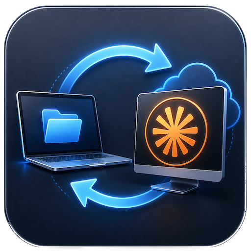

# Aki Dev Sync 🚀

**Aki Dev Sync** là ứng dụng desktop (Command Center) chuyên biệt, tối ưu cho quy trình lập trình **Lạc Việt Anh Workflow** (Local ↔ Remote với AI).



## 📖 Triết Lý: Lạc Việt Anh Workflow

Ứng dụng này giải quyết bài toán chia tách môi trường phát triển để tối đa hóa hiệu suất của AI (Claude) và giữ an toàn tuyệt đối cho source code:

1. **Máy Local (Source of Truth):**
   - Nơi lưu trữ bộ code gốc, chuẩn nhất.
   - Bạn chỉ thực hiện **code nhẹ** và **commit Git** tại đây.

2. **Máy Remote (Engine / AI Workspace):**
   - Nơi chạy AI Assistant (Claude Max) với cấu hình và sức mạnh tính toán cực lớn.
   - Bạn đẩy code lên đây để AI đọc, refactor, tạo file hàng loạt.

3. **Tại sao lại cần đồng bộ cả `.git/` lên Remote?**
   - Mặc dù Local là Source of Truth, ta vẫn đẩy file `.git/` sang Remote. Việc này giúp AI (Claude) trên Remote có thể chạy lệnh Git, đọc diffs, và hiểu chính xác tiến trình công việc của dự án.
   - Quan trọng hơn, khi bạn mở **VSCode Remote SSH** trên máy Remote, cây Git sẽ hiển thị chính xác các trạng thái (Changes/Staged) so với máy Local của bạn, tạo cảm giác mượt mà và liền mạch như đang code 100% trên một máy.

## 🔥 Tính Năng Nổi Bật

### 1. Nút PUSH Thông Minh (Có Checkbox `.git`)
- Nút **PUSH** nay đi kèm một Checkbox `[.git]`.
- **Mặc định (ON):** Đẩy toàn bộ code VÀ thư mục `.git/` lên Remote để Claude có đầy đủ context.
- **Tắt (OFF):** Chỉ đẩy code lên Remote, bỏ qua `.git/` (dành cho những trường hợp đặc biệt không muốn chép đè lịch sử Git trên Remote).

### 2. PUSH SPECIAL (Chỉ đẩy file thay đổi)
- Mở danh sách **những file bị thay đổi** ở máy Local (Modified, Untracked, Deleted).
- "Những file bên đó có rồi thì cần gì, đúng ko?" - Chính xác! Tính năng này cho phép bạn chọn nhanh (multi-select) một vài file vừa sửa để cập nhật sang Remote cho Claude xử lý, tiết kiệm tối đa thời gian quét và đồng bộ.

### 3. PULL Siêu Tốc
- Lấy lại đoạn code tuyệt vời mà Claude vừa viết trên Remote về thẳng máy Local.
- Bạn review nhanh và **Commit trực tiếp** tại Local, hoàn thành chu trình.

### 4. SSH Config Editor (Tích hợp & An Toàn)
- Chỉnh sửa trực tiếp file `~/.ssh/config` ngay trên giao diện (Raw Text Code Editor).
- Tính năng **UNDO (Khôi phục Backup nội bộ)** cứu nguy ngay lập tức nếu lỡ gõ sai cú pháp làm mất kết nối.
- Auto-load danh sách Host tự động.

### 5. Open-Source Ready (Zero Hardcode)
- Codebase được thiết kế chuẩn mực Native Flow, loại bỏ mọi đường dẫn (paths) và biến môi trường cá nhân bị gài cứng.
- Global Logging ghi nhận chi tiết từng Real-time Event (Load, SSH, Git) phục vụ quá trình debug và giám sát.

### 6. Quản Lý Trạng Thái Git Hợp Nhất (Single Flow)
- Gộp toàn bộ lệnh check Git (Clean/Dirty/Ahead), lấy URL Remote và trích xuất lịch sử Commit Log vào một luồng quét native duy nhất.
- Tối ưu hiệu năng tối đa cho mỗi project, giúp mở Modal xem chi tiết tình trạng Git cực nhanh mà không phải chờ đợi hay gọi các luồng phụ chắp vá.

### 7. Giám Sát Quota & Force Sync (AI Agents)
- Theo dõi Real-time % hạn mức sử dụng của Claude Code trên Remote và Antigravity ở Local với thời gian đếm ngược (Relative Time) được tự động quy đổi cực kỳ trực quan dựa theo Absolute Time. Đối với Antigravity ở Local, hệ thống sử dụng cơ chế quét tiến trình native và kết nối Connect RPC trực tiếp siêu tốc, loại bỏ hoàn toàn hiện tượng mất kết nối chập chờn của CLI cũ. Chi tiết xem tại [antigravity-usage.md](docs/ref/antigravity-usage.md).
- **Force Sync Quota (Phá băng Cache):** Bổ sung nút (↻) tự động xuất hiện khi qua chu kỳ reset. Click để chạy ngầm lệnh `claude -m haiku` ở thư mục rỗng `/tmp`. Kỹ thuật này ép server Anthropic trả về Rate Limit Headers chuẩn nhất mà không hề tốn Token đọc Context.

### 8. Cơ Chế An Toàn Khác
- **DRY RUN Toggle:** Công tắc xem trước. Kích hoạt sẽ hiển thị chi tiết lệnh rsync sẽ làm gì mà không chép đè bất cứ byte nào xuống ổ cứng.
- **Sync Status Indicator:** Nút PUSH/PULL tự động sáng lên khi phát hiện có thay đổi cần đồng bộ, mờ đi khi đã gọn. Background polling 60s giữ trạng thái luôn cập nhật mà không cần thao tác thủ công.

→ Implementation detail: `docs/feat/background-refresh.md`

### 9. Open Popup (Trình Mở Nhanh)
- Thay thế các nút mở riêng lẻ bằng một menu popup tập trung duy nhất, xuất hiện khi rê chuột hoặc click vào nút **OPEN** ở cột Actions.
- **Local:** Mở dự án tại Local bằng Finder, Terminal, VSCode, VSCode Insiders, hoặc Antigravity IDE.
- **Remote SSH:** Mở trực tiếp dự án trên máy Remote thông qua kết nối SSH Terminal, VSCode Remote SSH, VSCode Insiders Remote, hoặc Antigravity Remote.
- **Auto Check IDE:** Tự động kiểm tra các IDE đã cài đặt trên máy người dùng (macOS) và làm mờ đi các lựa chọn không khả dụng.
---

## 🛠 Tech Stack
- **Frontend:** Vue 3 + Vite, Vanilla CSS.
- **Backend:** Rust + Tauri v2.
- **Core Engine:** `rsync` và `ssh` native.

## 💻 Development

### Prerequisites (macOS)

Cài Xcode Command Line Tools và Rust:

```bash
xcode-select --install
curl --proto '=https' --tlsv1.2 -sSf https://sh.rustup.rs | sh
```

### Prerequisites (Linux — Ubuntu 22.04 / 24.04)

**1. Cài Rust:**
```bash
curl --proto '=https' --tlsv1.2 -sSf https://sh.rustup.rs | sh
source "$HOME/.cargo/env"
```

**2. Cài system dependencies cho Tauri v2:**
```bash
sudo apt install -y \
  libwebkit2gtk-4.1-dev \
  libjavascriptcoregtk-4.1-dev \
  libsoup-3.0-dev \
  libayatana-appindicator3-dev \
  librsvg2-dev \
  build-essential \
  libssl-dev \
  pkg-config
```

> `build-essential`, `libssl-dev`, `pkg-config` thường đã có sẵn trên máy dev — giữ lại để đảm bảo đủ khi cài fresh.

### Run & Build

```bash
npm install
npm run tauri dev   # Dev (lần đầu build Rust ~5–10 phút)
```
```bash
npm run build:app   # Production build + post-build artifact rename
```

*Thiết kế dành riêng cho tốc độ và quy trình Lạc Việt Anh Workflow.*

---

## ⚠️ Tauri Gotchas & Conventions

Lessons from working with Tauri v2 on a macOS-first app. Recorded to avoid re-discovery.

### Titlebar sacred boundary

`"decorations": false` + `"transparent": true` removes the native titlebar entirely. Every fixed or absolute-positioned element that spans the full window **must** start at `top: var(--titlebar-h)` (42px), never `top: 0`. Covering the drag region makes the window un-movable.

→ Full rule + rationale: `docs/ref/titlebar-sacred-boundary.md`

### Version SSOT — `package.json` only

`tauri.conf.json` sets `"version": "../package.json"`. Do **not** hardcode a version there or sync `Cargo.toml`'s version to track the app release — they are separate concerns. Bump only `package.json`.

### Post-build artifact rename

Raw `npm run tauri build` outputs filenames with spaces (e.g., `Aki Dev Sync_1.2.0_aarch64.dmg`). Use `npm run build:app` instead — it chains `tauri build` and `node scripts/post-build.js` to produce `Aki-DevSync-v1.2.0-arm.dmg` (or `-universal.dmg`).

### IPC capability: silent failures

Every Tauri command — including `@tauri-apps/api/window` calls — must be **granted** in `src-tauri/capabilities/default.json`. A missing entry causes a **silent no-op**: the JS call resolves without error and nothing happens. This was the root cause of the window drag/minimize/close not responding (fixed by adding `core:window:allow-start-dragging`, `core:window:allow-minimize`, `core:window:allow-close`).

### async IPC + blocking subprocess

Tauri runs `async fn` commands on an async executor. Calling `std::process::Command` (blocking) directly inside an `async fn` starves the thread pool — the UI appears frozen until the command returns. Use `tauri::async_runtime::spawn_blocking` for any blocking work inside an `async fn` command.

> History: `run_sync` was temporarily changed to a sync `fn` as a workaround, introducing a different UI freeze. Reverted in v1.1.1 with proper `spawn_blocking`.

### CSP

Never leave `"csp": null` in `tauri.conf.json`. Minimum safe policy:

```json
"csp": "default-src 'self'; img-src 'self' data:; style-src 'self' 'unsafe-inline'; script-src 'self'"
```

### Serde struct fields and old JSON

Adding a field to a Rust struct deserialized from persisted JSON (e.g. `projects.json`) will **silently drop** records missing the new key — unless the field is annotated `#[serde(default)]`. Always add `#[serde(default)]` to new optional fields on persistent structs.

### `#[cfg(target_os = "macos")]` variable scoping

Variables declared **outside** a `#[cfg(target_os = "macos")]` block but only used inside it produce unused-variable warnings on Linux/Windows builds. Declare them **inside** the cfg block.
