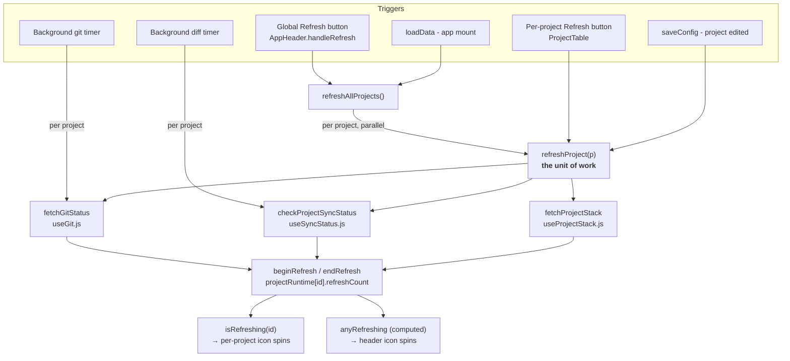
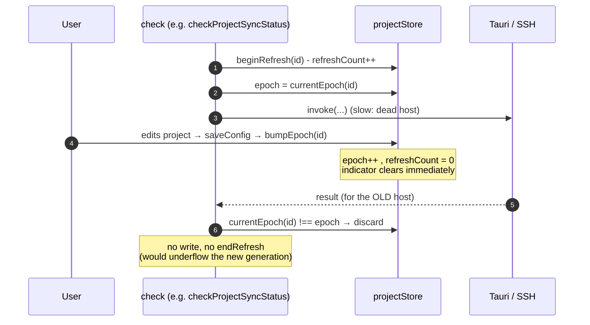
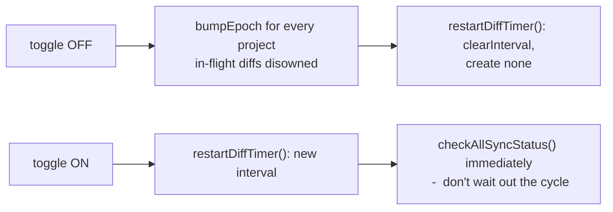

# Refresh Controller - one unit of work, one scheduler

Status layer architecture: how a project's *derived* state (git status, remote diff, dev/build
commands) gets refreshed, who is allowed to trigger it, where the busy indicator comes from, and
how an in-flight check is cancelled.

Source of truth: `src/composables/useBackgroundRefresh.js` (controller) +
`src/store/projectStore.js` (busy counter + generation token).

---

## The bug this architecture exists to prevent

Before this, "refresh" was three unrelated mechanisms that only looked like one feature:

| Trigger | What it actually did | Visible state |
|---|---|---|
| Global Refresh button (`AppHeader`) | `loadData()` - a **full app reload**: re-read `projects.json`, SSH hosts, IDE availability | `isReloading`, a global flag owned by `loadData` |
| Background git/diff timers | ran the real checks | **none** |
| Per-project Refresh button | ran some checks | whatever ad-hoc flag was last bolted on |

Every observed symptom follows from that table, and none of them was an independent bug:

- Buttons dimmed only on the global click - only that path had a flag.
- A ring cycle completed with the per-project icons dead still - that path had no state at all.
- Changing a project's host left it stuck loading the old host - no one owned a check's lifetime.

Adding another per-button flag creates a *fourth* mechanism. The fix had to be structural.

---

## Structure

Three rules hold this together:

1. **One unit of work.** `refreshProject(p)` = a project's three checks, run in parallel. Nothing
   else is "a refresh".
2. **One scheduler.** Both timers live in `useBackgroundRefresh.js`. No component owns a timer.
3. **Busy state belongs to the check, not to its caller.** This is the load-bearing rule - it is
   what makes a background tick light up the per-project icons without any trigger being
   special-cased, and what guarantees the header spinner and the row icons can never disagree
   (they read the same counters).

`loadData()` is an app-load concern again - called once on mount, never by a Refresh button.
Re-reading config from disk and refreshing derived status are different operations.

### Why `refreshCount` is a counter, not a boolean

Three checks are in flight for the same project at once, and they finish at very different times
(local `git` ~50ms vs. two SSH rsync dry-runs). A boolean would be cleared by whichever finished
first, so the icon would stop spinning while the remote diff was still running.

---

## Cancellation - the generation token

`invoke()` returns a plain Promise with no abort handle, so a Tauri call cannot be cancelled. It
can only be **disowned**: let it resolve, then refuse to write its result.

Each project carries `projectRuntime[id].epoch`. Every check captures it *after* `beginRefresh`
and re-checks it after every `await`.

`bumpEpoch()` force-resets `refreshCount` to 0, so the UI clears the instant the *cause* fires
rather than whenever the superseded call happens to resolve.

> **This only ever cancels read-only status checks. An rsync push/pull in progress is never
> touched.** That boundary is the whole point of cancelling at the check layer.

### Who bumps the epoch

| Cause | Where |
|---|---|
| `remote_host` / `local_path` changed | `saveConfig()` - also blanks `hasPendingPush`/`hasPendingPull` (measured against the old host) and re-runs `refreshProject` against the new one |
| Sync check switched off | `toggleSyncCheck()` - every project |
| Project list re-read from disk | `loadData()` - per project, while rebuilding runtime state |
| Project removed | `confirmRemove()` - *implicitly*, see invariant below |

### Invariants (breaking these silently reintroduces the bug)

- **Epoch is monotonic per project.** `loadData()` writes `epoch: (prev?.epoch ?? 0) + 1` - it must
  never reset to a fixed value, or an in-flight check could coincidentally match again.
- **A live project's epoch is always ≥ 1.** `beginRefresh` materializes `epoch ?? 1`. A deleted
  project's `currentEpoch()` reports `0`, which therefore can never equal a captured epoch - that
  is how `confirmRemove()` cancels without touching the epoch at all. Do not "optimize"
  `delete projectRuntime.value[id]` into keeping the entry around.
- **Capture the epoch *after* `beginRefresh`,** never before, or the ≥ 1 guarantee doesn't apply.
- **`endRefresh` only in `finally`, only on an epoch match.** A stale run decrementing the counter
  would underflow the new generation and freeze the icon dim forever.

---

## Sync-check toggle: teardown, not no-op

`restartDiffTimer()` does not create its `setInterval` at all while `syncCheckEnabled` is off, and
a `watch(syncCheckEnabled, …)` tears it down / rebuilds it on every toggle.

Rapid on/off/on is safe by construction: `clearInterval` always precedes any create (so timers
can't accumulate), and `bumpEpoch` resets `refreshCount` to 0 (so counters can't accumulate
either). "Off" means the cycle does not exist, not that the leaf function silently returns.

---

## Related

- `docs/feat/sync-check-and-usage-switches.md` - the switch that surfaced this, and what else it gates
- `docs/feat/background-refresh.md` - what each of the three checks costs and the `.git/` mtime quirk
- `src/store/projectStore.js` - `beginRefresh` / `endRefresh` / `isRefreshing` / `anyRefreshing` / `bumpEpoch` / `currentEpoch`
- `src/composables/useBackgroundRefresh.js` - controller, timers, ring keys
- `src/composables/useGit.js`, `useSyncStatus.js`, `useProjectStack.js` - the three checks
- `src/composables/useProjectConfig.js`, `src/components/AppHeader.vue`, `src/components/ProjectTable.vue` - epoch call sites and the two buttons
