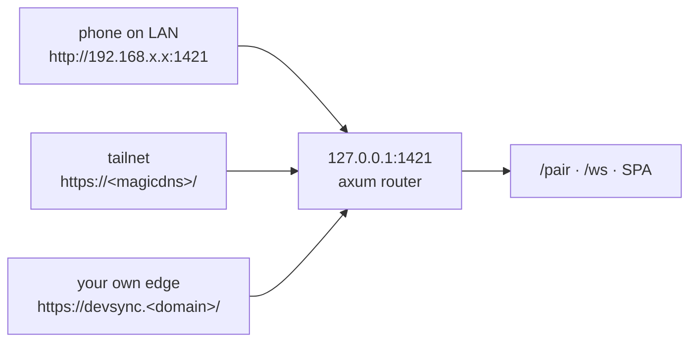

# Remote ingress — one port, swappable edge

> updated 2026-08-22 · v1.28.1

How a phone's request reaches this Mac. Owns three questions: which addresses the app advertises, who is allowed to touch the tailnet's shared 443 mount, and what a caller must prove before it is paired. It does **not** own what happens after the socket is up — the relay protocol, mirroring and PTY transport are `docs/plan/done/remote-control.md`; the user-facing behaviour is `docs/feat/remote-control.md`.

Source of truth: `src-tauri/src/web_server.rs` (ingress state, mount ownership, pairing gate) + `src/composables/useRemoteControl.js` (host-side state) + `src/components/modals/RemoteSettingsModal.vue` (the only UI that configures it).

---

## The invariant

**Every edge terminates at `127.0.0.1:1421`, and nothing above the edge knows which edge it was.** The axum router, `/pair`, the websocket, the mirror and the PTY frames are written against one local port and have no branch on ingress mode. An edge is therefore added or swapped without touching any of them.

The three arrive by different routes and are indistinguishable at `P`. Only the middle one involves Tailscale; Tailscale is an option, never a requirement.

## Modes

One stored setting, `ingress_mode`, with an `origin` that is meaningful in exactly one of them.

| Mode | Advertised addresses | Who terminates TLS | App's role |
|---|---|---|---|
| `tailscale` (default) | LAN + tailnet addresses **derived** from network interfaces (`get_companion_url`), plus `https://<magicdns>/` when the app holds the 443 mount | `tailscaled` | Installs and removes its own 443 handler |
| `public` | LAN addresses, plus the single stored `origin` verbatim | Whatever the owner runs — Cloudflare tunnel, reverse proxy, anything | **None.** The app does not create, manage or verify the edge |

The asymmetry is deliberate: derived addresses are discovered and cannot be wrong; a configured origin is a claim the app cannot check, so it is stored and shown, never probed. In `public` mode the Tailscale probe is skipped entirely on both sides — a failure there would not be a failure.

`get_companion_url` returns a list of `{kind, url}` with `kind` ∈ `lan` | `tailscale` | `public`. The list is data; the UI renders whatever is in it.

## The 443 mount is a shared node resource

`tailscale serve` and `tailscale funnel` write **one per-node config**, and both default to mounting at `/` on 443. Any app on this machine can therefore hold the mount another app wants — this is a property of Tailscale, not a bug in either app.

The contract, enforced at one function so no caller can lose it (`pattern.A8`):

| Situation | Enable | Disable |
|---|---|---|
| Mount vacant | proceeds | no-op |
| Mount proxies `127.0.0.1:1421` (ours) | already on | removes **only that handler** (`serve --https=443 --set-path=/ off`) |
| Mount proxies anything else | **refuses, and names the target** | **no-op** — never clears someone else's handler |

`mount_owner()` reads `tailscale serve status --json` and is the single decision point. A `tailscale` binary that will not run reads as vacant, which is the conservative answer in both directions. The foreign target travels to the UI as `foreignTarget` so the modal can say *who* holds it rather than the app silently stealing it.

Diagnostic outside the app: `scripts/check-tailscale-mount.sh` (read-only).

## Pairing is the trust boundary

The port carries no authorization of its own — on the LAN it is plain HTTP, and in `public` mode it is reachable from the internet. Everything rests on `/pair`.

Two secrets, minted together so no path can hand out one without the other:

| Secret | For | Lifetime |
|---|---|---|
| 6-digit code | typing on a phone | process only |
| `pair_link_token` (long) | a one-tap link, where typing a 6-digit code over a public origin is the weak part | process only, never persisted, cleared on stop |

`judge_pair_attempt(code, ip, now)` returns `Disabled` | `Locked(retry_after)` | `Rejected` | `Accepted`. Failures cost **pairing time, never availability** — the server stays up and paired devices keep working, because on a public origin a penalty that disables the server is an unauthenticated kill switch recoverable only by physical access.

| Guard | Value | Why this shape |
|---|---|---|
| Per-IP failures before lock | 10 | The attacker's own address pays; one address cannot lock out another |
| Global failures before lock | 100 | Backstop against a distributed spray, an order of magnitude above the per-IP budget so it cannot fire first in normal use |
| Lock duration | 300 s | Long enough to make guessing worthless, short enough that the owner is not locked out of his own device |
| Record TTL / cap | 900 s / 512 IPs | The table is bounded memory, not an audit log |

Sizing record (reach, capability, motive, blast radius) with its reopen trigger: `docs/plan/remote-ingress-rework.md` §4.

## Persistence

`companion-server.json` holds the whole ingress decision plus the last explicit on/off choice, written by **one** function (`persist_server_state`) from live state. A writer that emitted a partial object would delete the fields it did not know about — the reason there is exactly one.

Every field is `#[serde(default)]`, so a file written by an older build loads as `{ enabled: false, mode: tailscale, origin: "" }` rather than failing.

## What this layer deliberately does not do

- **It does not manage a tunnel.** No `cloudflared` process is spawned, watched or configured. `public` mode is bring-your-own-edge.
- **It does not issue or renew certificates.** Enabling HTTPS certs for the tailnet stays a one-time step in the Tailscale admin console.
- **It does not depend on the sibling app.** `~/.aki/mcpsv/ingress.json` is read best-effort to prefill a suggested origin; missing, unreadable or unexpected shape yields no suggestion and no error. Dev Sync runs identically where `aki-mcp-sv` was never installed.

Why the two apps share a domain but not a subdomain, a tunnel or a process: `docs/research/remote-ingress-shared-vs-separate.md`.
