```mermaid
sequenceDiagram
    participant Rust as Tauri Rust Backend
    participant Node as Node (Login Shell)
    participant OS as OS Process Table (ps)
    participant LSOF as lsof (Port Scan)
    participant AG as Antigravity Language Server
    
    Rust->>Node: Pipe get-antigravity-usage.js contents
    Node->>OS: Execute 'ps auxww'
    OS-->>Node: Process list stdout
    Node->>Node: Match language_server binary & extract CSRF token / seed port
    Node->>LSOF: Execute 'lsof -nP -iTCP -sTCP:LISTEN -a -p <PID>'
    LSOF-->>Node: List of listening TCP ports
    Node->>AG: Probe ports (POST /GetUnleashData with CSRF)
    AG-->>Node: Response 200/401 (identifies active port)
    
    rect rgb(20, 30, 40)
        Note over Node,AG: Parallel Connect RPC Query
        Node->>AG: Query GetUserStatus (POST)
        Node->>AG: Query RetrieveUserQuotaSummary (POST)
        AG-->>Node: Return email & plan status
        AG-->>Node: Return detailed groups/buckets quota
    end

    Node->>Node: Standardize JSON output (Merge email & quota summary)
    Node-->>Rust: Print JSON output to stdout
    Rust-->>Rust: Parse & return to Vue Frontend
```

# Antigravity IDE Local Proxy Quota Monitoring Reference

This reference document explains the architecture, flow, and implementation details of local quota monitoring for the Google Antigravity IDE in this project.

## Mechanism of Action

The Antigravity IDE (Gemini-based desktop agent coding environment) runs a local native Language Server instance (`language_server_macos_arm`, `language_server_macos_x64`, etc.) which exposes local Connect RPC APIs. 

Instead of making external network requests to Google Cloud Code APIs (which return simulated/dead data with `0%` usage), our tool queries this local server directly to fetch real-time, accurate quota metrics (such as Gemini Pool and Claude/OSS pool status).

## Flow of Action

Quota retrieval is executed by the self-contained Node.js script [get-antigravity-usage.js](file:///Volumes/DEV/Frameworks/Tauri/Aki-Dev-Sync/scripts/get-antigravity-usage.js) compiled directly into the Tauri Rust backend.



### 1. Process Detection
* **Execution:** Runs `ps auxww` on macOS/Unix to output the command list without line truncation.
* **Targeting:** Filters lines containing exact native binary executable names:
  * `language_server_macos_arm` (macOS Apple Silicon)
  * `language_server_macos_x64` (macOS Intel)
  * `language_server_linux_x64` (Linux Intel)
  * `language_server_linux_arm64` (Linux ARM)
  * `language_server_windows_x64.exe` (Windows)
* **Argument Extraction:** Parses the command arguments using regular expressions to extract:
  * `--csrf_token` (Security token required for all Connect RPC queries).
  * `--extension_server_port` (Base extension communication port).

### 2. Port Discovery & Probing
* **TCP Port Detection:** Runs `lsof -nP -iTCP -sTCP:LISTEN -a -p <PID>` to gather active ports listening on the target process ID.
* **Seed Ports:** Seeds the candidate list with the extracted `extensionServerPort` and its adjacent port (`port + 1`).
* **Connection Probing:** Sends POST requests to `/exa.language_server_pb.LanguageServerService/GetUnleashData` containing the CSRF token to check for valid Connect RPC statuses (`200` or `401`).

### 3. API Query & Standardization
* **Parallel Queries:** Performs two Connect RPC queries concurrently using `Promise.all`:
  * `GetUserStatus`: Fetch account information such as `email`.
  * `RetrieveUserQuotaSummary`: Fetch the 4 detailed quota metrics (5h and Weekly buckets for Gemini and Claude/GPT pools).
* **Output Mapping:** Merges the results into a standardized JSON snapshot containing:
  * `email`: User account email.
  * `models`: Autocomplete/model metadata (for backward compatibility).
  * `quotaSummary`: Structured list of groups and buckets, including remaining fractions and reset times.

## Execution Environment

The script is compiled into the Tauri binary via `include_str!` inside [agent_usage.rs](file:///Volumes/DEV/Frameworks/Tauri/Aki-Dev-Sync/src-tauri/src/agent_usage.rs) and executed in a shell using `zsh -lc node` for local targets or `ssh <host> node` for remote targets. 

Using a login shell (`-lc`) is mandatory for desktop GUI execution since GUI apps launched from Finder/Launchpad do not inherit the user's shell profile `PATH` where Node.js is located.

## Stability and Performance

* **Zero Plugin Conflicts:** By targeting the native binary `language_server_` names rather than a generic `"language-server"` search, it avoids false matches with external plugins like Volar's `language-server.js` or `cssServerMain` which run inside the Antigravity IDE directory.
* **Zero CLI Startup Latency:** Directly executing our raw JS script avoids spawning `npx` or updating the NPM package index over the network, bringing detection time down to ~40ms.

---

## Per-Account Cache (localStorage) & Account Dropdown

Antigravity can switch the logged-in account on the same machine, so usage is cached **per email**
in `localStorage` under `aki-antigravity-usage-cache-v2`:

```json
{
  "accounts": {
    "user@a.com": { "data": { ...usage, "email": "user@a.com" }, "fetchedAt": 1751430000 },
    "user@b.com": { "data": { ... }, "fetchedAt": 1751420000 }
  },
  "lastActiveEmail": "user@a.com"
}
```

* **Migration:** the old single-blob key `aki-antigravity-usage-cache` is migrated once (keyed by the
  blob's `data.email`) into the v2 map, then removed. Handled by `loadAgStore()` in `useAgentUsage.js`.
* **Why it also fixes the stale-account bug:** previously the cache was one un-keyed blob. When a live
  fetch returned `null` (the language server restarts right after an account switch — very common),
  the null branch displayed that blob = the *previous* account; whether you saw old or new depended
  on whether the fetch happened to succeed that tick (a race, persisted even across reload). Now the
  null branch deterministically shows the **last-active account's** cache (labeled *Cached*), and the
  next successful fetch overwrites it with the true current account. No more random flips.
* **Account dropdown:** clicking the email in the AG header (`AgentUsage.vue`) opens a dropdown listing
  every cached account with its cached-ago time and a "live" dot on the active one. Selecting a
  non-active account **pins** the view to that account's cache (`isCached` badge shown) while the
  background poll keeps fetching and updating the active account's cache; selecting the live account
  returns to follow-live. State lives in the composable: `accounts`, `viewingEmail`, `activeEmail`,
  `selectAccount()`. The email-blur eye-toggle applies to dropdown rows too.

> **Contrast with Claude Code:** CC deliberately has **no** multi-account cache — exactly one account
> per remote host by design (see `usage-claudecode.md`). Only Antigravity uses this store.

### Design locks (by design — do not "fix")

- **CC has no multi-account cache.** One account per remote host; do not add an AG-style store to CC.
- **`viewingEmail` is not persisted.** Pinning the view to a previous account is transient; every
  reload returns to the follow-live view of the active account.
- **Header shows the local part only.** The header email is truncated to the part before `@`
  (`emailLocal()` in `AgentUsage.vue`) so the header width stays stable when the active/cached account
  changes; the full email is shown in the dropdown rows and the tooltip.
- **AG payload always has an email.** Antigravity authenticates via Google, so a live payload always
  carries `email`; no empty-email guard is added in the live cache path.

---

## Related Source Files

- **Backend / Scripts:**
  - [get-antigravity-usage.js](file:///Volumes/DEV/Frameworks/Tauri/Aki-Dev-Sync/scripts/get-antigravity-usage.js) — Node.js script to probe and fetch Connect RPC metrics.
  - [agent_usage.rs](file:///Volumes/DEV/Frameworks/Tauri/Aki-Dev-Sync/src-tauri/src/agent_usage.rs) — Tauri Rust backend executor command handler.
- **Frontend:**
  - [useAgentUsage.js](file:///Volumes/DEV/Frameworks/Tauri/Aki-Dev-Sync/src/composables/useAgentUsage.js) — Vue frontend composable managing state. Guards: `isSyncing` (forceSync), `isChecking` (checkUsage).
  - [AgentUsageSection.vue](file:///Volumes/DEV/Frameworks/Tauri/Aki-Dev-Sync/src/components/AgentUsageSection.vue) — LOCAL/REMOTE split layout; Antigravity bound to `localHostRef = ref('local')`.
  - [AgentUsage.vue](file:///Volumes/DEV/Frameworks/Tauri/Aki-Dev-Sync/src/components/AgentUsage.vue) — Usage card component. Antigravity header shows full email with eye-toggle visibility.
  - [UsageCircle.vue](file:///Volumes/DEV/Frameworks/Tauri/Aki-Dev-Sync/src/components/UsageCircle.vue) — SVG radial progress circle used for Gemini and Claude/GPT quota buckets.
  - [RefreshRing.vue](file:///Volumes/DEV/Frameworks/Tauri/Aki-Dev-Sync/src/components/RefreshRing.vue) — Countdown ring on the reload button (overlay mode).
