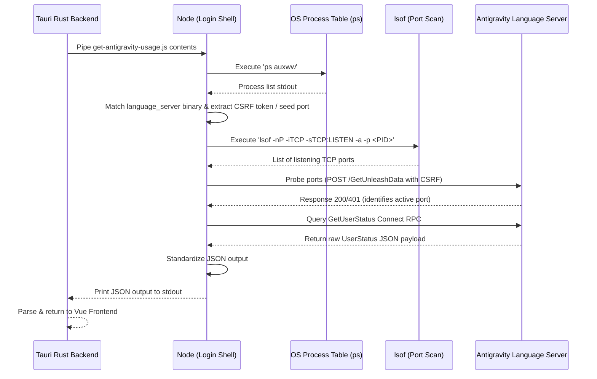

# Antigravity IDE Local Proxy Quota Monitoring Reference

This reference document explains the architecture, flow, and implementation details of local quota monitoring for the Google Antigravity IDE in this project.

## Mechanism of Action

The Antigravity IDE (Gemini-based desktop agent coding environment) runs a local native Language Server instance (`language_server_macos_arm`, `language_server_macos_x64`, etc.) which exposes local Connect RPC APIs. 

Instead of making external network requests to Google Cloud Code APIs (which return simulated/dead data with `0%` usage), our tool queries this local server directly to fetch real-time, accurate quota metrics (such as Gemini Pool and Claude/OSS pool status).

## Flow of Action

Quota retrieval is executed by the self-contained Node.js script [get-antigravity-usage.js](file:///Volumes/DEV/Frameworks/Tauri/Aki-Dev-Sync/scripts/get-antigravity-usage.js) compiled directly into the Tauri Rust backend.

### 1. Process Detection
* **Execution:** Runs `ps auxww` on macOS/Unix to output the command list without line truncation.
* **Targeting:** Filters lines containing exact native binary executable names:
  * `language_server_macos_arm` (macOS Apple Silicon)
  * `language_server_macos_x64` (macOS Intel)
  * `language_server_linux_x64` (Linux Intel)
  * `language_server_linux_arm64` (Linux ARM)
  * `language_server_windows_x64.exe` (Windows)
* **Argument Extraction:** Parses the command arguments using regular expressions to extract:
  * `--csrf_token` (Security token required for all Connect RPC queries).
  * `--extension_server_port` (Base extension communication port).

### 2. Port Discovery & Probing
* **TCP Port Detection:** Runs `lsof -nP -iTCP -sTCP:LISTEN -a -p <PID>` to gather active ports listening on the target process ID.
* **Seed Ports:** Seeds the candidate list with the extracted `extensionServerPort` and its adjacent port (`port + 1`).
* **Connection Probing:** Sends POST requests to `/exa.language_server_pb.LanguageServerService/GetUnleashData` containing the CSRF token to check for valid Connect RPC statuses (`200` or `401`).

### 3. API Query & Standardization
* **User Status Query:** Performs a POST request to `/exa.language_server_pb.LanguageServerService/GetUserStatus` with the header `X-Codeium-Csrf-Token`.
* **Output Mapping:** Converts the raw cascade model configurations into the unified JSON format:
  * `email`: User account email.
  * `models`: Detailed lists of models, reset times, remaining usage fractions, and autocomplete-only markers.

## Execution Environment

The script is compiled into the Tauri binary via `include_str!` inside [agent_usage.rs](file:///Volumes/DEV/Frameworks/Tauri/Aki-Dev-Sync/src-tauri/src/agent_usage.rs) and executed in a shell using `zsh -lc node` for local targets or `ssh <host> node` for remote targets. 

Using a login shell (`-lc`) is mandatory for desktop GUI execution since GUI apps launched from Finder/Launchpad do not inherit the user's shell profile `PATH` where Node.js is located.

## Stability and Performance

* **Zero Plugin Conflicts:** By targeting the native binary `language_server_` names rather than a generic `"language-server"` search, it avoids false matches with external plugins like Volar's `language-server.js` or `cssServerMain` which run inside the Antigravity IDE directory.
* **Zero CLI Startup Latency:** Directly executing our raw JS script avoids spawning `npx` or updating the NPM package index over the network, bringing detection time down to ~40ms.

---

## Related Source Files

- **Backend / Scripts:**
  - [get-antigravity-usage.js](file:///Volumes/DEV/Frameworks/Tauri/Aki-Dev-Sync/scripts/get-antigravity-usage.js) — Node.js script to probe and fetch Connect RPC metrics.
  - [agent_usage.rs](file:///Volumes/DEV/Frameworks/Tauri/Aki-Dev-Sync/src-tauri/src/agent_usage.rs) — Tauri Rust backend executor command handler.
- **Frontend:**
  - [useAgentUsage.js](file:///Volumes/DEV/Frameworks/Tauri/Aki-Dev-Sync/src/composables/useAgentUsage.js) — Vue frontend composable managing state.
  - [AgentUsage.vue](file:///Volumes/DEV/Frameworks/Tauri/Aki-Dev-Sync/src/components/AgentUsage.vue) — Component representing the usage card on UI.
