# Antigravity IDE Local Proxy Quota Monitoring Reference

This reference document explains the architecture, flow, and implementation details of local quota monitoring for the Google Antigravity IDE & CLI in this project.

> **Updated 2026-07-22:** Multi-Surface Integration (v1.17.0: Antigravity Desktop App `AG`, IDE `IDE`, CLI `CLI`). See [docs/plan/done/1.17.0-ag-multi-surface.md](../plan/done/1.17.0-ag-multi-surface.md).

## Mechanism of Action

The Antigravity IDE (Gemini-based desktop agent coding environment) runs a local native Language Server instance (`language_server_macos_arm`, `language_server_macos_x64`, etc.) which exposes local Connect RPC APIs. 

Instead of making external network requests to Google Cloud Code APIs (which return simulated/dead data with `0%` usage), our tool queries this local server directly to fetch real-time, accurate quota metrics (such as Gemini Pool and Claude/OSS pool status).

## Flow of Action

Quota retrieval is executed by the self-contained Node.js script [get-antigravity-usage.js](../../scripts/get-antigravity-usage.js) compiled directly into the Tauri Rust backend.

```mermaid
sequenceDiagram
    participant Rust as Tauri Rust Backend
    participant Node as Node (Login Shell)
    participant OS as OS Process Table (ps)
    participant LSOF as lsof (Port Scan)
    participant AG as Antigravity Language Server
    
    Rust->>Node: Pipe get-antigravity-usage.js contents
    Node->>OS: Execute 'ps auxww'
    OS-->>Node: Process list stdout
    Node->>Node: Match language_server binary & extract CSRF token / seed port
    Node->>LSOF: Execute 'lsof -nP -iTCP -sTCP:LISTEN -a -p <PID>'
    LSOF-->>Node: List of listening TCP ports
    Node->>AG: Probe ports (POST /GetUnleashData with CSRF)
    AG-->>Node: Response 200/401 (identifies active port)
    
    rect rgb(20, 30, 40)
        Note over Node,AG: Parallel Connect RPC Query
        Node->>AG: Query GetUserStatus (POST)
        Node->>AG: Query RetrieveUserQuotaSummary (POST)
        AG-->>Node: Return email & plan status
        AG-->>Node: Return detailed groups/buckets quota
    end

    Node->>Node: Standardize JSON output (Merge email & quota summary)
    Node-->>Rust: Print JSON output to stdout
    Rust-->>Rust: Parse & return to Vue Frontend
```



### 1. Process Detection (Multi-Instance: IDE & CLI agy)
* **Execution:** Runs `ps auxww` on macOS/Unix to output the command list without line truncation.
* **Targeting:** Detects both Antigravity IDE and standalone `agy` CLI processes running simultaneously:
  * **IDE Language Server binaries:** `language_server_macos_arm`, `language_server_macos_x64`, `language_server_linux_x64`, `language_server_linux_arm64`, `language_server_windows_x64.exe` (with `--csrf_token` and `--extension_server_port`).
  * **AGY CLI binary:** Standalone `agy` process instances listening on local Connect RPC HTTPS ports.
* **Argument Extraction:** Parses the command arguments using regular expressions to extract:
  * `--csrf_token` (Security token required for IDE Connect RPC queries).
  * `--extension_server_port` (Base extension communication port for IDE).

### 2. Port Discovery & Probing
* **TCP Port Detection:** Runs `lsof -nP -iTCP -sTCP:LISTEN -a -p <PID>` to gather active ports listening on each target process ID (both IDE and CLI).
* **Seed Ports:** Seeds candidate lists with extracted `extensionServerPort` and adjacent ports (`port + 1`).
* **Connection Probing:** Sends POST requests to `/exa.language_server_pb.LanguageServerService/GetUnleashData` (probing HTTPS and HTTP) to check for valid Connect RPC statuses (`200` or `401`).

### 3. API Query & Standardization
* **Parallel Queries:** Performs two Connect RPC queries concurrently using `Promise.all`:
  * `GetUserStatus`: Fetch account information such as `email`.
  * `RetrieveUserQuotaSummary`: Fetch the 4 detailed quota metrics (5h and Weekly buckets for Gemini and Claude/GPT pools).
* **Output Mapping:** Merges the results into a standardized JSON snapshot containing:
  * `email`: User account email.
  * `models`: Autocomplete/model metadata (for backward compatibility).
  * `quotaSummary`: Structured list of groups and buckets, including remaining fractions and reset times.

## Signed-Out Detection & usage-flow stability (fixed 2026-07-03, 1.9.1)

When the user is signed out while the language server is still running, `GetUserStatus` does **not**
reliably return `401`. On the current Antigravity build it returns **HTTP `500`** with body
`{"code":"unknown","message":"GetCascadeModelConfigData() is nil"}` - the server answers, but has
no session, so the account-derived model config is nil (empirically verified on this machine after
a real logout). The earlier code assumed signed-out == `401`, so it mislabeled this as a generic
connection failure. `get-antigravity-usage.js` still uses `Promise.allSettled` to keep the raw
rejection reason, and now classifies **both** signatures as signed-out:

- classic: HTTP `401` / `unauthorized`
- current: HTTP `500` matching `is nil` / `GetCascadeModelConfigData`

**Root cause of the "usage keeps erroring / unstable" report:** the probe script itself is 100%
stable while the IDE runs (measured 8/8, ~175 ms). The instability was purely in error surfacing:
`agent_usage.rs::get_antigravity_usage` only swallowed `"is not running"` / `"Not authenticated"`
/ `"command not found"` to `Ok(None)`, and returned `Err` for every other transient case - port
not open yet, IDE mid-restart, a single RPC timeout, and the signed-out `500`. Each `Err` set
`error.value` in `useAgentUsage.js`, flashing an error banner every poll. AG usage is a best-effort
monitor and the frontend already has a graceful null path (show the last cached account), so
`get_antigravity_usage` now swallows **any** non-zero script exit to `Ok(None)` and logs the reason
at debug level. Result: transient/offline/signed-out states show the cached account (or the
"Not connected - open & sign in to Antigravity to monitor" empty state), never a repeating banner.

## Log Out (fixed 2026-07-03, v1.9.x → next)

Antigravity's account dropdown (in `AgentUsage.vue`, opened by clicking the email) has a **Log Out**
row that calls the `logout_antigravity` Tauri command.

**Where the credential actually lives (empirically verified on this machine).** The live OAuth
session is stored in VS Code's globalState SQLite store,
`User/globalStorage/state.vscdb`, in the `ItemTable` under two keys:

- `antigravityUnifiedStateSync.oauthToken` (~1 KB)
- `antigravityUnifiedStateSync.userStatus` (~8 KB - account/email/quota)

These values are **not** Electron `safeStorage` ciphertext - they carry no `v10`/`v11` prefix
(inspected without materializing the token; first byte `0x43` = base64 protobuf, the Connect-RPC
wire form). The earlier theory that the token was `safeStorage`-encrypted and that deleting the
`"Antigravity IDE Safe Storage"` Keychain item made it "permanently undecryptable" was **wrong**:
because the token isn't encrypted with that key, wiping cookies + the Keychain item left the token
fully readable, so the IDE re-read it on next launch and silently signed back in. That was the
"logout does nothing" bug in 1.9.

`logout_antigravity` now:

1. Quits the app (`osascript quit app` then `pkill -f` fallback) so nothing holds the files open.
2. Deletes the account-only Chromium files (`ANTIGRAVITY_ACCOUNT_ONLY_PATHS`).
3. **Deletes the two auth rows** (`ANTIGRAVITY_AUTH_KEYS`) from `state.vscdb` **and** `state.vscdb.backup`
   (Antigravity restores from the backup if the primary is missing) via the system `/usr/bin/sqlite3`
   - `remove_antigravity_auth_rows()`. This is what actually forces re-login. A `DELETE ... WHERE key IN (...)`
   touches only those two rows and leaves all other globalState intact (verified: 2 keys removed, 1632 rows preserved).
4. Deletes the `"Antigravity IDE Safe Storage"` Keychain item (defense-in-depth - harmless, and covers
   any future build that *does* move to `safeStorage`).

`User/` (settings, keybindings, snippets, extensions, workspaceStorage) and the rest of
`globalStorage/` are never touched, so extensions, rules, and permissions survive a logout intact.

## Execution Environment

The script is compiled into the Tauri binary via `include_str!` inside [agent_usage.rs](../../src-tauri/src/agent_usage.rs) and executed in a shell using `zsh -lc node` for local targets or `ssh <host> node` for remote targets. 

Using a login shell (`-lc`) is mandatory for desktop GUI execution since GUI apps launched from Finder/Launchpad do not inherit the user's shell profile `PATH` where Node.js is located.

## Stability and Performance

* **Zero Plugin Conflicts:** By targeting the native binary `language_server_` names rather than a generic `"language-server"` search, it avoids false matches with external plugins like Volar's `language-server.js` or `cssServerMain` which run inside the Antigravity IDE directory.
* **Zero CLI Startup Latency:** Directly executing our raw JS script avoids spawning `npx` or updating the NPM package index over the network, bringing detection time down to ~40ms.

---

## Per-Account Cache (localStorage) & Account Dropdown

Antigravity can switch the logged-in account on the same machine, so usage is cached **per email**
in `localStorage` under `aki-antigravity-usage-cache-v2`:

```json
{
  "accounts": {
    "user@a.com": { "data": { ...usage, "email": "user@a.com" }, "fetchedAt": 1751430000 },
    "user@b.com": { "data": { ... }, "fetchedAt": 1751420000 }
  },
  "lastActiveEmail": "user@a.com"
}
```

* **Migration:** the old single-blob key `aki-antigravity-usage-cache` is migrated once (keyed by the
  blob's `data.email`) into the v2 map, then removed. Handled by `loadAgStore()` in `useAgentUsage.js`.
* **Why it also fixes the stale-account bug:** previously the cache was one un-keyed blob. When a live
  fetch returned `null` (the language server restarts right after an account switch - very common),
  the null branch displayed that blob = the *previous* account; whether you saw old or new depended
  on whether the fetch happened to succeed that tick (a race, persisted even across reload). Now the
  null branch deterministically shows the **last-active account's** cache (labeled *Cached*), and the
  next successful fetch overwrites it with the true current account. No more random flips.
* **Account dropdown:** clicking the email in the AG header (`AgentUsage.vue`) opens a dropdown listing
  every cached account with its cached-ago time and a "live" dot on the active one. Selecting a
  non-active account **pins** the view to that account's cache (`isCached` badge shown) while the
  background poll keeps fetching and updating the active account's cache; selecting the live account
  returns to follow-live. State lives in the composable: `accounts`, `viewingEmail`, `activeEmail`,
  `selectAccount()`. The email-blur eye-toggle applies to dropdown rows too.

> **Contrast with Claude Code:** CC deliberately has **no** multi-account cache - exactly one account
> per remote host by design (see `usage-claudecode.md`). Only Antigravity uses this store.

## Smart Multi-Environment Logout (`logout_antigravity` vs `logout_antigravity_cli`)

To support simultaneous multi-account monitoring across Antigravity IDE and AGY CLI, logout is environment-aware:

1. **Antigravity IDE (`sourceType: "ide"`):**
   - Command: `logout_antigravity`
   - Action: Quits `Antigravity IDE.app` (`osascript` / `pkill`) and wipes OAuth session rows (`antigravityUnifiedStateSync.oauthToken` and `.userStatus`) from SQLite `state.vscdb` (`~/Library/Application Support/antigravity-ide/User/globalStorage/state.vscdb`).
   - UI: Dropdown displays `<i class="fa-solid fa-right-from-bracket"></i> Log Out IDE`.
2. **AGY CLI (`sourceType: "cli"`):**
   - Command: `logout_antigravity_cli`
   - Action: Terminates `agy` CLI binary processes (`pkill -f agy`) and removes CLI credential files (`oauth_creds.json`, `google_accounts.json`, `state.json`) from `~/.gemini/`.
   - UI: Dropdown displays `<i class="fa-solid fa-terminal"></i> Log Out CLI`.

Both commands trigger `@logout-success`, causing all active usage slots to self-heal and fall back cleanly to remaining active accounts.

## Dynamic N-Tier Grid Architecture (`usageTierStore.js` & `AgentUsageSection.vue`)

The usage section uses a declarative, standardized N-Tier slot architecture:

* **Declarative Schema (`ALL_TIER_ROWS`):** Slots are modeled declaratively as rows of slot configurations (`Slot A` & `Slot B` for Tier 1; `Slot C` & `Slot D` for Tier 2).
* **Zero Template Duplication:** A nested `v-for` renders `activeTierRows` dynamically based on `tierCount`. Adding N tiers requires zero HTML template edits.
* **User Control:** The App Titlebar Menu (☰) includes a 1 Tier / 2 Tiers toggle, persisting the preference in `localStorage` (`aki-usage-tier-count`).

## Log Out behavior & cache retention (PO decision, chốt 2026-07-07 - nguồn chân lý)

**Mục tiêu của cache multi-account**: xem được hiện trạng lần cuối (last-known state) của **từng**
account, vì AG native chỉ hiển thị được 1 account tại 1 thời điểm. Cache tồn tại để bù đắp đúng giới
hạn đó - không phải để "dọn dẹp" hay "ẩn" tài khoản không còn active.

- **Sau khi Log Out 1 account trong app**: header hiện **như bình thường** - không có xử lý đặc biệt,
  không blank/reset về trạng thái trống. `resetAccount()` chỉ kích một lần `checkUsage()` ngay (đẩy
  nhanh việc phát hiện account mới nếu người dùng sắp login lại) - **không** xóa `data`, `activeEmail`,
  `viewingEmail`, hay bất kỳ entry nào trong `accounts`. Chấm "live" (`ag-live-dot`) đã tự nhiên di
  chuyển sang account mới active ngay khi nó có live fetch đầu tiên - không cần thêm indicator/badge
  riêng cho "account này vừa logout".
- **Thời hạn giữ trong dropdown: vô hạn.** Không có cơ chế dọn theo thời gian/số lượng. Một account đã
  từng xuất hiện thì luôn có mặt trong dropdown cho tới khi bị dọn thủ công (không có UI cho việc này
  ở v1 - nếu cần, đó là yêu cầu riêng).
- **Hiển thị "hiện trạng lần cuối": tooltip hiện tại là đủ** (`cachedAgo`/`cachedAbsTime` trong
  `AgentUsage.vue`) - không cần thêm timestamp tường minh ở dòng dropdown.

### Lịch sử - vì sao mục này tồn tại (tránh tái phạm)

1.9.3 (`a26b8f5` -> `b082d0d`) từng thêm `resetAccount()` gọi `clearAgStore()` để giải quyết vấn đề
"header vẫn hiện account vừa logout" - nhưng đó **không phải là bug** theo mục tiêu thật của tính năng
(xem đầu mục này), và cách giải quyết (xóa toàn bộ store) là một regression nghiêm trọng: mỗi lần
logout xóa sạch lịch sử mọi account, không chỉ account vừa logout. Đã sửa 2026-07-07: `resetAccount()`
không còn xóa gì, chỉ trigger recheck. Xem mục "Regression Guard - Multi-entity State" trong
`CLAUDE.md` (repo root) cho nguyên tắc chung rút ra từ sự việc này.

### Design locks (by design - do not "fix")

- **CC has no multi-account cache.** One account per remote host; do not add an AG-style store to CC.
- **`viewingEmail` is not persisted.** Pinning the view to a previous account is transient; every
  reload returns to the follow-live view of the active account.
- **Header shows the local part only.** The header email is truncated to the part before `@`
  (`emailLocal()` in `AgentUsage.vue`) so the header width stays stable when the active/cached account
  changes; the full email is shown in the dropdown rows and the tooltip.
- **AG payload always has an email.** Antigravity authenticates via Google, so a live payload always
  carries `email`; no empty-email guard is added in the live cache path.
- **Logout never clears the account cache or blanks the header.** See "Log Out behavior & cache
  retention" above - this is a deliberate product decision, not a gap to "fix" later.
- **10-Day Eviction TTL on cached accounts (v1.16.1):** Account records with `fetchedAt` older than 10 days (`> 864,000s`) are automatically evicted during `loadAgStore()` to prevent indefinite accumulation of obsolete sessions.

---

## Related Source Files

- **Backend / Scripts:**
  - [get-antigravity-usage.js](../../scripts/get-antigravity-usage.js) - Node.js script to probe and fetch Connect RPC metrics.
  - [agent_usage.rs](../../src-tauri/src/agent_usage.rs) - Tauri Rust backend executor command handlers (`logout_antigravity`, `logout_antigravity_cli`).
- **Frontend Stores & Composables:**
  - [useAgentUsage.js](../../src/composables/useAgentUsage.js) - Vue frontend composable managing state and multi-account persistence.
  - [usageTierStore.js](../../src/store/usageTierStore.js) - Reactive store managing 1 Tier / 2 Tiers layout preference.
- **UI Components:**
  - [AgentUsageSection.vue](../../src/components/AgentUsageSection.vue) - Owns usage sources and dynamically renders declarative N-Tier slot rows.
  - [AgentUsageSlot.vue](../../src/components/AgentUsageSlot.vue) - Independent display slot component supporting per-slot account viewing state.
  - [AgentUsage.vue](../../src/components/AgentUsage.vue) - Usage card component featuring dynamic IDE/CLI icon, cyan/purple live dots, and environment-aware logout.
  - [UsageCircle.vue](../../src/components/UsageCircle.vue) - SVG radial progress circle used for Gemini and Claude/GPT quota buckets.
  - [RefreshRing.vue](../../src/components/RefreshRing.vue) - Countdown ring on the reload button (overlay mode).
