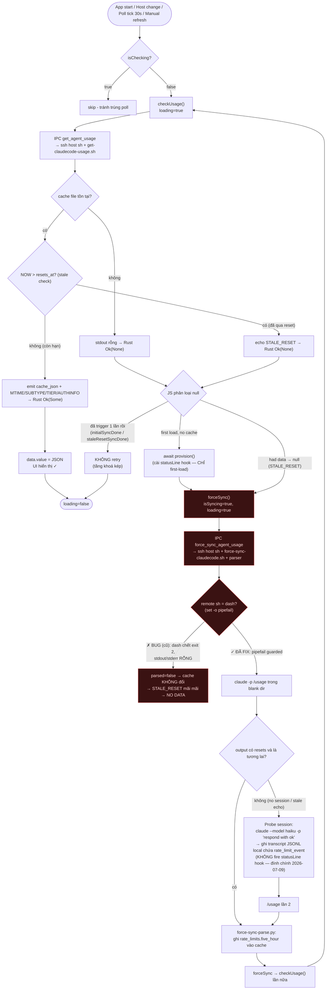

# Kiến trúc Theo dõi & Đồng bộ Usage Claude Code

Tài liệu này đúc kết toàn bộ cơ chế, các giới hạn kỹ thuật từ phía Anthropic/Claude CLI, và giải pháp kiến trúc "Hybrid Patching" mà Aki Dev Sync sử dụng để quản lý Quota (Hạn mức) của Claude Code một cách chính xác 100% mà không gây hao tốn token.

## 1. Bản chất của hệ thống Telemetry trong Claude Code

Claude Code CLI (một tool Node.js) sử dụng cơ chế **hook ngầm** có tên là `statusLine` để xuất (export) dữ liệu Telemetry dưới dạng JSON ra ngoài sau mỗi lượt (turn) tương tác với LLM.
- Hook này được định nghĩa trong `~/.claude/settings.json` bằng trường `"statusLine"`.
- Dữ liệu JSON xuất ra chứa các thông tin quý giá: Tổng token (input/output), cost, context window, thông tin thư mục làm việc, và quan trọng nhất là `rate_limits` (Hạn mức API do Anthropic trả về).
- **Chỉ hoạt động với tài khoản Claude.ai Pro/Max** — không áp dụng cho API key thông thường.

App của chúng ta đọc dữ liệu này thông qua một bash script `~/.claude/statusline-command.sh` (được cấu hình để hứng `stdin` từ Claude CLI và ghi ra file `~/.claude/rate-limits-cache.json`). Hàm `get_agent_usage` (Rust Backend) định kỳ đọc file này lên UI.

### JSON Payload Structure

Dữ liệu `stdin` của `statusLine` hook có cấu trúc:

```json
{
  "rate_limits": {
    "five_hour":  { "used_percentage": 42, "resets_at": 1782034800 },
    "seven_day":  { "used_percentage": 18, "resets_at": 1782288000 }
  },
  "cwd": "/home/user/project",
  "transcript_path": "/home/user/.claude/projects/..."
}
```

- `resets_at`: Unix epoch seconds, UTC.
- `used_percentage`: Phần trăm đã dùng trong cửa sổ thời gian tương ứng.
- `statusLine` hook được gọi tự động sau **mỗi turn** — đây là số liệu thật từ server, không phải ước lượng.

### Local File Layout on Remote Machine

```
~/.claude/settings.json              → Cấu hình, trỏ đến statusLine script
~/.claude/statusline-command.sh      → Script nhận stdin JSON từ Claude Code
~/.claude/rate-limits-cache.json     → File cache (do chúng ta tạo bằng cách dump stdin)
~/.claude/.credentials.json          → OAuth credentials (subscriptionType, rateLimitTier, accessToken)
                                        — ⚠️ có thể KHÔNG tồn tại trên bản Claude Code mới (credential
                                        storage đã chuyển sang OS keychain); xem fallback bên dưới.
~/.claude/auth-cache.json            → Auth info cache (email, orgName) — ghi bởi `provision-claudecode.sh`
                                        (mỗi host session) và làm mới bởi `get-claudecode-usage.sh`
                                        (TTL 300s, force-refresh ở lần check đầu mỗi app-launch từ 1.9.7)
~/.claude/projects/**/*.jsonl        → Transcript files (fallback ước lượng token nếu cần)
```

### Local Machine Monitoring (no SSH)

Claude Code có thể được theo dõi ngay trên máy đang chạy Aki Dev Sync, không cần SSH tới remote nào.
`run_interpreter_timeout()` (Rust, `agent_usage.rs` — tên cũ `run_remote_script_timeout` được tổng quát
hoá 2026-07-18 để dùng chung cho cả CC lẫn AG, xem §3d) kiểm tra `is_local_host(host)`
(`host == "local" || "localhost"`) và rẽ nhánh theo `Interpreter` (`Sh` cho CC, `Node` cho AG): local thì
spawn trực tiếp (`sh` cho CC, `zsh -lc node` cho AG — login shell để resolve `node` qua nvm), remote thì
`ssh host sh`/`ssh host node`. Cùng một script POSIX `sh` chạy được cả hai đường CC vì nó chỉ đụng
`$HOME` — không cần sửa gì ở `scripts/*.sh`. `get_antigravity_usage()` gọi qua `run_remote_node_timeout()`
(wrapper mỏng quanh cùng hàm, `Interpreter::Node`) — trước 1.12.0 hàm này tự spawn + `wait_with_output()`
KHÔNG có timeout, một SSH/local probe treo (blackhole mạng) làm kẹt `isChecking` phía JS vĩnh viễn; nay
bound bởi `REMOTE_SCRIPT_TIMEOUT_SECS` (30s) như CC — xem §3d.
Ở tầng UI, nguồn "Claude Code (local)" và "Claude Code (remote)" là hai instance độc lập của
`useAgentUsage()`, mỗi cái tự bật/tắt polling qua flag `enabled` riêng — xem `docs/feat/remote-mode.md`
cho cách nguồn remote được gate bởi công tắc Remote Mode toàn cục.

### Subscription Tier Fallback — `claude auth status` (2026-07-03)

Trên các bản Claude Code mới, `~/.claude/.credentials.json` không còn tồn tại (credential storage
chuyển sang OS keychain) → `SUB_TYPE`/`TIER` luôn `Unknown` → badge PRO/Max biến mất dù usage % vẫn đọc
đúng (usage đọc từ `rate-limits-cache.json`, file khác, không liên quan). `claude auth status` (đã được
gọi sẵn trong script để lấy email/org) trả về `subscriptionType` trực tiếp trong JSON, không phụ thuộc
file credentials. `get-claudecode-usage.sh` giờ chạy khối "Auth info" **trước** khối "subscription
metadata": nếu đọc từ `.credentials.json` ra `Unknown`, thử parse `subscriptionType` từ output
`claude auth status` (đã cache ở `auth-cache.json`) trước khi kết luận `Unknown`. `rateLimitTier` không
có nguồn thay thế nên vẫn `Unknown` nếu file credentials thiếu — chỉ ảnh hưởng phần "5x/20x" chi tiết,
không ảnh hưởng badge Pro/Max chính.

### Self-Provisioning Logic

Vì dữ liệu thật chỉ tồn tại thoáng qua trong `stdin` khi `statusLine` script chạy, chúng ta phải persist nó:

1. SSH vào remote host và patch `statusline-command.sh` bằng script [provision-claudecode.sh](file:///Volumes/DEV/Frameworks/Tauri/Aki-Dev-Sync/scripts/provision-claudecode.sh).
2. Đọc `~/.claude/statusline-command.sh`.
3. Kiểm tra chuỗi `rate-limits-cache`.
4. Nếu chưa có: dùng `sed` để inject đoạn mã jq + bash ngay sau dòng `input=$(cat)`. File tạm `/tmp/patch.sh` được dọn dẹp qua `trap EXIT`; file `.bak` của `sed -i.bak` cũng được xóa ngay.
5. Nếu đã có: bỏ qua (idempotent).
6. **Auth Info (v1.3.0):** Cuối `provision-claudecode.sh`, chạy `bash -lc 'claude auth status'` (login shell đảm bảo PATH có `claude`), ghi kết quả JSON vào `~/.claude/auth-cache.json`. Chạy một lần mỗi host session. Từ 1.9.7, `get-claudecode-usage.sh` bổ sung TTL 300s + force-refresh ở lần check đầu mỗi app-launch để tự làm mới file này giữa các session — xem §2 Lỗi email account-switch.
7. Từ đó trở đi: đọc `~/.claude/rate-limits-cache.json` qua SSH bằng script [get-claudecode-usage.sh](file:///Volumes/DEV/Frameworks/Tauri/Aki-Dev-Sync/scripts/get-claudecode-usage.sh).

---

## 2. Vấn đề giới hạn kỹ thuật (Technical Limitations)

Trong quá trình sử dụng thực tế, chúng ta đã phát hiện 2 điểm mù (Blind Spots) của Claude CLI và API Anthropic:

### Lỗi A: Hội chứng "Mất tích" Rate Limits (turn thiếu `rate_limits`)
Claude Code CLI thỉnh thoảng **CẮT BỎ** cục `rate_limits` khỏi luồng JSON truyền vào `statusLine`. Điều này xảy ra khi chạm nóc Quota (HTTP `429`) — nhưng **cũng xảy ra ở nhiều turn bình thường**, không chỉ lúc cạn quota.
- **Hệ quả:** File cache bị mất key `rate_limits`, UI của App không đọc được % và thời gian reset, dẫn đến việc thanh Progress Bar biến mất hoàn toàn.
- **⚠️ Bẫy của cách vá cũ (v1):** Bản vá đầu tiên ép `used_percentage = 100` cho mọi window mỗi khi turn thiếu `rate_limits`. Vì turn thiếu key này xảy ra cả khi **chưa** cạn quota, cache bị ghi 100% giả → UI **nhấp nháy đỏ 100%** rồi tự sửa ở turn kế. Bản vá **v2** khắc phục bằng cách **giữ nguyên `rate_limits` cũ** (merge verbatim) thay vì fabricate — xem §3.

### Lỗi B: Sự cố đồng bộ Quota khi chạy ngầm qua SSH
App chạy ngầm `claude --model haiku -p /usage` để cố lấy thông tin quota. Trong thực tế triển khai, lệnh này đã gặp phải 2 sự cố kỹ thuật:
- **Trễ 3 giây do thiếu `< /dev/null`:** Khi chạy qua SSH subshell không phải TTY, Claude CLI sẽ chờ nhập liệu từ stdin trong 3 giây trước khi xử lý tiếp, in cảnh báo ra stderr. Do đó, quá trình đồng bộ bị trễ từ ~2s lên hơn 5s.
- **Parser bị sập khi Quota Reset (0% used):** Khi quota reset hoàn toàn (hoặc chưa tiêu tốn token nào), output của `/usage` trả về `Current session: 0% used` và **không kèm theo** mốc thời gian reset kế tiếp. Do regex parser cũ quá cứng nhắc, việc không khớp chuỗi thời gian dẫn đến lỗi parse, khiến file cache không được cập nhật. Kết hợp với logic vô hiệu hóa cache cũ khi qua giờ reset, UI sẽ bị kẹt vĩnh viễn ở trạng thái "No data - waiting for next session".

### Lỗi C: Điểm mù freshness — usage đứng im khi chỉ dùng Claude app (xác nhận 2026-07-07)

Pool usage của Pro/Max là **chung toàn tài khoản** (claude.ai app, Desktop, mobile, Cowork, Claude Code
— Anthropic xác nhận chính thức). `rate_limits` mà statusLine hook nhận được vì vậy **đã bao gồm app
usage** — nhưng hook chỉ fire **theo từng turn của Claude Code**. Khi người dùng chỉ dùng Claude app
(incident thực tế 2026-07-07: dùng Cowork cả ngày, không mở CC), không có turn nào → cache không được
ghi mới → UI đứng im ở con số của turn CC cuối cùng, dù quota thật đang bị app tiêu.

- Nhánh force-sync `/usage` **không cứu được**: nó là họ P2 (local JSONL), hoàn toàn mù với app usage.
- Probe session cứu được reset-time (tạo turn thật; turn đó **tự mang** `rate_limit_event.resetsAt`
  trong response) nhưng chỉ chạy ở STALE_RESET/first-load — không phải cơ chế refresh định kỳ.
  ⚠️ **ĐÍNH CHÍNH 2026-07-09:** probe **KHÔNG** fire statusLine hook (headless `-p` không render
  status line) — xem block cập nhật cuối §2 và `docs/research/claude-headless-rate-limit-event-2026-07-09.md`.
- **Fixed by P3 writer (Phase 1 code landed 2026-07-07, chưa Mac-verify):** `scripts/get-claudecode-usage.sh`
  poll `GET https://api.anthropic.com/api/oauth/usage` (OAuth token từ `~/.claude/.credentials.json`,
  header `anthropic-beta: oauth-2025-04-20` + `User-Agent: claude-code/2.1.0` bắt buộc) TRƯỚC
  stale-check, gate 60s, merge vào cùng cache statusLine hook ghi. Server-side, account-level, realtime,
  không tốn quota, không cần turn CC. Khi oauth khỏe, force-sync/probe trở thành unreachable tự nhiên
  (không sửa, không xóa) — candidate xóa ở Phase 2 (xem plan). Chi tiết thiết kế, rủi ro, checklist
  recon còn mở: `docs/plan/claudecode-oauth-usage-p3.md`; tool cộng đồng tham khảo:
  `docs/research/claude-app-usage-measurement.md`.

**⚠️ Giới hạn quan trọng của `/usage` (xác nhận 2026-06-24):** Lệnh `/usage` **KHÔNG** thực hiện network call đến Anthropic API. Output của nó ghi rõ: *"Approximate, based on local sessions on this machine — does not include other devices or claude.ai"*. Tức là nó **chỉ đọc file JSONL local** (`~/.claude/projects/**/*.jsonl`) rồi tính toán locally — là **họ P2**, không phải P3. Kết quả:
- Chỉ phản ánh session trên chính máy `bien`, không phản ánh tài khoản tổng thể.
- Nếu người dùng khác dùng Claude Code trên máy khác, `/usage` trên `bien` **không thay đổi**.
- `0% used` + không có `resets_at` là **chính xác** khi không có session local nào trong 5 giờ qua, dù tài khoản thực tế có thể đã dùng nhiều trên thiết bị khác.


---

## 3. Kiến trúc Giải pháp: "Hybrid Patching"

Để vượt qua các giới hạn trên, Aki Dev Sync áp dụng giải pháp **Hybrid Patching** (Vá thông minh kết hợp 2 luồng) được xử lý ngay từ tầng Rust Backend bằng Python và Bash script qua SSH.

### Luồng Bị động (Passive Flow - Quá trình Provision)
Bắt trọn mọi hoạt động chat của User và đề phòng Lỗi A.
- Khi người dùng kết nối, lệnh [provision_agent_usage](file:///Volumes/DEV/Frameworks/Tauri/Aki-Dev-Sync/src-tauri/src/agent_usage.rs) sẽ tiêm (inject) một đoạn mã jq + bash thông minh vào script `statusline-command.sh` trên máy chủ từ xa thông qua [provision-claudecode.sh](file:///Volumes/DEV/Frameworks/Tauri/Aki-Dev-Sync/scripts/provision-claudecode.sh).
- **Thuật toán (v2):** Nếu luồng JSON của Claude đẩy ra *KHÔNG CÓ* `rate_limits`, script chui vào file `rate-limits-cache.json` cũ và **merge nguyên vẹn** cục `rate_limits` cũ (cả `used_percentage` lẫn `resets_at`) vào JSON mới rồi ghi ra file — **không fabricate** giá trị. Khi cạn quota thật, % cuối cùng thường ≥90 nên UI vẫn đỏ đúng; `resets_at` được giữ nên STALE_RESET auto-recovery vẫn chạy. Không còn cảnh nhấp nháy 100% giả.
- Mọi dữ liệu xịn xò (session, cwd, tokens, v.v.) được giữ nguyên. UI không bao giờ bị sập thanh Progress.
- **Version marker + migration:** Block tiêm vào mở đầu bằng comment `# aki-rlcache v2`. `provision-claudecode.sh` kiểm tra 3 nhánh idempotent: (1) đã có `aki-rlcache v2` → bỏ qua; (2) có block v1 (không marker) → `sed` xóa dải từ dòng `rl_input=` tới dòng `printf ... rate-limits-cache.json` rồi tiêm v2; (3) chưa từng vá → tiêm v2. Nhờ vậy host **đã vá v1 vẫn được nâng lên v2**.
- **Re-provision cho host cũ:** `useAgentUsage.js` gọi `provision()` fire-and-forget một lần/host/session ngay ở nhánh **data-present** của `checkUsage()` (host có cache luôn rơi vào nhánh này, không bao giờ vào null-path vốn là nơi duy nhất gọi provision trước đây). `provision()` idempotent và set cờ `provisioned` ngay đầu nên chỉ chạy đúng một lần, không thêm latency.
- **⚠️ Cần rebuild:** script được nhúng bằng `include_str!` (compile-time) → phải build lại app trên Mac để host nhận bản v2.

### Luồng Chủ động (Active Flow - Force Sync)

**Mục đích duy nhất:** `forceSync` chỉ phục vụ trường hợp **không có session hoạt động nên không đọc được thông tin từ file cache** — tức là khi `get_agent_usage` trả về `null`. Khi đọc cache thành công (kể cả khi `resets_at = 0`), không có lý do force sync.

Rust Backend ([agent_usage.rs](file:///Volumes/DEV/Frameworks/Tauri/Aki-Dev-Sync/src-tauri/src/agent_usage.rs)) kích hoạt script [force-sync-claudecode.sh](file:///Volumes/DEV/Frameworks/Tauri/Aki-Dev-Sync/scripts/force-sync-claudecode.sh):
  - **Cơ chế tự động Probe Session (v1.2.9, cải tiến v1.3.2):** Lệnh `/usage` (họ P2) chỉ đọc local JSONL logs. Nếu trong 5h qua không có local session nào, nó sẽ báo `0% used` và **không hiển thị** mốc `resets_at`. Probe được kích hoạt trong **hai trường hợp**: (1) output không có từ khóa `resets` — không có session local nào trong window hiện tại; (2) output có `resets` nhưng mốc thời gian đã qua — `/usage` echo lại `resets_at` cũ từ `rate-limits-cache.json` (xảy ra ngay sau quota reset khi cache chưa được làm mới). Trường hợp (2) là lý do UI bị stuck "No data" sau reset dù STALE_RESET auto-recovery đã fire. Probe chạy `claude --model haiku -p "respond with ok" < /dev/null` → ~~statusLine hook fire → ghi `resets_at` mới vào cache~~ → `/usage` lần 2 hiện mốc future. Kiểm tra thực hiện bằng Python inline ngay trong script. **⚠️ ĐÍNH CHÍNH 2026-07-09 (thực nghiệm trên Mac):** probe **KHÔNG** fire statusLine hook — headless `-p` không render status line nên hook (chỉ chạy interactive) không đụng vào. Cơ chế thật: probe ghi một **transcript JSONL local** chứa `rate_limit_event` mới; `/usage` (đọc JSONL local) đọc lại transcript đó — vì vậy mới cần chạy `/usage` **lần 2**. Đồng thời phát hiện: `claude -p '…' --output-format json` trả thẳng `rate_limit_info.resetsAt` trong response của turn — nguồn reset-time native, một turn, mọi máy. Xem block cập nhật cuối §2 + `docs/research/claude-headless-rate-limit-event-2026-07-09.md`.
- **⚠️ Cơ chế thực tế của `/usage`:** Lệnh này **KHÔNG** gọi Anthropic API để lấy quota tài khoản tổng thể, nó **chỉ đọc local JSONL files** (`~/.claude/projects/**/*.jsonl`) rồi tính toán offline. Do đó, nó phản ánh chính xác mốc reset của chu kỳ hiện tại mà thiết bị này tham gia, nhưng không bao gồm hoạt động trên thiết bị khác.
- **Các kịch bản kích hoạt Force Sync (và KHÔNG kích hoạt):**
  1. **Chưa có cache (First load, no cache):** `get_agent_usage` trả `null` (không tìm thấy file cache trên remote) → `checkUsage()` tự động kích hoạt Force Sync một lần (cờ `initialSyncDone`). Đây là trường hợp "không có session nào viết vào JSONL." Đây cũng là trường hợp **duy nhất** chạy `provision()` (cài statusLine hook): cache chưa từng đọc được nên hook có thể chưa tồn tại. Flow tuần tự một luồng: `await provision()` **rồi mới** `forceSync()` — không còn hai phiên SSH chạy song song tới cùng host (vốn làm log đan xen + tăng tải đúng lúc đang bận). `provision` nuốt lỗi của chính nó; `forceSync` parse `/usage` trực tiếp, không phụ thuộc hook, nên provision fail không chặn recovery. (`forceSync` cố ý giữ fire-and-forget vì nó kết thúc bằng `checkUsage()` — `await` ở đây sẽ bị chính cờ `isChecking` của lượt ngoài chặn lại.)
  2. **STALE_RESET — qua mốc reset, chưa có session mới:** `get-claudecode-usage.sh` phát hiện `now > resets_at` → trả `|||STALE_RESET|||` → JS nhận `null`. Nếu trước đó `data` có giá trị (transition data → null), `checkUsage()` tự kích hoạt Force Sync một lần (cờ `staleResetSyncDone`). Cờ reset về `false` khi data trở lại. **Không** chạy `provision` ở đây: cache vẫn đọc được tới ngay trước lượt poll này nên hook chắc chắn đã được cài.
  3. **Nút Force Sync (người dùng bấm trực tiếp):** Gọi `forceSync()` ngay (bỏ qua `checkUsage()`), dành cho khi người dùng muốn chủ động probe session ngay lập tức.
  - ❌ **`resets_at = 0` không kích hoạt Force Sync:** Data đọc được từ cache thành công — "cách thông thường" hoạt động. `resets_at = 0` chỉ nghĩa là chưa có rate-limit event trong 5h window, không phải lỗi.
  - ❌ **Nút Reload (App Header) và Refresh (CC card) không kích hoạt Force Sync trực tiếp:** Cả hai chỉ gọi `checkUsage()`. `checkUsage()` sẽ tự kích hoạt Force Sync theo luật 1–2 nếu kết quả là null.
- **Hai đánh đổi cố ý (by design, không phải bug):**
  1. **Độ trễ phát hiện reset ≤ một chu kỳ poll (30s):** Reset được phát hiện ở lượt poll kế tiếp sau khi `now > resets_at`, nên worst-case người dùng thấy data chu kỳ cũ thêm tối đa `usage_interval_s` (mặc định 30s) trước khi STALE_RESET → forceSync chạy. Đã cân nhắc đặt timer chính xác tại `resets_at + 2s`; **chủ động không làm** vì thêm phức tạp mà chỉ tiết kiệm vài giây một lần mỗi 5h — đi ngược tiêu chí tối giản.
  2. **Probe chủ động tạo session + tiêu một nhúm quota:** Khi "qua reset mà chưa có session", `/usage` không có `resets_at`; cách duy nhất lấy mốc mới là để một session thật chạm rate-limit. Probe (`claude --model haiku -p "respond with ok"`) cố ý **tạo** một session ở pct≈0 để moi `resets_at`. Tốn rất ít (haiku, prompt tối thiểu) và chỉ chạy khi thực sự thiếu future-reset — nếu `/usage` lần 1 đã có future-reset thì probe được skip hoàn toàn.
- **`< /dev/null`** là bắt buộc: nếu thiếu, Claude Code chờ stdin 3 giây không cần thiết trước khi xử lý.
- **Blank dir độc lập** (`/tmp/aki-dev-sync-blank-dir`): tránh dùng `/tmp` trực tiếp vì có thể có file bị nhặt làm project context; tạo mới nếu chưa tồn tại.
- **Concurrency guard (v1.3.0/v1.3.1):** `useAgentUsage.js` dùng hai cờ độc lập:
  - `isSyncing` — bảo vệ `forceSync()`: chỉ một lần force sync chạy tại một thời điểm.
  - `isChecking` — bảo vệ `checkUsage()`: ngăn nhiều poll tick hoặc `manualRefreshCount` watch trigger đồng thời. Cả hai cờ reset khi host thay đổi.
- **JSONL cleanup (v1.3.0 → v1.3.2 → v1.3.3):** Probe và `/usage` đẻ ra session transcript trong `~/.claude/projects/`. Ba lớp dọn dẹp, theo nguyên tắc "dọn sạch những gì biết chắc là rác của chính mình, đặt time-window an toàn cho phần còn lại":
  1. **Probe transcript của lượt hiện tại (v1.3.3, deterministic):** Ngay sau `usage_run2`, xóa đúng project dir của probe vừa tạo (`-tmp-aki-probe-$NOW_TS`) bằng path tuyệt đối — không glob, không time-window, không rủi ro chạm transcript của lượt khác. Đây là nguồn tích lũy chính (mỗi reset event đẻ một dir mới) nên dọn ngay.
  2. **Blank-dir transcript (v1.3.3, `-mmin +1`):** Xóa các `*.jsonl` trong BLANK_DIR project folder cũ hơn **1 phút** — đủ già để không bao giờ đua với transcript vừa tạo của một lượt sync đang chạy song song, đủ gắt để giới hạn tích lũy ở mức một nhúm file.
  3. **Orphan probe dirs (v1.3.3, `-mmin +60`):** Vì lớp 1 đã xóa probe dir của chính mình, sweep này chỉ là lưới an toàn cho các lượt chết giữa chừng trước khi tới bước dọn. Window 1 giờ vừa đủ dọn nhanh mà chắc chắn không đụng probe dir của một sync đang chạy.
- **Shell safety (v1.3.1, sửa 2026-06-25):** `get-claudecode-usage.sh` có `set -e` (hợp lệ trên dash) — parse Python fail sẽ abort thay vì truyền data rỗng. `auth-cache.json` được validate JSON qua `python3` trước khi dùng — file bị truncate/corrupt sẽ fallback `{}`.
  - ⚠️ **Bẫy `set -o pipefail`:** Script được giao qua `ssh host sh` (= **dash** trên đa số remote Linux). `set` là special built-in; `set -o pipefail` (bashism) gây usage error → dash **thoát ngay exit 2** trước cả `|| true`, còn `2>/dev/null` nuốt luôn lỗi → `force-sync` chết im lặng (exit 2, không stdout/stderr). Đây là nguyên nhân gốc của vụ "load mãi / no data sau reset". **Phải dùng** pattern probe-trong-subshell: `( set -o pipefail ) 2>/dev/null && set -o pipefail`. Chi tiết: `docs/research/claude-usage-dash-pipefail-regression.md`.
- Output (Stdout) có dạng: `Current session: 3% used · resets Jun 22, 10:10pm (Asia/Singapore)` (khi có session) hoặc `Current session: 0% used` (khi không có session local trong 5h qua).

### Delimiter Chain trong `get-claudecode-usage.sh`

Script ghép nhiều thông tin vào một stdout stream qua các delimiter riêng biệt để Rust parse:

```
<nội dung rate-limits-cache.json>
|||MTIME|||<unix timestamp của file>
|||SUBTYPE|||<subscriptionType từ .credentials.json>
|||TIER|||<rateLimitTier từ .credentials.json>
|||AUTHINFO|||<nội dung auth-cache.json (JSON: email, orgName, ...)>
```

Rust (`agent_usage.rs`) split tuần tự theo từng delimiter, parse `|||AUTHINFO|||` thành `serde_json::Value`, rồi inject `email` và `orgName` (nếu có, nếu non-empty) vào payload JSON trả về frontend. `orgName` tự động bị suppressed nếu trùng với pattern `"<email>'s Organization"` (Anthropic default) — logic này nằm ở computed `ccOrgName` trong `AgentUsage.vue`.

- Backend nhúng script [force-sync-parse.py](file:///Volumes/DEV/Frameworks/Tauri/Aki-Dev-Sync/scripts/force-sync-parse.py) chạy inline:
  1. Dùng Regex cắt lấy số `%` (bắt buộc) và chuỗi ngày giờ (tùy chọn).
  2. Dùng thư viện `datetime` chuyển đổi "Jun 22, 10:10pm" thành Unix Timestamp.
  3. Ghi đè cụm `rate_limits.five_hour` trong cache. Nếu không có `resets_at`, ghi `resets_at: 0`.

> _Cập nhật 2026-06-23: Bổ sung `< /dev/null` để loại 3s delay. Đổi `cd /tmp` thành blank dir riêng để đảm bảo context rỗng._
> _Cập nhật 2026-06-24 (v1.2.9): Sửa lỗi parser regex thất bại khi quota được reset hoàn toàn (0% used). Tích hợp cơ chế tự động chạy "Probe Session" (dummy session haiku) khi `/usage` thiếu mốc thời gian reset. Tài liệu hóa các kịch bản kích hoạt luồng Force Sync._
> _Cập nhật 2026-06-24 (v1.3.0): Bổ sung STALE_RESET auto-recovery (trigger #3 mới), concurrency guard `isSyncing`, và JSONL cleanup cho BLANK_DIR + probe orphan dirs. Bổ sung CC Auth Info Pipeline: `provision-claudecode.sh` → `auth-cache.json` → `|||AUTHINFO|||` delimiter → Rust inject `email`/`orgName` vào payload._
> _Cập nhật 2026-06-24 (v1.3.1): Thêm `isChecking` guard cho `checkUsage()`. Shell safety: `set -e` + `set -o pipefail`, JSON validation của `auth-cache.json`, temp file cleanup trong `provision-claudecode.sh`._
> _Cập nhật 2026-06-25 (v1.3.2): Fix probe bị bypass sau quota reset — `/usage` echo lại `resets_at` cũ (past) từ cache, `grep -q "resets"` pass nên probe không fire, Python ghi lại past timestamp, UI stuck vô thời hạn. Fix bằng Python inline check verify reset time phải là future. Rút ngắn JSONL cleanup từ 7 ngày xuống 1 ngày._
> _Cập nhật 2026-06-25 (fix dash/pipefail): `force-sync-claudecode.sh` dòng `set -o pipefail 2>/dev/null || true` giết dash ngay exit 2 (special built-in usage error thoát trước `|| true`, `2>/dev/null` nuốt lỗi) → `force-sync` chết im lặng trên mọi remote dùng dash. Đây là root cause của "load mãi / no data sau reset" tồn tại từ refactor `98fa2b7` (đổi `ssh host <cmd>` login-shell → `ssh host sh` dash). Sửa bằng `( set -o pipefail ) 2>/dev/null && set -o pipefail`. Post-mortem đầy đủ: `docs/research/claude-usage-dash-pipefail-regression.md`._
>
> _Cập nhật 2026-06-25 (v1.3.3): Tích hợp logging toàn pipeline. `logger.rs` mới: ghi `{appdata}/usage.log` (appdata = `app.path().app_data_dir()`, cùng dir với `projects.json`), stderr khi `--debug`/`AKI_DEBUG=1`, IPC `is_debug_mode()`+`get_log_path()`. `agent_usage.rs` emit `GET_USAGE`/`FORCE_SYNC`/`PROVISION` tags tại mọi decision point; shell stderr được relay line-by-line vào log file; FORCE_SYNC parse từng field của diagnostic JSON riêng lẻ. Shell scripts log env (zsh/bash path, login claude path), timing từng bước (`dur_s`), probe details (start/end/exit), cleanup stats. Timestamp format `YYYY-MM-DD HH:MM:SS.mmm` (UTC cho Rust, local cho JS). `useAgentUsage.js` log `loading=true/false` transition, `invoking`/`returned` cho mỗi IPC call, stale computation với đầy đủ inputs (`five_hour.state`, `until_reset_s`, `reset_overdue_s`)._
>
> _Cập nhật 2026-07-02 (fix false-100%): Bản vá statusLine nâng lên **v2** — turn thiếu `rate_limits` giờ **merge nguyên vẹn** `rate_limits` cũ thay vì ép `used_percentage=100`. Nguyên nhân gốc của "thỉnh thoảng CC full đỏ 100% rồi lượt sau về đúng": turn thiếu key này xảy ra cả khi chưa cạn quota, v1 fabricate 100% giả vào cache. `provision-claudecode.sh` thêm marker `# aki-rlcache v2` + migration 3 nhánh (xóa block v1 rồi tiêm v2) để host cũ được nâng cấp; `useAgentUsage.js` re-provision fire-and-forget 1 lần/host/session ở nhánh data-present. Cần rebuild trên Mac (script `include_str!`)._
>
> **Một tài khoản mỗi remote (by design):** Claude Code **KHÔNG** có cơ chế cache đa tài khoản như Antigravity (xem `usage-antigravity.md`). Mỗi remote host chắc chắn đăng nhập đúng một tài khoản `claude` và chỉ nên như vậy; usage đọc từ `~/.claude/rate-limits-cache.json` của chính host đó. Đổi host = đổi remote, không phải đổi account cùng máy._
>
> _Cập nhật 2026-07-03 (v1.9.0): Thêm local machine monitoring (`is_local_host`, không cần SSH). Fix badge PRO/Max biến mất trên bản Claude Code mới không còn `.credentials.json` — fallback đọc `subscriptionType` từ `claude auth status`. Badge bỏ chữ "Claude" lặp lại, chỉ còn tier. Layout đổi từ LOCAL/REMOTE cố định sang 2 panel tự chọn (`AgentUsageSlot.vue`) có khóa chống hiển thị trùng nguồn; nguồn remote không còn công tắc riêng, mirror công tắc Remote Mode toàn cục — xem `docs/feat/remote-mode.md`._
>
> _**Cập nhật 2026-07-09 (ĐÍNH CHÍNH lớn — thực nghiệm trực tiếp trên Mac):**_
> - _**Headless `claude -p` KHÔNG fire statusLine hook.** Chạy probe → `rate-limits-cache.json` mtime bất động. Hook chỉ chạy trong session interactive (render status line mỗi turn). Mọi câu trong doc này nói "probe → hook fire → ghi cache" (§Lỗi C, §Luồng Chủ động, mermaid Force Sync) là **SAI** và đã gạch/đánh dấu inline. Cơ chế thật: probe ghi **transcript JSONL local** chứa `rate_limit_event`; `/usage` đọc lại transcript đó (nên phải chạy `/usage` lần 2)._
> - _**Nguồn reset-time native mới:** `claude -p '…' --output-format json` trả thẳng `rate_limit_info.resetsAt` (window đang bind, vd `five_hour`) trong response của turn. Một turn, mọi máy, không keychain, miễn nhiễm bug regex "resets" + bug `raw_len=0`. Giới hạn đo được: không có `%`, không có `seven_day`; chưa verify ở đúng ranh giới 0%-sau-reset. Đây là ứng viên thay đường `/usage`-text cho reset-time._
> - _**Modal force-sync giveup:** giờ chỉ hiện dưới `--debug` (`useAgentUsage.js`), không còn bắn cho user thường. **Hiển thị 5h:** khi `five_hour.resets_at == seven_day.resets_at` (Claude báo trùng lúc 5h idle 0%), 5h hiển thị N/A thay vì mốc "5 ngày" sai (`AgentUsage.vue`)._
> - _Điều tra đầy đủ + bằng chứng: `docs/research/claude-headless-rate-limit-event-2026-07-09.md`._

---

## 3b. Sơ đồ luồng Update (cập nhật 2026-06-25)

Sơ đồ trạng thái thực tế của một chu kỳ cập nhật usage Claude Code, ghi nhận đúng nơi bug `dash/pipefail` từng làm đứt luồng (nhánh `forceSync` đỏ).



**Điểm cốt tử trong sơ đồ:** nút `Dash` là nơi cả luồng từng đứt. Khi `force-sync` chết (`✗ BUG`), không có gì ghi cache mới → `get-usage` mãi trả `STALE_RESET` → vòng lặp `NO DATA` vĩnh viễn, lại bị `tầng khoá kép` (`initialSyncDone`/`staleResetSyncDone`) chặn không cho thử lại.

## 3c. Kiến trúc phòng ngừa — chấm dứt class bug "shell giao qua SSH chết im lặng"

Mục tiêu: **không bao giờ** để một script giao qua `ssh host sh` chết im lặng và bị che lấp nữa. Bốn lớp phòng thủ:

1. **Hợp đồng shell rõ ràng (POSIX-only):** Mọi script trong `scripts/*.sh` được `include_str!` và giao qua `ssh host sh` PHẢI là POSIX sh thuần — cấm `set -o pipefail` (không guard), `[[ ]]`, mảng, `+=`, `function name {`. Áp cho: `get-claudecode-usage.sh`, `force-sync-claudecode.sh`, `provision-claudecode.sh`.

2. **Guard build-time — `scripts/lint-remote-scripts.js`:** Chạy tự động ở đầu `npm run dev` / `npm run build` / `npm run tauri` (cũng gọi tay được qua `npm run lint:scripts`). Mỗi script remote bị quét 3 lớp: (a) regex bắt bashism mà `dash -n` không thấy (vd `set -o pipefail` không guard — đã loại trừ đúng idiom `( set -o pipefail )`, và bỏ qua comment); (b) `dash -n` syntax check nếu có `dash`; (c) `shellcheck -s sh` nếu có `shellcheck`. Một bashism lọt vào → **fail build**, không bao giờ ship lại được. Danh sách script remote trong lint phải khớp với các `include_str!(... .sh)` trong `agent_usage.rs`.

3. **Không nuốt lỗi — surfacing exit code:** `agent_usage.rs::force_sync_agent_usage` khi `stdout rỗng` (parser không chạy → shell chết sớm) trả **`Err`** (reject IPC) kèm `exit` + `stderr_bytes`, thay vì `Ok("{parsed:false}")` im lặng như trước. JS bắt lỗi này ở nhánh catch.

4. **Tự phục hồi + chống treo:**
   - **Timeout cho `run_remote_script` (Rust):** `run_interpreter_timeout()` (tên cũ `run_remote_script_timeout`, tổng quát hoá 2026-07-18 — xem §3d) đọc stdout/stderr trên thread riêng + poll `try_wait()`, **kill** tiến trình nếu quá `REMOTE_SCRIPT_TIMEOUT_SECS = 30s` → trả lỗi timeout rõ ràng thay vì treo `wait_with_output()` vô hạn khi probe `claude -p` đơ. Sau khi kill SSH client, spawn thread riêng `ssh host pkill -f 'claude -p'` để dọn remote orphan process (fire-and-forget, chỉ áp cho CC — xem §3d): nếu không làm, remote `claude -p` tiếp tục chạy nền, tiêu quota và tạo session ngoài ý muốn.
   - **Retry có giới hạn (JS):** `useAgentUsage.js` đếm `forceSyncFailCount`. Khi force-sync fail (IPC reject hoặc `diag.parsed===false`): nếu `< MAX_FORCESYNC_RETRIES (3)` → clear cờ `initialSyncDone`/`staleResetSyncDone` cho poll kế tiếp tự thử lại (poll interval = backoff); nếu chạm trần → dừng auto-retry, set `error` rõ ("Force sync failed 3× …"), nhưng **manual refresh vẫn reset bộ đếm** để người dùng thử lại từ đầu. Force-sync thành công → reset `forceSyncFailCount=0`. Đây là liều thuốc cho `tầng khoá kép` từng làm kẹt vĩnh viễn.

> Trạng thái áp dụng (2026-06-25): **cả 4 lớp đã code xong và verify thực địa.** Lớp 1 — `force-sync-claudecode.sh` đã sửa, cả 3 script pass lint. Lớp 2 — `scripts/lint-remote-scripts.js` đã wire vào `package.json` (đã test: pass khi sạch, fail exit=1 khi tái nhét `set -o pipefail`). Lớp 3 — empty-stdout → `Err`. Lớp 4 — timeout 30s + remote pkill cleanup + retry cap 3.
>
> **Verify thực địa (log 2026-06-25 14:10, build đã có fix):** Bắt đúng khoảnh khắc giao thoa reset với "không có session active" — `stale_check` phát hiện `now > resets_at` (overdue 1s) → `null` → forceSync → `/usage` lần 1 không có resets (`has_resets=NO`) → `probe_decision=YES` → probe tạo session → `/usage` lần 2 lấy được `resets_at` future → cache ghi `pct=0` → UI chuyển `47% → 0%` sạch, không flash data sai. Startup **không** còn forceSync vô điều kiện. Đúng thiết kế.
>
> **Vòng tinh chỉnh v1.3.3 (sau verify):** (a) check cache-fresh sau probe so với `PROBE_START` thay vì age tuyệt đối; (b) probe transcript của lượt hiện tại bị xóa deterministic ngay sau `usage_run2`, blank-dir `-mmin +1`, orphan sweep `-mmin +60`; (c) `provision` chỉ chạy ở nhánh first-load-no-cache và tuần tự **trước** forceSync (hết chạy song song). _Lưu ý: thay đổi Rust + shell (`include_str!` compile-time) + đổi logic JS cần **rebuild app** trên máy Mac để có hiệu lực._
>
> **Cập nhật 2026-07-08 (v1.9.5):** (1) Regex parse "resets" ở `force-sync-claudecode.sh` (2 chỗ) + `force-sync-parse.py` sửa để khớp format CLI hiện tại (`"resets Jul 14 at 10am"` — chữ "at", không phẩy, phút optional); regex cũ đòi dấu phẩy nên fail mọi lần → ghi `resets_at=0` + `probe_decision=YES` đốt quota mỗi sync. (2) `run_usage()` thôi `2>/dev/null`: capture stderr `claude` vào temp và log `run_usage: EMPTY stdout — claude stderr=…` **chỉ khi** output rỗng — để chẩn đoán case `no_pct_match`/`raw_len=0`, là **biến thể nặng** của case verify §266 ở trên (xảy ra ở ranh giới reset khi host không có session active, một nhịp probe không cứu được `usage_run2`). Không thêm retry (JS `useAgentUsage.js` đã auto-retry sẵn). Chi tiết + điều kiện trigger: `docs/plan/claudecode-oauth-usage-p3.md`.

## 3d. WKWebView suspend self-heal + funnel generalization (v1.12.0, 2026-07-18)

Điều tra đầy đủ: `docs/plan/fix-usage-monitor-freeze.md`. Tóm tắt các thay đổi (đã implement, chờ verify
trên Mac — build Rust/Tauri không chạy được trên máy remote viết code):

- **P1 (root cause của "reset time đứng im/không ổn định"):** macOS WKWebView suspend/throttle
  `setInterval` khi cửa sổ occluded/minimized hoặc máy sleep — mọi lớp tự phục hồi ở trên (kể cả 4 lớp
  vừa liệt kê) chỉ chạy khi poll tick thực sự fire, nên tất cả cùng bất hoạt. `useAgentUsage.js` giờ có
  hai listener tại module scope, dùng chung bởi cả 3 instance (`ag`/`ccLocal`/`ccRemote` —
  `AgentUsageSection.vue`): `visibilitychange`/`focus` (refresh ngay khi user quay lại app) và một
  watchdog heartbeat 7s so `Date.now() - lastTickAt` với `2 × usage_interval_s` (bắt cả trường hợp
  suspend không đổi `document.visibilityState`, ví dụ occlusion thuần). Cả hai gọi `checkUsage()` +
  `restartPollTimer()`.
- **P2:** `run_remote_script_timeout` đổi tên `run_interpreter_timeout`, tổng quát hoá nhận một
  `Interpreter` enum (`Sh` cho CC — giữ nguyên preamble `CLAUDE_BIN_RESOLVER_PREAMBLE` + pkill cleanup;
  `Node` cho AG — không preamble, không pkill vì `node` không có process pattern an toàn để `pkill -f`).
  `get_antigravity_usage()` trước đây `wait_with_output()` KHÔNG timeout — một SSH/local probe treo làm
  kẹt `isChecking` phía JS vĩnh viễn, tệ hơn cả kịch bản CC (CC luôn tự thoát sau 30s). Nay bound bởi
  cùng `REMOTE_SCRIPT_TIMEOUT_SECS`, timeout được swallow về `Ok(None)` giống policy "transient miss"
  sẵn có (không tạo banner lỗi mới).
- **P3:** hook statusline `aki-rlcache` lên v3 (`provision-claudecode.sh`). Bug v2: khi turn CÓ
  `rate_limits` (bản CC hiện tại chỉ có `five_hour`, không `seven_day`), hook ghi đè TOÀN BỘ object thay
  vì merge → `seven_day` mà OAuth poll vừa ghi bị mất ngay turn kế tiếp → thanh 7-Day biến mất giữa
  session. v3 deep-merge bằng jq `*` (key mới thắng, key thiếu giữ nguyên từ cache cũ) + ghi atomic
  (temp file + `mv`).
- **P4:** `AgentUsage.vue`'s `ccClockTimer` giờ phát hiện `ccNow` vượt `cc5hResetsAt` (cùng pattern
  wasPast/nowPast của `UsageCircle.vue`) → `$emit('retry')`, cho CC một boundary-trigger tự fetch giống
  AG đã có, thay vì phụ thuộc hoàn toàn vào STALE_RESET phía server-script.
- **P5 (phát hiện phụ trong lúc audit P2):** `provision_agent_usage`/`force_sync_agent_usage` là
  `async fn` nhưng gọi thẳng hàm blocking (không qua `spawn_blocking`) — vi phạm rule never-block-UI,
  sót so với `get_agent_usage`/`logout_antigravity`. Đã wrap theo đúng pattern (tách thân hàm ra
  `*_sync`, gọi qua `tauri::async_runtime::spawn_blocking`).
- **Pin/unpin window (audit, kết luận: không phải root cause trực tiếp):** `useAppWindow.js` chỉ gọi
  window API (`setAlwaysOnTop`/`setVisibleOnAllWorkspaces`) + localStorage, không đụng gì tới poll/IPC
  của usage flow. Ảnh hưởng chỉ gián tiếp: cửa sổ pinned luôn nổi trên cùng (ít bị occlude hơn khi màn
  hình đang bật) → user quan sát app thường xuyên hơn → thấy freeze rõ hơn dù root cause vẫn là sleep
  suspend timer, không phải pin.

---

## Cách đọc log khi debug

### Rust log file (tất cả IPC + shell output)
```
# Linux
tail -f ~/.local/share/aki.devsync/usage.log

# macOS  
tail -f ~/Library/Application\ Support/aki.devsync/usage.log
```

Log path chính xác được in ra DevTools F12 khi app khởi động:
`[YYYY-MM-DD HH:MM:SS.mmm][USAGE:init] log_file=<path>`

### Frontend log (JS state transitions)
Mở DevTools F12 trong app Tauri → Console → filter `USAGE:` để chỉ thấy usage logs.

### Format mỗi log entry
```
# Rust (usage.log):
[2026-06-25 07:30:22.345][GET_USAGE] ssh_result: exit=0 stdout_bytes=842 stderr_bytes=612
[2026-06-25 07:30:22.346][GET_USAGE]   shell| [2026-06-25 07:30:22][SHELL:get-usage] STALE_RESET: ...

# JS (DevTools F12):
[2026-06-25 15:30:22.345][USAGE:claudecode] forceSync start host="bien"
[2026-06-25 15:30:38.901][USAGE:claudecode] force_sync_agent_usage returned raw_len=187
```

### Phân tích "load mãi" từ log
1. Xác nhận `forceSync start` được log → forceSync đã fire
2. Xem `invoking force_sync_agent_usage` → IPC đã gọi
3. Nếu không có `force_sync_agent_usage returned` → IPC đang hang (probe session hoặc SSH treo)
4. Trong Rust log, xem `[SHELL:force-sync]` lines: `probe: starting` → `probe: done exit=X dur_s=Y`
5. Nếu `probe: starting` có nhưng `probe: done` không có → `claude` CLI hang vô hạn

---

## 4. File Code Liên Quan (Related Source Files)

- **Backend / Scripts:**
  - [provision-claudecode.sh](file:///Volumes/DEV/Frameworks/Tauri/Aki-Dev-Sync/scripts/provision-claudecode.sh) — Script patch statusline hook của Claude Code.
  - [get-claudecode-usage.sh](file:///Volumes/DEV/Frameworks/Tauri/Aki-Dev-Sync/scripts/get-claudecode-usage.sh) — Script đọc file cache và detect stale reset. Emit `[SHELL:get-usage]` log lines ra stderr.
  - [force-sync-claudecode.sh](file:///Volumes/DEV/Frameworks/Tauri/Aki-Dev-Sync/scripts/force-sync-claudecode.sh) — Script kích hoạt live sync quota qua command `/usage`. Emit `[SHELL:force-sync]` log lines ra stderr.
  - [force-sync-parse.py](file:///Volumes/DEV/Frameworks/Tauri/Aki-Dev-Sync/scripts/force-sync-parse.py) — Python parsing dữ liệu stdout của `/usage`. Trả về diagnostic JSON chi tiết gồm `ts`, `raw_len`, `year_fix_applied`, `year_fix_from/to`, `resets_at_overdue_s`, `parse_error`.
  - [agent_usage.rs](file:///Volumes/DEV/Frameworks/Tauri/Aki-Dev-Sync/src-tauri/src/agent_usage.rs) — Tầng điều phối Tauri commands bên Rust. Emit tagged log entries `GET_USAGE`, `FORCE_SYNC`, `PROVISION` tại mọi decision point.
  - [logger.rs](file:///Volumes/DEV/Frameworks/Tauri/Aki-Dev-Sync/src-tauri/src/logger.rs) — Logger module: `DEBUG_MODE` global flag (check `--debug` / `AKI_DEBUG`), ghi log vào `{appdata}/usage.log` (cùng thư mục `projects.json`), in stderr khi debug mode. IPC commands: `is_debug_mode()`, `get_log_path()`.
- **Frontend:**
  - [useAgentUsage.js](file:///Volumes/DEV/Frameworks/Tauri/Aki-Dev-Sync/src/composables/useAgentUsage.js) — Vue composable theo dõi & đồng bộ agent usage. Guards: `isSyncing` (forceSync), `isChecking` (checkUsage).
  - [AgentUsageSection.vue](file:///Volumes/DEV/Frameworks/Tauri/Aki-Dev-Sync/src/components/AgentUsageSection.vue) — Sở hữu 3 nguồn dùng chung (`ag`, `ccLocal`, `ccRemote`) và render 2 `AgentUsageSlot`. `ccRemote.enabled` mirror trực tiếp `remoteModeStore` (không có toggle riêng) — xem `docs/feat/remote-mode.md`.
  - [AgentUsageSlot.vue](file:///Volumes/DEV/Frameworks/Tauri/Aki-Dev-Sync/src/components/AgentUsageSlot.vue) — Mỗi panel tự chọn LOCAL/REMOTE và (trong LOCAL) AG/CC; eye-toggle email per slot; đồng bộ lựa chọn với `usageViewStore` để hai panel không hiển thị trùng nguồn.
  - [AgentUsage.vue](file:///Volumes/DEV/Frameworks/Tauri/Aki-Dev-Sync/src/components/AgentUsage.vue) — Card hiển thị quota. CC header: tier badge (chỉ hiện tier, không lặp lại "Claude"), email, orgName (suppresses Anthropic default). AG header: email full + dropdown tài khoản (kèm mục Log Out). Dùng `RefreshRing` cho countdown reload.
  - [UsageCircle.vue](file:///Volumes/DEV/Frameworks/Tauri/Aki-Dev-Sync/src/components/UsageCircle.vue) — SVG radial progress circle với tooltip reset time (dùng cho Antigravity buckets).
  - [RefreshRing.vue](file:///Volumes/DEV/Frameworks/Tauri/Aki-Dev-Sync/src/components/RefreshRing.vue) — SVG `stroke-dashoffset` countdown ring tái dùng được. Hai mode: `overlay` (position absolute trên button, dùng trong AgentUsage) và `inline` (16px trong flex row, dùng trong ProjectTable header cho git/diff timer).
  - ~~UsageProgressBar.vue~~ — Đã xóa ở v1.3.0, thay bởi UsageCircle + CC horizontal bars.

---

## 5. Official References

- [StatusLine Documentation](https://code.claude.com/docs/en/statusline)
- [Claude Code Changelog](https://code.claude.com/docs/en/changelog)
- [Rate Limits Documentation](https://platform.claude.com/docs/en/api/rate-limits)
