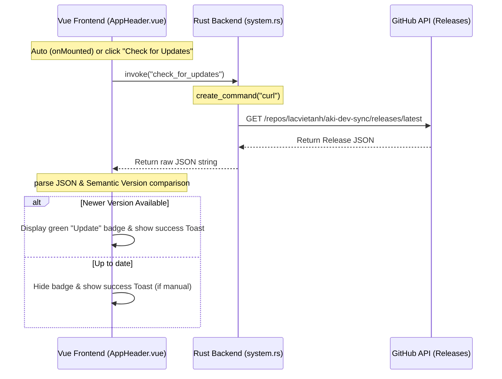

# App Update Check

A background update checking mechanism that automatically queries the latest release on GitHub upon app startup, with an option to trigger manual checks and receive instant Toast notifications.



## Behavior

- **Automatic Check on Startup**: When the app is mounted (`onMounted` in `AppHeader.vue`), it silently runs a check via the Rust backend.
- **Update Badge**: If a newer version is available on GitHub compared to the local build version, a green badge (`Update`) appears next to the version number in the header.
- **Click to Download**: Clicking on the update badge opens the GitHub releases page in the default web browser.
- **Manual Check**: A **Check for Updates** menu item is located in the Logo dropdown menu (top-left logo icon).
  - Clicking this manually starts a check, changing the icon to a spinning indicator (`fa-spin`).
  - If a new version is found, it alerts the user with a success Toast and reveals the green badge in the header.
  - If the version is up-to-date, it displays an informative Toast: *"You are on the latest version!"*.

## Implementation Details

The feature is split into backend extraction and frontend comparison to avoid CORS issues and environment variable inconsistencies in macOS app bundles.

### 1. Backend Extraction (Rust)
- The Tauri command `check_for_updates` is registered as a synchronous command so that Tauri executes it in its thread pool, keeping the main JS thread fully responsive.
- It executes `curl` to fetch release info from GitHub's API:
  `https://api.github.com/repos/lacvietanh/aki-dev-sync/releases/latest`
- Uses `create_command` (defined in `system.rs`) to inject correct path environments (e.g. `/opt/homebrew/bin:/usr/local/bin`), preventing `executable not found` errors when running the application as a standalone GUI macOS bundle.

### 2. Frontend Parsing & Comparison (Vue/JS)
- The raw JSON response returned by the backend is parsed into a JavaScript object.
- The `hasUpdate` utility function cleans up the versions (strips any leading `v` tags) and performs a semantic version comparison:
  ```javascript
  const cleanVer = (v) => v.replace(/^v/, '').trim();
  const hasUpdate = (current, latest) => {
    const cParts = cleanVer(current).split('.').map(Number);
    const lParts = cleanVer(latest).split('.').map(Number);
    for (let i = 0; i < Math.max(cParts.length, lParts.length); i++) {
      const c = cParts[i] || 0;
      const l = lParts[i] || 0;
      if (l > c) return true;
      if (l < c) return false;
    }
    return false;
  };
  ```

## Key files

- `src-tauri/src/system.rs` - `check_for_updates` Tauri command querying the GitHub releases API.
- `src-tauri/src/lib.rs` - Registering `check_for_updates` in the Tauri invoke handler array.
- `src/components/AppHeader.vue` - Header component hosting the logo dropdown trigger, the update badge markup, version constant configurations, and the update checker methods (`triggerManualUpdateCheck`, `hasUpdate`, `cleanVer`).
