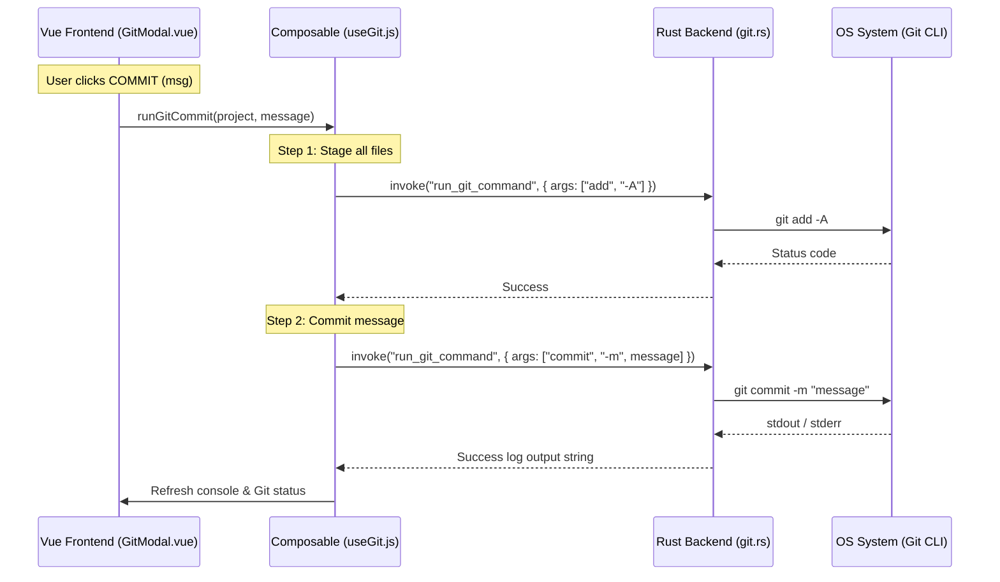

# Git Modal Operations & Unified Executor

A complete Git interaction suite inside each project panel that lets developers query repository status, stage/commit changes, fetch from remote, push commits, and trace terminal logs.



## Behavior

- **Trigger**: Accessed by clicking the Git button in the project list.
- **Commit Input**: A text area to write commit messages.
- **Stage & Commit**: Clicking the `COMMIT` button automatically performs `git add -A` followed by `git commit -m "[message]"`.
- **Fetch**: Clicking `FETCH` runs `git fetch` to download objects and refs from the remote repository.
- **Push**: Clicking `PUSH` runs `git push` to upload local commits to the remote branch.
- **Status Update**: Clicking `STATUS` updates the staging lists and refreshes logs.
- **Git Console Output**: A scrollable terminal-style console displaying stdout/stderr responses directly from local execution (success logs or stderr warnings in red).
- **Changelog Preview**: A `CHANGELOG` button dynamically appears in the footer if a changelog file (`CHANGELOG.md`, `changelog.md`, `CHANGELOG.txt`, etc.) is found in the local project path. Clicking this opens a styled markdown modal (inheriting from the system `ChangelogModal.vue`) to show a visual preview of the project releases. The preview state is automatically reset when switching projects to guarantee a clean, intuitive UX.

---

## Logging Policy (Global Log vs Silent Refreshes)

A strict policy is maintained to avoid bloating the global sync log while retaining audibility:

| Scenario / Action | Logging Level | Output Log Entry Example |
| :--- | :--- | :--- |
| **App Startup** | **Silent** | None (only system logs or loading error details if Git check fails). |
| **Background Polling** (Auto-refresh) | **Silent** | None. Runs every refresh interval without adding lines. |
| **Manual Click** (Status / Refresh in modal) | **Loud** | `[GIT] Checking status for "Aki"...`<br>`[GIT] Status for "Aki": 1 file modified` |
| **Manual Actions** (Commit, Fetch, Push) | **Loud** | `[GIT] Running git push for "Aki"...`<br>`[GIT] Git Push result: Everything up-to-date.` |
| **Command Failures** (Any scenario) | **Loud** | `[ERROR] Git Fetch failed for "Aki": remote hung up` |

---

## Technical Details

To avoid thin Rust command bloat, Git commands run through a single unified execute command with macOS bundle compatibility:

### 1. Unified Rust Executor
- Located in `src-tauri/src/git.rs` as `run_git_command(local_path, args)`:
  ```rust
  #[tauri::command]
  pub fn run_git_command(local_path: String, args: Vec<String>) -> Result<String, String> {
      let path = Path::new(&local_path);
      let out = create_command("git")
          .current_dir(path)
          .args(&args)
          .output()
          // ...
  }
  ```
- Uses `create_command` from `system.rs` to dynamically inject the correct environment `PATH` (such as `/opt/homebrew/bin:/usr/local/bin`), preventing execution failures when running from standalone macOS GUI bundles.

### 2. Frontend Compositions (JS)
- The JS composable `useGit.js` coordinates sequential commands:
  - **Commit Flow**: Calls `run_git_command` with `["add", "-A"]` first, and then triggers `["commit", "-m", message]`.
  - **Fetch Flow**: Calls `run_git_command` with `["fetch"]`.
  - **Push Flow**: Calls `run_git_command` with `["push"]`.

---

## Key files

- `src-tauri/src/git.rs` - Unified `run_git_command` and status/metadata extraction logic.
- `src-tauri/src/lib.rs` - Tauri registrations for git commands.
- `src/composables/useGit.js` - JS logic orchestrating git state, changelog parsing, and command triggers.
- `src/components/modals/GitModal.vue` - Modal template displaying logs, status lists, trigger buttons, and custom ChangelogModal preview embedding.
- `src/components/modals/ChangelogModal.vue` - Inherited Markdown/Mermaid parser rendering project changelog.
