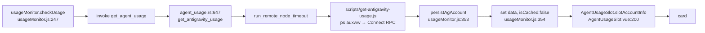

# Plan — the Antigravity card must show the live reading, not a pinned entity's old cache

Status: **Fix 1 resolved (2026-07-30 — entity model change)** · Fix 2 and Fix 3 still open · Read-only analysis; no source file was changed while producing this document.

> **2026-07-30 update:** Fix 1 is resolved structurally by the v4 entity model change. Account identity is now `(host, email)` with no `sourceType`. A pin is an email-only handle and matches any surface (IDE or CLI) running that account. The "pin says ide, live snapshot says cli" mismatch that §1 documents cannot occur when pins carry no sourceType at all. Fixes 2 and 3 are independent defects that remain open.

**What it fixes:** the AG card renders an arbitrarily old cached reading while the monitor is fetching and correctly caching a fresh one, whenever the running Antigravity surface is not the one the slot is pinned to. Reported as: "chạy `agy` nãy giờ mà nó không hề cập nhật được usage, vẫn cache từ rất lâu".

## 1. Root cause

**Root cause (historical — resolved by v4 entity model, 2026-07-30):** A pin was applied as a hard identity filter at render time, against a payload whose `sourceType` changes with which Antigravity surface is running. The AGY CLI and the Antigravity IDE were two entities that shared an email, and the probe reported whichever was alive. A slot pinned to `email:ide` stopped matching the moment the user worked in `agy` — and the fallback for "the pin matched nothing live" was the cache, not the live reading.

**Why this is now moot:** the entity key is `(host, email)` — no sourceType. A pin stores only the email (`slotViewingEmail`). `isPinned(a)` checks `a.email === key` — it matches whatever surface is running that account. There is no longer a surface mismatch to fall into.

This is the second form of a defect already recorded. `docs/research/test-case-check-flow.md` §B10 (finding 🔴 #5) documented the first form:

> "slot đã ghim `X:ide` → `loadAgAccount('X:ide', host)` trượt khoá trực tiếp, rơi vào fallback so khớp **chỉ theo email** → trả record `X:desktop_cli` → thẻ hiển thị quota của phiên CLI dưới nhãn IDE. Đây là *hiển thị số sai*, không chỉ là mất lịch sử."

That was fixed correctly — the email-only fallback was removed (`agUsageCache.js:256 if (keyOrEmail.includes(':')) return null;`) and the alias sweep now compares the whole triple. **The fix converted "a wrong number under the right label" into "a right number that is arbitrarily old under the right label."** Both are the same root shape: a pin that can select nothing live. §B10's fix closed the cache half; this plan closes the render half.

## 2. Intended flow

## 3. Actual flow

The probe succeeds. `persistAgAccount` writes the fresh reading under the correct key. The **card then discards it**.

### Breakpoint A-1 — `src/components/AgentUsageSlot.vue:227` and `:235-238`

1. `:187-188` — the slot holds a persisted pin in `localStorage['aki-usage-slot-<id>-viewing-account']`.
2. `:215-217` — the pin is split into `emailPart` + `typePart`; `isPinned(a)` requires `(a.sourceType || 'ide') === typePart`.
3. With only the AGY CLI live the probe emits ONE snapshot, so `allAccounts` is absent — `scripts/get-antigravity-usage.js:626` attaches it only when `finalSnapshots.length > 1`.
4. Control reaches `:227 else if (isPinned(src.data))` → **false**: the pin says `ide`, the live snapshot says `cli` or `desktop_cli`.
5. `:235 loadAgAccount(key, target.value.host)` → an exact hit on the **old cached IDE record**, which now reliably survives because §B10's sweep fix stopped deleting it.
6. `:237` returns `{ data: acc.data, isCached: true, cachedAt: acc.fetchedAt }` — indefinitely.

### Breakpoint A-2 — `scripts/get-antigravity-usage.js:104-110` → `:571-575`

The `agy` CLI entry is constructed with `csrfToken: undefined` (`:104-110`), because a bare `agy` process carries no `--csrf_token` argv — confirmed by the captured process line in `docs/research/antigravity-multi-instance-cli-discovery-jul22.md` §2 (`aki 86279 … agy`, no arguments). The probe then:

- accepts HTTP **401** at the discovery step as proof the port is the Connect API (`:282 VALID_CONNECT_STATUSES`, `:324`), and
- treats the identical **401** at the fetch step as a hard failure (`:373-381` → reject → `:574 continue`),
- having supplied the same absent token to both.

**This is a defect on its own terms, independent of what the server currently returns.** The probe's own 401-tolerance at the discovery step is an admission that a CSRF token may be required; the CLI path can never supply one and has no recovery when that possibility is realised. For an `ide` process a token is always present, so the asymmetry is invisible — which is why it has survived. When it does fire, every process fails, `snapshots.length === 0` (`:601`), exit 1, `agent_usage.rs:689 miss("probe exited 1")`, and `usageMonitor.js:406-421` shows the same old cache as A-1 — an anonymous failure indistinguishable from "the IDE is mid-restart".

### Breakpoint A-3 — `scripts/get-antigravity-usage.js:69`

`await execAsync(cmd)` for `ps auxww` sets **no `maxBuffer`**, while the Windows path at `:144` explicitly sets `10 * 1024 * 1024`. Node's default is 1 MiB; exceeding it rejects with `ENOBUFS`, which lands in `:638-641` → exit 1 → the same silent old-cache symptom, a third route to it. The asymmetry with `:144` is itself the proof that the omission is an oversight, not a decision. For scale: `ps auxww` on this Linux box is 34 KB over 324 processes; a Mac running Electron apps with long argv is the case that approaches the ceiling, and the probe's own documented reason for using `auxww` rather than `aux` is that it must not truncate long command lines.

## 4. Which change introduced A-1

`scripts/get-antigravity-usage.js` has not been modified since commit `b0a11a1` (`git log --oneline -- scripts/get-antigravity-usage.js` — that is the newest entry). The probe is not the regression. The shape change is `59aeccc` (monitor → entity; the pin moved to a per-slot persisted key) together with `55d3207` (cache/pin key `email:sourceType` → the triple `host|email:sourceType`) and §B10's follow-up removal of the email-only fallback. Before those, a pin on a bare email matched **any** live session for that email. Each change is right in isolation; together they made an old pin a filter the live payload can no longer satisfy.

## 5. The fix — all three, decided

All three are defects on their own terms. None is contingent on the others, and shipping only one leaves a live route to the same symptom.

### Fix 1 — RESOLVED by email-only entity model (2026-07-30)

The root cause (a pin keyed on `email:sourceType` that could not match a live snapshot of a different surface) no longer exists. Pins are email-only handles (`slotViewingEmail` stores just the email); `isPinned` matches on `a.email` alone; any surface running that account satisfies the pin. No code change to `AgentUsageSlot.vue` is needed for this fix.

### Fix 2 — a CLI process that cannot authenticate says so · `scripts/get-antigravity-usage.js` + `src-tauri/src/agent_usage.rs`

A `GetUserStatus` that returns **401 for a process the probe has no token for** is a permanent, nameable condition, not an anonymous `continue`. Carry it out of the script with a distinct exit code — the shape `agent_usage.rs` already uses for reachability — and surface it as a real `miss_reason`, e.g. `"AGY CLI session requires a CSRF token this probe cannot supply"`, instead of `"probe exited 1"`.

Correct whether or not the server currently enforces CSRF: if it does not, the branch never fires and nothing changes; if it does, a condition that is invisible for an entire release becomes one log line. This is the same treatment `agent_usage.rs:674-683` already gives the missing-`node` case, for the reason stated there — a permanent condition must not be indistinguishable from the many transient soft-misses beside it.

### Fix 3 — bound the process-table read · `scripts/get-antigravity-usage.js:69`

Pass `{ maxBuffer: 10 * 1024 * 1024 }` to the Unix `execAsync`, matching `:144`. One line; no behaviour change below the ceiling.

### What these delete downstream

- The "two candidates is not a reason to pick one" guard at `:221-225` stops carrying the frozen-card case.
- The deterministic AG-offline ladder at `usageMonitor.js:406-421` stops being the path a healthy machine takes every poll.
- `"probe exited 1"` stops being one bucket that three unrelated conditions fall into.

## 6. Non-goals

- **Recency must never override an explicit user choice.** The variant "if the cached record's `fetchedAt` is older than the live reading's, the live one wins" was proposed during the flow audit and is **rejected**: it silently deletes the pin feature, because a user who deliberately pinned the IDE account would have that choice overridden by any fresher CLI reading. Same class as the 1.9.3 blast radius — a fix must not destroy a preference it was not asked to touch. Recorded so it is not re-tabled.
- **The pin is never auto-cleared.** A permanently unresolvable pin may sit in localStorage indefinitely. Deliberate trade: rot is recoverable, a silently deleted preference is not.
- **No email-only fallback in `loadAgAccount`.** See Fix 1.
- **No attempt to obtain a CSRF token for `agy`.** There is no argv source (§3, A-2) and inventing one is speculative. Fix 2 makes the condition visible; acquiring a token is a separate question with no evidence behind it yet.
- **No Windows path work.** The app ships macOS-only.
- **No new UI.**

## 7. Warning to whoever executes WS-C (`docs/plan/usage-probe-oop.md`)

**WS-C §3 item P10 ports the `agy` CLI detection block verbatim, including `csrfToken: undefined`.** That is breakpoint A-2. Executed as written:

- the defect is carried into the new shell probe, and
- the port's parity checklist **passes because both sides are wrong** — the JS reference and the new `.sh` produce the identical empty result for a CLI-only host, so the diff is clean and the bug is invisible.

P10 must be ported together with Fix 2, and the parity baseline for that row re-captured afterwards. WS-C §3 P34/P35 (`exit 1` on zero snapshots) and N1 (a dedicated exit code for a permanent condition) are the natural carriers — Fix 2 is the same idea, one case earlier.

## 8. `docs/plan/investigate-ag-account-switch-detection.md` — closable by reasoning, no Mac test needed

That plan has sat unexecuted since 2026-07-08 waiting for a PID comparison. It can be closed now, and this analysis is why.

Its hypothesis: Antigravity does not restart `language_server` on an in-IDE account switch, so the RPC keeps returning the old account's context; therefore "không sửa được từ phía mình".

**It is neither superseded nor subsumed — it is answered.** Its own decision table says a PID that does *not* change confirms an external limitation with no available fix, and a PID that *does* change makes it a real bug in our code. Both branches now terminate without running the test:

- **PID unchanged** → the plan's own conclusion applies: nothing to fix in this repo. Its own proposed remedy — a tooltip hinting "quit & reopen Antigravity" — is refused by the project's Extreme Narrow UI rule, so no action remains.
- **PID changed** → the plan itself names the follow-ups it would open: poll interval too long, `discoverPorts`/`probeForConnectAPI` too slow, or a process-detection error between two polls. **Fix 3 (the unbounded `execAsync`) and Fix 2 (an anonymous `continue` that swallows every per-process failure) are exactly that class of error, and both are fixed here regardless of the PID answer.** A fresh account whose probe fails silently is indistinguishable from a stale account — which is why the symptom read as "not detected".

Recommendation: move it to `docs/plan/done/` with a status line recording that both branches of its decision table resolve to "no separate action", pointing at this doc. That removes an active plan whose only content was a request for a test the council can no longer justify asking for.

## 9. MULTI-ENTITY WARNING

Project rule: CLAUDE.md → Regression Guard — Multi-entity State.

- `src/composables/agUsageCache.js` holds `accounts` keyed `host|email:sourceType` and `lastActiveKeyByHost` keyed by host. Both are entity maps.
- `localStorage['aki-usage-slot-<id>-viewing-account']` is one key per slot — an entity map spread across keys.

Binding constraints:

1. **The fix is read-time re-derivation only.** It writes nothing.
2. **No `clear*` / `reset*` helper may be added** to `agUsageCache.js` or to the slot's pin handling. There is deliberately no "clear all accounts" or "clear all pins" counterpart anywhere in this subsystem; none may be introduced.
3. **Only an explicit second click via `handleSelectAccount` (`AgentUsageSlot.vue:190-198`) may clear a pin.** `AgentUsageSlot.vue:246-251` records that a previous watcher read an unresolvable pin as a "stale preference" and deleted both the in-memory selection and the persisted key — so merely looking at another host destroyed the user's pinned account. Any "auto-expire the stale pin" idea reintroduces exactly that.
4. **≥2-entity verification before this ships.** Sign the same email into the Antigravity IDE **and** the AGY CLI at once, with **a second email** already cached. Pin the IDE entity, then run only `agy`. Confirm: the card tracks the poll interval instead of freezing; every *other* cached account's `fetchedAt` is byte-identical; every *other* slot's `aki-usage-slot-<id>-viewing-account` value is byte-identical. Testing only the active account is the gap that shipped 1.9.3's bug.
5. `docs/research/test-case-check-flow.md` §B11 verified that no AG-cache clearing function exists anywhere in the frontend (`grep -rn "clearAg\|clearLastActive\|resetAccount" src/` matches only comments). **That property must survive this change** — re-checkable with the same grep.

## 10. Residual runtime risk

Everything above is settled from source and from files on disk. Two things are observable only while an Antigravity surface is running, and **neither gates any fix** — all three are correct under either outcome:

- Whether `GetUserStatus` currently enforces CSRF for an `agy` process. Fix 2 makes the answer visible in `usage.log` the first time it matters, which is better than measuring it once today.
- Whether `ps auxww` on the owner's Mac currently exceeds 1 MiB. Fix 3 removes the ceiling either way.

After the fix ships, one log line confirms the whole chain: `grep -E "ag live fetched|ag offline cached" ~/Library/Application\ Support/aki.devsync/usage.log | tail` should show `ag live fetched` on a machine where only `agy` is running.

## 11. Doc-sync obligations

Land these in the same task as the fix. Read each before editing — if one turns out not to describe the changed mechanism, drop it from this list rather than manufacture an edit.

- `docs/arch/usage-antigravity.md` — the pin/entity resolution rule. It currently presents the deterministic AG-offline fallback as the answer to the stale-account problem; that becomes wrong once a live reading outranks a resolvable pin.
- `docs/arch/refresh-controller.md` — that "polled" and "displayed" are separable, which this defect demonstrates.
- `docs/feat/sync-check-and-usage-switches.md` — the user-visible behaviour of the account dropdown and the pin.

## 12. Cross-references

- `src/components/AgentUsageSlot.vue` — owns the pin and `slotAccountInfo`.
- `src/composables/agUsageCache.js` — the per-account AG cache keyed by the `(host, email, sourceType)` triple.
- `src/composables/usageMonitor.js` — poll loop, breaker, AG-offline fallback.
- `scripts/get-antigravity-usage.js` — process detection and Connect RPC probe.
- `src-tauri/src/agent_usage.rs` — transport and the `AgentUsageResult` envelope.
- `docs/research/test-case-check-flow.md` §B10 — finding 🔴 #5, the first form of this defect; §B11 — the no-clearing-function property this change must preserve.
- `docs/research/antigravity-multi-instance-cli-discovery-jul22.md` §2 — the captured `agy` process line showing no `--csrf_token` argv.
- `docs/plan/usage-probe-oop.md` — WS-C. See §7.
- `docs/plan/investigate-ag-account-switch-detection.md` — closable. See §8.
