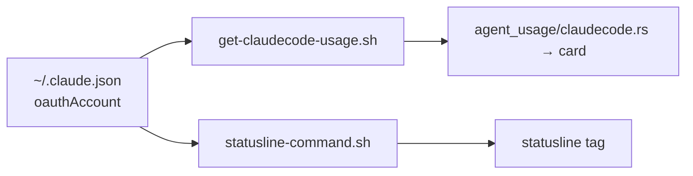

# Plan — one source of truth for the Claude Code account identity

Status: **DONE — fixed, committed, and owner-verified on real hardware, 2026-07-30.** Fix 1/2/4 (`scripts/get-claudecode-usage.sh`, `src-tauri/src/statusline-unified.sh`) and Fix 3 (`scripts/provision-claudecode.sh`) all landed; the path bug found afterward (§14) and the final live-`claude auth status`-based redesign (§15) are both committed in `d75dbe9` ("fix(agent_usage): CC identity resolves via live claude auth status, not .claude.json") plus the doc-sync commit `8b98616`. The working tree is clean — nothing from this plan is outstanding in it. §15's acceptance test passed end-to-end on 2026-07-30 (two concurrent CC sessions, distinct accounts, both the app card and the real terminal statusline tracked the correct one). `src-tauri/src/agent_usage/claudecode.rs` and the JS usage store needed **no change** throughout — both already treat every poll's `AUTHINFO`/`content` as the full, authoritative replacement rather than a cache to merge selectively.

**Target state, which is the specification:** the flow already reads the live email; when the account changes, the displayed email changes — on the card and in the statusline, without an app restart and without deleting any file.

Reported as: "refresh tự check lại acc để update account. Hiện phải xóa tay thủ công authcache và limitcache rồi khởi động lại cả app. Mà xóa auth cache + limitcache xong vẫn bị dính hiển thị email acc cũ trên app, statusLine vẫn hiển thị email cũ."

## 1. Root cause

**`~/.claude.json → oauthAccount` is the live account identity and already carries every field the card displays. The app parses it, discards it, and displays `auth-cache.json` instead — a snapshot of `claude auth status` kept alive by a TTL, a once-per-process latch, and a provisioning re-seed.**

Verified by reading both files on this machine:

| Field the card renders | `~/.claude.json → oauthAccount` | `~/.claude/auth-cache.json` |
|---|---|---|
| email | `emailAddress` ✅ | `email` ✅ |
| org name (`AgentUsage.vue:755`) | `organizationName` ✅ | `orgName` ✅ |
| tier (`AgentUsage.vue:773`) | `organizationRateLimitTier` = `default_claude_max_5x` ✅ | — |
| subscription (`AgentUsage.vue:789`) | `organizationType` = `claude_max` ✅ (maps to `max`) | `subscriptionType` = `max` ✅ |
| stable account identity | `accountUuid` ✅ | — (only `orgId`) |

`auth-cache.json` contributes **nothing the live file does not already have**, and lacks the one field — `accountUuid` — that the cache-integrity gate is built on. The whole enforcement apparatus around it exists to compensate for the wrong source being primary.

The second root cause is separate and equally concrete: **`provision-claudecode.sh` is version-blind to anything newer than its own `v3` and stacks a second, weaker cache writer in front of the good one.** Proven on disk in §3.

## 2. Intended flow

## 3. Actual flow

### Breakpoint B-1 (root) — the live identity is read, then dropped · `scripts/get-claudecode-usage.sh:133` vs `:298`

- `:119-137` parses `~/.claude.json → oauthAccount.{emailAddress, accountUuid, organizationRateLimitTier, userRateLimitTier}` into `CURRENT_ACCT`, `CURRENT_ACCT_UUID`, `LIVE_ORG_TIER`, `LIVE_USER_TIER`.
- `CURRENT_ACCT` is used **only** at `:199` (the cache-mismatch gate) and `:138` (one log line). It is never emitted. `LIVE_ORG_TIER` *is* used for `TIER` (`:148-151`) — proving the pattern is already accepted here for tier and simply was not applied to identity.
- `:298 echo "|||AUTHINFO|||$AUTH_INFO"` is the only identity that reaches the app, and `AUTH_INFO` comes solely from `auth-cache.json` / `claude auth status` (`:79-105`).
- `src-tauri/src/agent_usage/claudecode.rs:182-185` pulls `email` and `orgName` out of that block and injects them into the rendered payload.

### Breakpoint B-2 — refresh cannot re-derive the account · `src-tauri/src/agent_usage/claudecode.rs:39-42`

`cc_auth_force_needed(host)` is a `OnceLock<Mutex<HashSet<String>>>`: `AKI_FORCE_AUTH_REFRESH=1` is injected (`:77`) **once per host per app process**. The manual-refresh path — `src/composables/usageMonitor.js:628-636` → `checkUsage` → `get_agent_usage` — has no wire to that latch. Refresh is therefore bounded by `AUTH_REFRESH_AGE_S=300` (`get-claudecode-usage.sh:64`), and even past the TTL it re-reads `claude auth status`, not `~/.claude.json`. Hence "phải khởi động lại cả app".

### Breakpoint B-3 — the manual wipe is undone within one poll tick · `scripts/provision-claudecode.sh:58-60`

1. The user deletes `~/.claude/rate-limits-cache.json`.
2. `get-claudecode-usage.sh:16 if [ -f "$FILE" ]` is now false → the script emits nothing (`:301-303`).
3. `agent_usage/claudecode.rs:115-116` returns `miss("no cache")`.
4. `usageMonitor.js:430 if (!isAg) provision()` fires.
5. `provision-claudecode.sh:58-60` runs `claude auth status` and **rewrites `auth-cache.json`**.

The deletion is undone before the user sees a result. The documented workaround is self-defeating by construction.

### Breakpoint B-4 — two cache writers stacked in one installed script · **verified on disk**

`~/.claude/statusline-command.sh` on this machine contains **both** markers and runs **both** blocks on every Claude Code turn:

| Installed line | Block | Writes |
|---|---|---|
| 16-27 | `# aki-rlcache v3`, injected by `provision-claudecode.sh:33-48` | the **entire payload** — no `account`, no `account_uuid`, no `seen_at`, no pruning, no account gate |
| 40-105 | `# aki-rlcache v4`, from an older generation of the unified template | `{"account":…,"rate_limits":…}` — `account` but **no `account_uuid`**, and its `_rl_prune` has no `seen_at` clause |

The resulting file matches exactly: `{"account":"…","rate_limits":{"five_hour":{"used_percentage":37,"resets_at":1785360600}}}` — `account` present, `account_uuid` absent, `seen_at` absent.

**Why the idempotence guard fails.** `provision-claudecode.sh:17` tests `grep -q "aki-rlcache v3"` — it knows only its own version. A file already carrying `v4` (installed by a Statusline Apply, i.e. *newer and better*) does not match, so control falls to `:20`, whose removal range is `sed '/^rl_input=/,/printf .*rate-limits-cache\.json/d'`. In the unified template `rl_input=` is **indented** (`  rl_input=$(printf …)`), so the anchored `^rl_input=` matches nothing, the deletion is a no-op, and `v3` is prepended on top of the surviving `v4`. **Provisioning downgrades a good install and cannot detect that it has done so.**

Consequence for the account gate: `v3` runs first and writes a file with no `account_uuid`; `v4` then reads it, finds `cached_uuid` empty, and degrades to the email gate on every single turn. Downstream, `get-claudecode-usage.sh:211-227` does the same — `cached_uuid` empty and `current_uuid` present → `elif not cached_uuid` → email gate. **The `accountUuid` integrity check that v5 was written for never executes.** It is not "inert on hosts that were never Applied", as previously supposed; it is inert on a host that *was* Applied, because provisioning re-broke it.

### Breakpoint B-5 — the statusline's live-file read is conditional · `statusline-unified.sh:170` and `:506`

`:170` pre-fills `JSON_ACCOUNT_EMAIL` from the CLI payload (`.account.email // .user.email // .email`). `:506 if [ -z "$JSON_ACCOUNT_EMAIL" ]` means the live-file read at `:508-509` runs **only when the payload email is empty**. The comment at `:503` — "Neither CLI puts an email in the payload" — is an assertion, not a test, and it is the only thing standing between a payload field and the account tag.

The two installed copies have also **drifted**, which the file's own header forbids ("ONE physical file, installed verbatim at BOTH paths"): `~/.claude/statusline-command.sh` carries `v3 + v4`; `~/.gemini/antigravity-cli/statusline.sh` carries `v4` only, because provisioning patches the CC path exclusively. Neither is the repo template — both predate the `account_uuid` / `seen_at` work.

### Breakpoint B-6 — no quota ⇒ no identity · `scripts/get-claudecode-usage.sh:16`

The entire auth, identity and emit block is nested inside `if [ -f "$FILE" ]`, where `$FILE` is the *quota* cache. A host with a correct, current account but no quota cache yet reports no account at all.

## 4. What was already recorded, and how far it was fixed

`docs/research/test-case-check-flow.md` §B12:

> "email hiển thị là **mới** …, còn 5h/7d vẫn là **quota của account cũ**. Không có cơ chế nào phát hiện lệch — hai nguồn không chia sẻ khoá định danh."
> "Sửa tối thiểu: ghi email vào `rate-limits-cache.json` và so khớp với `AUTHINFO` trước khi hiển thị."

**Partially fixed.** The stamp-and-compare was written (`statusline-unified.sh:113-116` emits `account` + `account_uuid`; `get-claudecode-usage.sh:209-227` compares). Three things were never done, and B-4 shows the first of them was actively undone in the field:

1. The gate never runs with a uuid, because provisioning strips it every turn (B-4).
2. The comparison is against `~/.claude.json`, but the **displayed** email still comes from `AUTHINFO` — the two sources still disagree in exactly the direction §B12 named.
3. A mismatch **drops the cache** rather than **correcting the email** — a blank card, not a right one.

`get-claudecode-usage.sh:86-88` cites an earlier report of the same class — "auth-cache.json echoed the SAME email forever even after the user logged into a different CC account on this host" — addressed only by adding the 300 s TTL.

## 5. The fix — decided

### Fix 1 — emit the live identity and prefer it

`get-claudecode-usage.sh` already holds `CURRENT_ACCT` and `CURRENT_ACCT_UUID` at `:133-134`. Emit them — merged into the `AUTHINFO` object, or as a new `|||IDENTITY|||` frame — and make `agent_usage.rs:596` prefer them over the `auth-cache` email. `organizationName` supplies `orgName` the same way `LIVE_ORG_TIER` already supplies `TIER` at `:148-151`. Keep `claude auth status` as the fallback for when `oauthAccount` is absent.

### Fix 2 — move the identity read out from under the quota-file test

Lift `:119-137` (and the auth block it feeds) above `:16 if [ -f "$FILE" ]`, so a host with a correct account but no quota cache still reports the account. Closes B-6, and removes the trigger for B-3 at the same time — "no cache" stops meaning "no identity".

### Fix 3 — make provisioning version-aware, not v3-aware

`provision-claudecode.sh:17` must detect **any** `# aki-rlcache vN` marker and refuse to downgrade: if the installed N is ≥ its own, do nothing. Its removal range must also match the indented form the unified template uses, or it must stop trying to edit a file the Statusline Customizer owns. Retiring the v3 injection entirely in favour of Apply is the cleaner end state and should be the default choice; the minimum acceptable outcome is that provisioning can never leave two writers stacked.

### Fix 4 — statusline reads the live file first

Invert `statusline-unified.sh:506` for `CLI=CC`: read `~/.claude.json` first, let the payload be the fallback. That turns the `:503` comment into behaviour. Re-Apply to both paths afterwards so the two installed copies stop being different files.

### What this fix DELETES

Four pieces of enforcement, all of which exist only because the wrong source is primary. A flow fix that removes four guards is evidence the reshaping is right rather than another guard:

| Deleted | Where it lives today | Why it stops being needed |
|---|---|---|
| `AUTH_REFRESH_AGE_S` (the 300 s TTL) | `scripts/get-claudecode-usage.sh:64`, `:79` | `~/.claude.json` is read fresh every poll; nothing ages out. |
| `cc_auth_force_needed` (once-per-host-per-process latch) | `src-tauri/src/agent_usage/claudecode.rs:39-42` | Nothing needs forcing when the read is already live. |
| The `AKI_FORCE_AUTH_REFRESH` plumbing | `agent_usage/claudecode.rs:77` (inject), `get-claudecode-usage.sh:79` (consume) | Same. |
| The auth-cache fallback branch | `scripts/get-claudecode-usage.sh:97-104` ("falling back to stale cache") | There is no stale identity cache left to fall back to. |

`auth-cache.json` shrinks to owning **`subscriptionType` only** — and even that is derivable from `organizationType` (`claude_max` → `max`, verified on this machine). It is kept solely as a conservative fallback for accounts whose `oauthAccount` lacks `organizationType`; it never again decides which email is displayed.

## 6. Non-goals

- **`~/.claude.json` is never written, moved, or deleted by this fix.** It is read-only input. See §7.
- **No "clear the CC identity caches" button, menu item, or convenience command.** See §7 for why this is a hard non-goal.
- **No new UI element, badge, row or banner** — the card already renders email, org and tier (project rule: UI Principle — Extreme Narrow).
- **`CHANGELOG.md` is not edited by this plan.** The `[Unreleased]` line is drafted in §10 only.
- **This plan does not touch `docs/plan/usage-probe-oop.md`.** WS-C §1 Non-goals states verbatim: "**No CC behaviour change.** `get-claudecode-usage.sh` and `provision-claudecode.sh` are untouched." Those are the two files this plan changes; the two must not be merged, or one doc holds two contradictory definitions of "correct".
- **The AGY-side account source is out of scope here** — see §11 for a related finding handed to the lead rather than folded in.

## 7. MULTI-ENTITY WARNING

Project rule: CLAUDE.md → Regression Guard — Multi-entity State.

**What is not at risk.** `~/.claude/rate-limits-cache.json` is a single-account file for the whole machine (`docs/research/test-case-check-flow.md` §B12: "một file duy nhất cho cả máy"). So `rm -f "$RLCACHE"` at `statusline-unified.sh:121-124` and the `ACCOUNT_MISMATCH` drop at `get-claudecode-usage.sh:214-227` are not multi-entity wipes. `src/store/usageReadingStore.js:54 patchUsageReading` is already scoped to one `monitorId` with deliberately no clear-all counterpart; this fix must not add one.

**The adjacent risk, which is real.** A "clear the CC identity caches" convenience — the obvious thing to reach for while fixing B-3 — would sit next to `src-tauri/src/claude_cleanup.rs`'s **Account group, which deletes `~/.claude.json` itself** (`docs/feat/claudecode-cleanup.md`: the Account group removes `~/.claude.json`, `.credentials.json`, `auth-cache.json`, `stats-cache.json`, `rate-limits-cache.json`, …). **Deleting the live source in order to fix a stale cache is the 1.9.3 blast radius in a new costume** — a function whose stated scope is "clear a cache" reaching a store it was never asked to touch. If any clearing helper is written at all it must be named for its true scope, must never list `~/.claude.json` among its targets, and must be reviewed against this paragraph.

**Verification floor.** `agUsageCache.js`'s `accounts{}` map — the exact store 1.9.3 wiped — sits in the same subsystem and is mirrored to companions. With ≥2 Antigravity accounts cached, apply this fix and confirm every entry's `fetchedAt` is byte-identical afterwards. `docs/research/test-case-check-flow.md` §B11 established that no AG-cache clearing function exists anywhere in the frontend; re-run its check (`grep -rn "clearAg\|clearLastActive\|resetAccount" src/` → comments only) as the closing gate.

## 8. Acceptance

- Switching Claude Code accounts and clicking Refresh updates the email on the card **without an app restart and without deleting any file**.
- The statusline tag shows the same email on the next turn.
- `~/.claude/statusline-command.sh` contains exactly **one** `# aki-rlcache vN` marker, and running provisioning again does not add a second.
- `~/.claude/rate-limits-cache.json` carries `account_uuid` and per-entry `seen_at`.
- `~/.claude/statusline-command.sh` and `~/.gemini/antigravity-cli/statusline.sh` are byte-identical outside the AKI-GENERATED-CONFIG region, as the template's own header promises.

## 9. Residual runtime risk

Everything above was settled from source and from files on disk; nothing here needed a Mac. Two points are observable only during a live account switch, and **neither gates any fix**:

- Whether `claude auth status` lags `~/.claude.json` by minutes or by hours after a switch. On this machine both currently agree (`ntu_genai@masic.ai`), which is the expected steady state and says nothing about the transition. Fix 1 removes the dependency either way.
- Whether Claude Code's statusline payload ever carries an email field (B-5's live exposure). Fix 4 makes the question moot by reading the live file first.

## 10. CHANGELOG `[Unreleased]` entry — draft only

`CHANGELOG.md` is **not** edited by this plan. Per CLAUDE.md's Regression Guard the entry states what was **preserved**, not only what was fixed — a claim a future audit can check against the diff:

> **Fixed** — Claude Code now reads its account identity live from `~/.claude.json` on every poll instead of from a cached `claude auth status` result, so Refresh updates the email without an app restart and without deleting any cache file; the generated statusline reads the same live source; and provisioning can no longer stack an older rate-limit cache writer in front of a newer one, which had been silently stripping the `account_uuid` the cache-integrity check depends on. The Antigravity per-account cache (`agUsageCache.js`'s `accounts{}` map) is not read, written or cleared by this change — every cached AG account survives it intact.

## 11. Adjacent finding, handed to the lead — not fixed here

While verifying the AG-side identity sources on disk: `src-tauri/src/agent_usage/antigravity_logout.rs:120-129` (`logout_antigravity_cli`) deletes `~/.gemini/oauth_creds.json`, `~/.gemini/google_accounts.json` and `~/.gemini/state.json`. **None of those three exists on a current AGY CLI install** — the live credential is `~/.gemini/antigravity-cli/antigravity-oauth-token`. The same missing `google_accounts.json` is what `statusline-unified.sh:512` reads for the AG account tag, so that tag renders blank. Both are outside the two defects this session scoped; recorded here so the observation is not lost.

## 12. Doc-sync obligations

Land these in the same task as the fix. Read each before editing — if one turns out not to describe the changed mechanism, drop it rather than manufacture an edit.

- `docs/arch/usage-claudecode.md` — §5's source-priority ladder and the `AUTH_REFRESH_AGE_S` / `AKI_FORCE_AUTH_REFRESH` description, all of which describe mechanisms §5 removes; §3's provision/cache-gate description, which B-4 shows is not what happens in the field.
- `docs/ref/statusline-unified-spec.md` — the statusline is a **separate identity holder**, and a fix that leaves it stale is half a fix. Record that for `CLI=CC` the live file is primary and the payload is the fallback, and that the two installed copies must remain byte-identical outside the generated region.

## 13. Cross-references

- `scripts/get-claudecode-usage.sh` — the CC probe: quota read, auth read, identity read, sanitiser, delimiter emit.
- `scripts/provision-claudecode.sh` — injects the `aki-rlcache v3` block and seeds `auth-cache.json`.
- `src-tauri/src/agent_usage/claudecode.rs` — transport, the `AKI_FORCE_AUTH_REFRESH` latch, and the AUTHINFO → payload injection.
- `src-tauri/src/statusline-unified.sh` — the generator template; the rate-limits-cache writer and the account tag.
- `src/composables/usageMonitor.js` — poll loop, manual-refresh watcher, and the `provision()` call on the null path.
- `src-tauri/src/claude_cleanup.rs`, `docs/feat/claudecode-cleanup.md` — the Account group that deletes `~/.claude.json`. See §7.
- `docs/research/test-case-check-flow.md` §B12 (the prior record), §B11 (the no-clearing-function property).
- `docs/research/claudecode-usage-FINAL.md` — the earlier "email hiển thị sai khi đổi tài khoản" report cited at `get-claudecode-usage.sh:86-88`.

## 14. Addendum (2026-07-30) — the fix above was necessary but not sufficient: the path itself was wrong

This plan's Fix 1/2/4 (§5) made the live file primary. They still pointed at the wrong file: `$HOME/.claude.json`. The bug survived the fix, with the exact same symptom — quota fresh, email stuck — because the real live file lives one directory deeper.

**Root cause, verified by hand (not a hypothesis).** The installed Claude Code CLI (2.1.220) writes `oauthAccount` into `.claude.json` **inside its own config directory**, whose default — used whenever `CLAUDE_CONFIG_DIR` is unset, which is the ordinary case — is `$HOME/.claude`, not bare `$HOME` (`docs/ref/multiple-account-config-dir.md:19`, "Default Config Path" table). `$HOME/.claude.json` is a file the current CLI never touches again; it sits frozen at whatever it last held, while `rate-limits-cache.json` (correctly under `~/.claude/`) keeps updating — reproducing "quota refreshes, email doesn't" even after Fix 1/2/4.

**A rejected hypothesis, recorded so it is not retried.** Before finding the path bug, `CLAUDE_CONFIG_DIR` (the env var documented in `docs/ref/multiple-account-config-dir.md` for multi-account setups) was suspected as the cause. It is not — the owner confirmed this has nothing to do with using multiple accounts. `CLAUDE_CONFIG_DIR` is a per-command alias (`cc1`/`cc2` in `~/.zshrc`), never exported globally, so the app's shell never sees it either way. A first attempted patch used the fallback `${CLAUDE_CONFIG_DIR:-$HOME}/.claude.json` — wrong, because with the var never exported that always resolves to bare `$HOME`, identical to the original bug. The correct fallback is `${CLAUDE_CONFIG_DIR:-$HOME/.claude}/.claude.json`.

**Fixed on top of §5's fix (committed — superseded in turn by §15 below, then finally by `d75dbe9`):**
1. `scripts/get-claudecode-usage.sh` — `CLAUDE_JSON_PATH="${CLAUDE_CONFIG_DIR:-$HOME/.claude}/.claude.json"`, used everywhere `oauthAccount` is read (§5b block, ~line 71-100); the `identity:` log line now prints `source=$CLAUDE_JSON_PATH`.
2. `src-tauri/src/statusline-unified.sh` — same pattern in two places: the rate-limits-cache writer (`_rl_claude_json`, ~line 56-63) and the account tag on the statusline (`_live_claude_json`, ~line 517-523).

**Historical note — this addendum's "still open" caveat below described a mid-session state and no longer applies; §15 replaced this whole approach the same day, and `d75dbe9` shipped the rebuild+Apply+owner-verify cycle this addendum was waiting on.** Left verbatim for the record: the fix requires a `npm run tauri dev` restart (the script is `include_str!`-embedded in the Rust binary — editing the file on disk does not propagate to a running build) **and** a fresh Statusline Customizer → Apply for Claude Code (the template embedded in the binary is not auto-installed; `~/.claude/statusline-command.sh` is a separate installed copy). Full acceptance test: switch CC account, run one command in a CC terminal (statusLine hook fires), click Refresh in the app, and confirm both the app card and the real terminal statusline show the new email.

## 15. Addendum (2026-07-30, same day) — `.claude.json` itself is not a reliable per-session identity source; switched to live `claude auth status`

§14 made `.claude.json` primary and fixed the path, but the owner's real workflow broke the assumption underneath it: **two `claude` processes legitimately hold two different, currently-authenticated accounts while sharing one `CLAUDE_CONFIG_DIR`** — this is the owner's normal daily setup, not a misconfiguration, and must not be treated as unsupported. `.claude.json`'s `oauthAccount` is written by whichever process's own internal profile-cache refresh flushes last, on a schedule the CLI controls, not per-command — so it reflects "whichever session wrote most recently," not "which account this session is currently authenticated as." A read against it can be correct for one poll and silently reflect the other session's account on the next, with nothing in this script's own state having changed.

`claude auth status`, run as a direct child process of a given session, resolves that session's own live identity correctly (confirmed: two terminals sharing one config dir, `claude auth status` run in each at the same moment, returned two different real emails — and confirmed it does not itself write `.claude.json`, so it is not subject to the same-file clobber race). Applying the standing principle again — whatever mechanism produced a correct read the first time must be what every subsequent read does, not a special first-read case — the fix is:

1. `scripts/get-claudecode-usage.sh` §5 — removed the 300s `AUTH_REFRESH_AGE_S` TTL and the once-per-host-per-process `AKI_FORCE_AUTH_REFRESH` latch entirely. `claude auth status` now runs live on every poll, no caching gate; `auth-cache.json` is written only as a fallback for the next cycle if a given call fails/returns empty. §5c's former override of `email`/`orgName` from `.claude.json` is removed (comment-only now) — `.claude.json` is used from here on **only** for `organizationRateLimitTier`/`organizationType` (tier/subtype) and `accountUuid` (cache-ownership matching), never for the displayed identity.
2. `src-tauri/src/statusline-unified.sh` (~line 505-540) — the CC branch no longer reads `.claude.json` at all for the account tag. It calls `claude auth status` live, bounded by a 15s local TTL cache file (`auth-cache.json`, the same file/path `get-claudecode-usage.sh` maintains) purely to avoid a ~200-300ms subprocess spawn on every single prompt render — not to tolerate staleness across an account switch. In the common case the app's own ~30s poll loop keeps this file warm, so the statusline itself rarely has to spawn anything.

**Explicitly not re-investigated, per the owner's direction:** the exact mechanism by which `claude auth status` resolves a different live identity per session while `.claude.json` is shared (three distinct `Claude Code-credentials*` macOS Keychain services were found on this machine, suggesting a real per-context credential store independent of `CLAUDE_CONFIG_DIR`) is accepted as correct, expected CLI behavior and was not diagnosed further. Do not reopen that investigation; the only requirement is that this app's identity reads follow the same call the CLI itself already resolves correctly.

**Acceptance test (pinned by the owner until it passes end-to-end):** with two real, currently-authenticated CC sessions active at once (same or different `CLAUDE_CONFIG_DIR`), trigger a command in each; confirm both the real terminal statusline and the app's Refresh show each session's own correct, distinct email **and** quota together — not quota-only. Verified 2026-07-30: after rebuild + re-Apply, owner confirmed the statusline and the app both track the currently-active session's account correctly.
