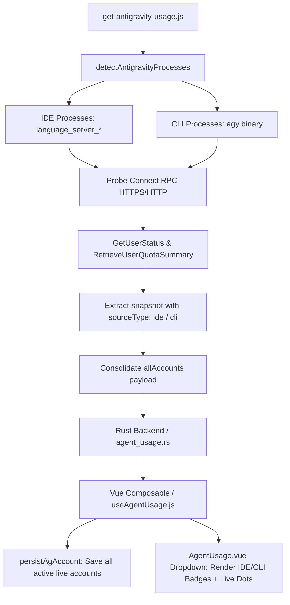

# Nghiên Cứu & Đúc Kết: Giám Sát Quota Đa Tiến Trình (Antigravity IDE vs AGY CLI)

* **Tác giả:** Antigravity AI / Aki Pair Programming
* **Ngày thực hiện:** 22/07/2026 (2026-07-22)
* **Trạng thái:** Bổ sung chính thức (Final Approved)
* **Phạm vi áp dụng:** Antigravity IDE 2.1.1+, AGY CLI (`agy`), Aki Dev Sync (Tauri v2 + Vue 3)

---

## 📌 1. Bối Cảnh & Đặt Vấn Đề

Trước phiên bản 1.15.1, ứng dụng Aki Dev Sync thực hiện đo Quota Antigravity bằng cách quét bảng tiến trình hệ thống (`ps auxww`) để tìm tiến trình nhị phân `language_server_*` của Antigravity IDE. 

tuy nhiên, trong kịch bản thực tế phức tạp hơn:
* Người dùng sử dụng **Tài khoản A** (`user-a@example.com`) trên giao diện Antigravity IDE.
* Người dùng đồng thời mở Terminal và sử dụng **Tài khoản B** (`user-b@example.com`) thông qua công cụ dòng lệnh **AGY CLI (`agy`)**.

**Vấn đề phát sinh:** Script đo quota cũ chỉ lấy duy nhất tiến trình IDE đầu tiên tìm thấy, dẫn đến việc tài khoản CLI (Acc B) bị bỏ qua hoàn toàn, không thể hiển thị trạng thái Live trên ứng dụng.

---

## 🔬 2. Quá Trình Điều Tra & Thử Nghiệm Thực Tế (Empirical Evidence)

### Thử nghiệm 1: Kiểm tra bảng tiến trình hệ thống (`ps auxww`)
* **Thực thi:** `ps auxww | grep -E "agy|language_server|gemini"`
* **Kết quả:**
  ```text
  aki  86279  14.2  1.7 437126112 286960 s006  R+  1:01AM  0:48.53 agy
  aki  41390   0.0  0.8 437032752 127520   ??  S   8:16PM  0:24.92 /Applications/Antigravity IDE.app/.../bin/language_server_macos_arm --csrf_token bd45... --extension_server_port 60085 --app_data_dir antigravity-ide --subclient_type ide
  ```
* **Nhận xét:** Process `agy` (PID 86279) và tiến trình IDE (PID 41390) là **hai tiến trình hoàn toàn độc lập** trên OS.

### Thử nghiệm 2: Khảo sát Socket & Cổng lắng nghe (`lsof`)
* **Thực thi:** `lsof -p 86279 | grep -E "LISTEN|TCP"`
* **Kết quả:**
  ```text
  agy 86279 aki 10u IPv4 0x46ac82a0198ce0d3 0t0 TCP localhost:57208 (LISTEN)
  agy 86279 aki 11u IPv4 0x8f9a006ccb8dbfb3 0t0 TCP localhost:57209 (LISTEN)
  ```
* **Phát hiện quan trọng:** Bản thân công cụ `agy` CLI khi thực thi cũng tự khởi tạo một máy chủ **Connect RPC HTTPS Server** nội bộ lắng nghe trên các port TCP ngẫu nhiên (`57208`, `57209`).

### Thử nghiệm 3: Truy vấn Connect RPC trên tiến trình `agy` CLI
* **Thực thi:** Gửi POST HTTPS request tới endpoint `/exa.language_server_pb.LanguageServerService/GetUnleashData` và `/GetUserStatus` tại port `57208`:
  ```bash
  curl -k -s -X POST https://127.0.0.1:57208/exa.language_server_pb.LanguageServerService/GetUnleashData \
    -H "Content-Type: application/json" -H "Connect-Protocol-Version: 1" -d '{"wrapper_data":{}}'
  ```
* **Kết quả thu được:**
  ```json
  {
    "context": {
      "properties": {
        "ide": "antigravity",
        "productName": "cli",
        "userTierId": "g1-pro-tier"
      }
    }
  }
  ```
  Và RPC `/GetUserStatus` trả về 100% dữ liệu hạn ngạch model, `userTier` và email tài khoản tương ứng với cấu hình của `agy` CLI.

---

## 🛠️ 3. Giải Pháp Kiến Trúc Đa Tiến Trình & Đa Tài Khoản

Dựa trên các phát hiện thực nghiệm, giải pháp toàn diện đã được thiết kế và triển khai:



### 1. Phân loại Tiến trình Target (`sourceType`)
* **Nhóm IDE:** Khớp binary `language_server_*` chứa tham số `--csrf_token` & `--extension_server_port` -> Gán `sourceType: "ide"`.
* **Nhóm CLI:** Khớp tiến trình binary `agy` -> Gán `sourceType: "cli"`.

### 2. Tổng hợp Dữ liệu Payload (`allAccounts`)
Script `get-antigravity-usage.js` duyệt qua tất cả các tiến trình phát hiện được, thực hiện song song việc truy vấn dữ liệu Connect RPC. Kết quả trả về chứa mảng `allAccounts`:
```json
{
  "email": "user-a@example.com",
  "sourceType": "cli",
  "allAccounts": [
    { "email": "user-a@example.com", "sourceType": "cli", "quotaSummary": { ... } },
    { "email": "user-b@example.com", "sourceType": "ide", "quotaSummary": { ... } }
  ]
}
```

### 3. Cập nhật Store & Giao Diện Vue (Aki Dev Sync)
* **`useAgentUsage.js`:** Cập nhật hàm `persistAgAccount` để lưu vết tất cả tài khoản có trong `allAccounts` theo `accountKey` (`email:sourceType`) vào `localStorage` (`aki-antigravity-usage-cache-v2`).
* **`activeEmails` Set:** Theo dõi toàn bộ danh sách email & accountKey đang hoạt động live.
* **Dropdown UI (`AgentUsage.vue`):**
  * Ghi nhận chấm Live (`ag-live-dot`) tinh tế: màu **Cyan (`#22d3ee`)** đại diện cho IDE, màu **Tím (`#c084fc`)** đại diện cho CLI `agy`.
  * Hiển thị nút Log Out thông minh theo môi trường: **`Log Out IDE`** (xóa SQLite OAuth Token & kill IDE) hoặc **`Log Out AGY CLI`** (kill `agy` & xóa credential file `~/.gemini/`).
* **Dynamic Header Icon & Shadow:**
  * Tài khoản IDE: Hiển thị logo Antigravity PNG với hiệu ứng viền Cyan nhẹ nhàng.
  * Tài khoản CLI: Tự động chuyển sang Icon Terminal vector với hiệu ứng viền Tím ấn tượng.

### 4. Kiến Trúc Khai Báo N-Tier Grid (`usageTierStore.js` & `AgentUsageSection.vue`)
* Khai báo danh sách các tầng và các slot dưới dạng mảng khai báo chuẩn hóa `ALL_TIER_ROWS`.
* Mặc định ứng dụng chạy 1 Tier (2 slots A & B). Người dùng có thể bật 2 Tiers (4 slots A, B, C, D) trực tiếp từ Menu App ☰ ở Titlebar.
* Mở rộng thêm N tầng trong tương lai mà không cần chỉnh sửa bất kỳ dòng HTML template nào.

---

## 💡 4. Kết Luận & Đúc Kết Rút Ra

1. **Giới hạn số tài khoản LIVE:** Trên 1 máy tính / 1 user OS session, số lượng tài khoản có thể chạy **LIVE đồng thời tối đa là 2** (1 từ Antigravity IDE và 1 từ AGY CLI).
2. **Khả năng tương thích API:** Cả Antigravity IDE và AGY CLI đều triển khai cùng một chuẩn Connect RPC (gRPC-web) của Codeium/Antigravity backend engine, cho phép sử dụng chung tập API probe `/GetUserStatus` và `/RetrieveUserQuotaSummary`.
3. **Độc lập Đăng xuất & Quản lý State:** Ứng dụng quản lý tách biệt hoàn toàn giữa session IDE và session CLI, cho phép người dùng theo dõi và đăng xuất độc lập từng công cụ mà không ảnh hưởng tới môi trường còn lại.
