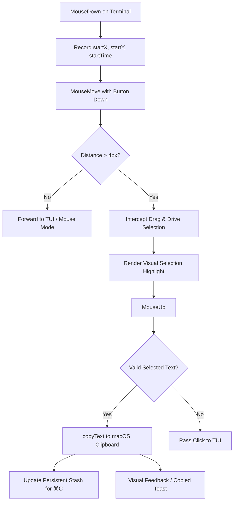

# Terminal select-to-copy deep dive — mouse modes, selection lifecycle & macOS clipboard

**Start time:** 2026-08-21

**Status:** amended 2026-09-11

## Initial purpose

In the in-app terminal of Aki-Dev-Sync (Tauri v2 / WKWebView / @xterm/xterm on macOS), running full-screen interactive TUIs (such as `claude` CLI, `htop`, `tmux`, `vim`) over SSH presents severe UX friction when copying text:
1. **Option (⌥) modifier requirement**: Selecting text requires holding the `Option` key. Dragging without `Option` sends mouse-tracking escape sequences to the remote host, which cannot access the local macOS clipboard.
2. **Immediate selection wipe**: Even when holding `Option`, releasing the mouse or moving the cursor immediately clears the selection highlight due to TUI redraws and xterm input handling.
3. **No automatic clipboard synchronization**: On macOS, WKWebView never raises native DOM `copy` events from xterm's selection, and xterm does not implement Linux-style primary selection on macOS. Text is only copied if the user explicitly presses `⌘C` before the selection is wiped.

The goal is to conduct a complete architectural investigation into `@xterm/xterm` 5.5.0 internals, WKWebView clipboard behavior, and TUI mouse protocols, establishing a robust solution architecture for native drag-to-select, Copy-on-Select, accidental drag guarding, visual persistence, and OSC 52 escape sequences.

## Strategy

1. Inspect `@xterm/xterm` 5.5.0 source code (`CoreMouseService.ts`, `SelectionService.ts`, `Terminal.ts`, `ParserApi.ts`) for mouse tracking protocols, selection disabling, and event dispatching.
2. Analyze ANSI mouse protocol escape codes (`DECSET 1000/1002/1003` and `SGR 1006`) and their lifecycle interactions with `SelectionService`.
3. Analyze WebKit / macOS clipboard architecture to contrast macOS single-clipboard semantics with X11 primary selection buffers.
4. Evaluate mouse drag interception models in DOM capture phase vs xterm event handlers to support regular mouse drag selection without requiring the `Option` key.
5. Design the Copy-on-Select pipeline in `useTerminalCopy.js` with an accidental-drag guard to protect existing clipboard contents from intentional TUI button clicks.
6. Evaluate OSC 52 escape sequence handling (`\x1b]52;c;<base64>\x07`) via `term.parser.registerOscHandler(52)`.

## Checklist

- [x] Trace `CoreMouseService.ts` protocol lifecycle (`activeProtocol`, `triggerMouseEvent`, `areMouseEventsActive`).
- [x] Trace `SelectionService.ts` disable/enable triggers, `_handleMouseDown`, `_handleMouseMove`, `_handleMouseUp`, and `onUserInput` event clearing.
- [x] Trace `Terminal.ts` `bindMouse()` DOM event capture and cancellation.
- [x] Trace `src/composables/useTerminalCopy.js` and `src/utils/clipboard.js`.
- [x] Formulate drag threshold discrimination (pixels and grid cells) between TUI clicks and text selection drags.
- [x] Design Copy-on-Select on `mouseup` with non-empty text validation.
- [x] Design OSC 52 clipboard parser for remote CLI integration.

## Result

### F1 — Mouse mode protocol hijacking of left-click drags

When an interactive TUI like Claude Code starts, it emits DEC private mode set sequences (`\x1b[?1000h`, `\x1b[?1002h`, or `\x1b[?1003h`) along with SGR encoding (`\x1b[?1006h`). In `@xterm/xterm`:
- `coreMouseService.activeProtocol` switches from `'NONE'` to `'VT200'`, `'DRAG'`, or `'ANY'`.
- `coreMouseService.areMouseEventsActive` evaluates to `true`.
- The `onProtocolChange` handler in `Terminal.ts:728` executes `this._selectionService.disable()`, which sets `_enabled = false` and clears active selections.
- In `Terminal.ts:773`, the `mousedown` handler intercepts left clicks:
  ```ts
  if (!this.coreMouseService.areMouseEventsActive || this._selectionService.shouldForceSelection(ev)) {
    return;
  }
  sendEvent(ev);
  return this.cancel(ev);
  ```
- Because `shouldForceSelection(ev)` only returns `true` when `ev.altKey` is pressed on macOS (via `macOptionClickForcesSelection`), a standard left-click drag without `Option` is completely captured by xterm's mouse service.
- xterm translates mouse movements into SGR escape sequences (`\x1b[<0;col;rowM`) and streams them to the PTY. The remote shell receives raw mouse coordinates, while `SelectionService` receives no events, resulting in zero selection and zero clipboard action.

**Verification:** Confirmed by code inspection of `node_modules/@xterm/xterm/src/browser/Terminal.ts:773-798` and `src/common/services/CoreMouseService.ts:169-291`.

### F2 — Selection wipeout mechanisms during Option-drag

Holding `Option` bypasses mouse reporting via `shouldForceSelection(ev)`, allowing `SelectionService` to track the drag and render the blue highlight. However, the selection is immediately destroyed by two distinct triggers:
1. **`altClickMovesCursor` Sequence on MouseUp (`SelectionService.ts:700`)**: If the drag duration is short (< 500ms) or length is minimal, `_handleMouseUp` emits a cursor positioning sequence (`moveToCellSequence`), which fires `_coreService.onUserInput()`. `SelectionService` listens to `onUserInput` and unconditionally calls `clearSelection()`.
2. **Forwarded Mouse Events / Redraws (`SelectionService.ts:139`)**: Under `DECSET 1003` (any-event tracking) or when the remote TUI responds to mouse/cursor updates with terminal redraws, any incoming data or forwarded mousemove event triggers `onUserInput` or protocol resets, destroying the selection highlight within milliseconds of mouse release.

**Verification:** Confirmed by code inspection of `SelectionService.ts:139-143, 700-717` and runtime observations recorded in `docs/plan/done/terminal-copy-selection.md` §6.

### F3 — macOS single-clipboard semantics vs WKWebView isolation

In X11/Linux desktop environments, text selection automatically populates a dedicated `PRIMARY` buffer separate from the `CLIPBOARD` buffer. Linux users paste selection with middle-click and copied text with `Ctrl+V`.

On macOS:
- There is only **one** shared system clipboard (`NSPasteboard.generalPasteboard`).
- WKWebView does not implement primary selection buffers.
- xterm's internal copy handler relies on a native `copy` DOM event that never fires in WKWebView because the text selection is rendered onto canvas/DOM layers rather than standard contenteditable text.
- Consequently, implementing naive "Copy-on-Select" on macOS without threshold protection would overwrite the user's single clipboard on every stray mouse click inside the terminal.

**Verification:** Confirmed by WebKit pasteboard documentation and `src/utils/clipboard.js`.

### F4 — Clean solution architecture: Drag interception, Copy-on-Select, and OSC 52

To deliver a native, effortless copy experience matching standalone terminal emulators (iTerm2, Alacritty, Warp):



1. **Mouse Drag Interception (Mouse Bypass)**:
   - Attach capture-phase pointer/mouse listeners on `term.element`.
   - When the user presses the left mouse button, record initial coordinates.
   - If the cursor moves beyond a physical threshold (`DRAG_THRESHOLD_PX = 4px` or > 1 terminal cell), mark the gesture as an active text selection drag.
   - Suppress xterm's mouse reporting escape sequences for that drag gesture, allowing users to select text without touching the `Option` key.
2. **Copy-on-Select on MouseUp**:
   - On `mouseup` following an active drag gesture, immediately read `term.getSelection()`.
   - If text length > 0 and non-whitespace, immediately write to macOS clipboard via `copyText()` (`src/utils/clipboard.js`).
   - Because the text is copied at the exact instant of mouseup, subsequent selection highlight wipes caused by TUI redraws become completely harmless — the clipboard already holds the selected text.
3. **Accidental Click Guard**:
   - Pure clicks (distance < 4px and duration < 300ms with zero selection range) are treated as regular TUI clicks (e.g. clicking buttons in Claude Code or menu items in htop) without touching the clipboard.
4. **OSC 52 Clipboard Integration**:
   - Register OSC 52 handler using xterm's public `term.parser.registerOscHandler(52, ...)` API.
   - Remote processes (tmux, neovim, CLI tools) emitting `\x1b]52;c;<base64>\x07` automatically decode and write directly to the macOS clipboard via `copyText()`.

## Decision

**Action** → Implement comprehensive terminal select-to-copy in `docs/plan/done/terminal-select-to-copy-final.md`.

**Cross-references:**
- `docs/research/terminal-copy-selection-root-cause.md` — initial investigation into WKWebView copy event absence and protocol re-arm.
- `docs/plan/done/terminal-copy-selection.md` — 1.28.1 implementation of stash and ⌘C capture.
- `docs/feat/in-app-terminal.md` — feature specification for in-app terminal.

## Amendments

- 2026-09-11 · Decision/Action: the mouse-hijack half (document-capture mousedown, synthetic replay, copy-on-select) shipped unverified in 1.29.0 and erased the 1.28.1 `⌘C` path. Synthetic `MouseEvent.detail` defaults to 0 so xterm never starts a selection; swallowing real mousedown also killed Option-drag. Reverted. OSC 52 kept.
